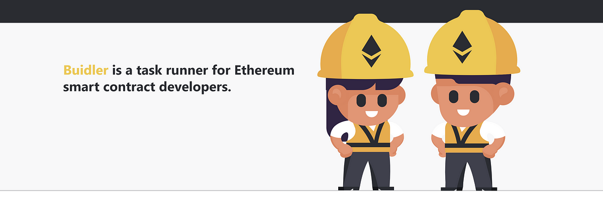
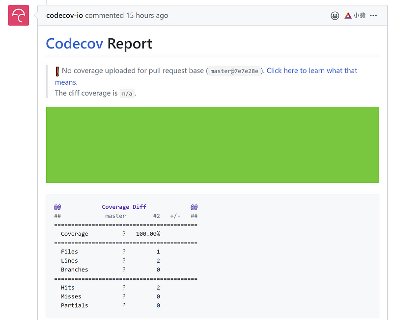

擷取自 [Buidler](https://buidler.dev/) 首頁

這是延續上篇文章《[Solidity 的新開發工具集：Buidler, Waffle, ethers](/posts/2019-12-26_solidity-%E7%9A%84%E6%96%B0%E9%96%8B%E7%99%BC%E5%B7%A5%E5%85%B7%E9%9B%86buidler-waffle-ethers/)》，實際把 Truffle, Waffle 與 Buidler 都設定了一下比較之間的差異。我們的開發環境是 TypeScript，所以設定上也會以支援 TypeScript 為主，同時也看看不同工具有支援那些有利於開發的功能比如說可不可以設定 coverage 等。

本篇文章使用了 Truffle, Waffle 跟 Buidler 都引用 openzelpilin 建立了一個 ERC20 與加入基本的測試。

#### TL;DR

目前的話我推薦使用 [buidler](https://buidler.dev/)，專案的設定可以參考我寫的範例 [buidler-sample](https://github.com/yurenju/buidler-sample)。

### Truffle + web3

Truffle 是目前最多人採用的工具，設定上也不會有什麼太大的問題，以下是 Truffle 使用範例。

[yurenju/truffle-sample](https://github.com/yurenju/truffle-sample)

Truffle 的 Migration 機制是我一直以來不太喜歡的地方，大多數的人都把它拿來佈署，通常也沒其他功能。來看看測試的部分：

```javascript
const SKEToken = artifacts.require("SKEToken");

contract("2nd SKEToken test", async ([deployer, user1]) => {
  it("should put 10000 SKEToken in the first account", async () => {
    const token = await SKEToken.new(10000, { from: deployer });
    let balance = await token.balanceOf(deployer);
    assert.equal(balance.valueOf(), 10000);
  });
});
```

而測試方面用了 `contract` 跟 `artifacts.require()` 分別做為取代 mocha 的 `describe` 跟匯入 smart contract，我沒那麼喜歡隱式的引用 `artifacts.require()` 而不是用 `require()` 或 `import` 進來使用。而根據[官方網站的說明](https://www.trufflesuite.com/docs/truffle/testing/writing-tests-in-javascript#use-contract-instead-of-describe-)， `contract()` 比起 `describe` 多提供了以下兩個功能：

1.  幫你每次重新 deploy contract
2.  每次給存滿錢的帳號供測試用

這兩件事情其實可以簡單的提供一個 function 就可以做到了，感覺沒有必要從一個函式隱式的提供。

不過整體來說設定上也滿簡易的，沒什麼太大的問題。如果需要佈署到網路上只要在 truffle.js 設定好即可。

```javascript

    ropsten: {
      provider: () =>
        new HDWalletProvider(
          process.env["MNEMONIC"],
          `https://ropsten.infura.io/v3/939fb730f6cd4449aeb9f101cca7277e`
        ),
      network_id: 3, // Ropsten's id
      gas: 5500000, // Ropsten has a lower block limit than mainnet
      confirmations: 2, // # of confs to wait between deployments. (default: 0)
      timeoutBlocks: 200, // # of blocks before a deployment times out  (minimum/default: 50)
      skipDryRun: true // Skip dry run before migrations? (default: false for public nets )
    }
```

### Waffle + ethersjs

Waffle 是相對來說較新的工具集，功能專注在測試上，以下也是使用範例。

[yurenju/waffle-sample](https://github.com/yurenju/waffle-sample)

Waffle 比較是我喜歡的運作方式，看以下的測試範例：

```javascript
import { use, expect } from "chai";
import { solidity, MockProvider, deployContract } from "ethereum-waffle";
import SKETokenArtifact from "../build/SKEToken.json";
import { SKEToken } from "../types/ethers-contracts/SKEToken";

use(solidity);

describe("Counter smart contract", () => {
  const provider = new MockProvider();
  const [wallet] = provider.getWallets();

  async function deployToken(initialValue: string) {
    const token = (await deployContract(wallet, SKETokenArtifact, [
      initialValue
    ])) as SKEToken;
    return token;
  }

  it("sets initial balance in the constructor", async () => {
    const token = await deployToken("10000");
    expect(await token.balanceOf(wallet.address)).to.equal("10000");
  });
});
```

雖然說乍看之下比起 truffle 的範例長很多，但是其實要做的事情比較明確，比如說存滿錢的帳號用 `MockProvider` 提供，如果需要每次都重新 deploy contract 就提供一個 `deployContract()`，在要撰寫新的測試時做的事情比較明確。

不過相較起來有些功能因為 waffle 主要是專注在測試上，所以就不像 truffle 有內建些功能。比如說佈署上 truffle 可以寫在設定裡面完成，而 waffle 得自己寫一個 script 來完成，不過也滿簡單的：

```javascript
import dotenv from "dotenv";
import { getDefaultProvider, Wallet } from "ethers";
import { deployContract } from "ethereum-waffle";
import SKETokenArtifact from "../build/SKEToken.json";
import { SKEToken } from "../types/ethers-contracts/SKEToken";

dotenv.config();

async function deploy() {
  const mnemonic = process.env["MNEMONIC"] || "";
  const provider = getDefaultProvider("ropsten");
  const wallet = Wallet.fromMnemonic(mnemonic).connect(provider);
  const token = (await deployContract(wallet, SKETokenArtifact, [
    "100000"
  ])) as SKEToken;
  console.log("deployed, address: " + token.address);
}

deploy();
```

### Buidler + Waffle + ethersjs

buidler 其實是一個 ethereum 的 task runner，所以還是會需要 truffle 或 waffle 一併使用，範例如下。

[yurenju/buidler-sample](https://github.com/yurenju/buidler-sample)

測試我們就不看了，因為採用 waffle 所以幾乎是一樣的。那 Buidler 提供了那些功能呢？

#### Error Stack

Error Stack 是 solidity 開發上一直以來一直缺乏的功能，而 Buidler 透過修改了 EVM 的 Buidler VM 來提供這個功能，所以當 solidity 錯誤時會丟出更詳細的錯誤訊息：

```
Error: Transaction reverted: function selector was not recognized and there's no fallback function
  at ERC721Mock.<unrecognized-selector> (contracts/mocks/ERC721Mock.sol:9)
  at ERC721Mock._checkOnERC721Received (contracts/token/ERC721/ERC721.sol:334)
  at ERC721Mock._safeTransferFrom (contracts/token/ERC721/ERC721.sol:196)
  at ERC721Mock.safeTransferFrom (contracts/token/ERC721/ERC721.sol:179)
  at ERC721Mock.safeTransferFrom (contracts/token/ERC721/ERC721.sol:162)
  at TruffleContract.safeTransferFrom (node_modules/@nomiclabs/truffle-contract/lib/execute.js:157:24)
  at Context.<anonymous> (test/token/ERC721/ERC721.behavior.js:321:26)
```

在其他語言開發上早就每天都在用的功能我們早就習以為常，但是真的在沒這個功能的時候，你才會驚覺他有多重要 🤣

#### Coverage

這是 [Wias Liaw](https://medium.com/u/af88987a8fbb) 在[上篇文章的留言](https://medium.com/@wiasliaw/%E4%BD%A0%E5%A5%BD-%E7%9C%8B%E5%AE%8C%E4%BD%A0%E7%9A%84%E6%96%87%E7%AB%A0%E5%BE%8C-%E6%88%91%E4%B9%9F%E5%8E%BB%E7%9C%8B%E9%81%8E-waffle-%E8%B7%9F-buidler-%E7%9A%84%E6%96%87%E4%BB%B6-%E5%85%A9%E8%80%85%E9%83%BD%E5%8F%AF%E4%BB%A5-compiler-%E8%B7%9F-test-%E4%BD%86%E5%9C%A8%E7%B4%B0%E9%83%A8%E4%B8%8A%E6%9C%89%E4%B8%80%E4%BA%9B%E5%B7%AE%E7%95%B0-%E6%88%91%E8%A6%BA%E5%BE%97-buidler-%E7%9A%84-task-runner-5d36556e1c87)提到的功能，我之前沒發現。Buidler 透過 solidity-coverage 的支援現在也可以知道目前測試的涵蓋率了。比如說範例專案裡面就有透過 github action 將涵蓋率顯示在 codecov 網站上。

[Code coverage done right.](https://codecov.io/gh/yurenju/buidler-sample)

同時每個 Pull Request 也都會有 codecov 的涵蓋率報告說明這次的修改對於測試涵蓋率的變動增減如何。



這個範例因為是測試用所以涵蓋率是 100%

不過這功能是透過 solidity-coverage 這個套件完成，所以 truffle 也可以有相同的功能。

除了以上兩個功能外，Buidler 還提供了其他的功能如佈署完之後順便把 Contract Source Code 上傳到 etherscan, 讓使用者可以直接在上面看到源碼等功能，有興趣的可以上 buidler 網站看他們提供的 plugin 有哪些。

總體來說，我不是特別喜歡透過 task runner 來整合這些功能，不管是 coverage 或 error stack 這些事情如果可以透過單一工具單獨整合會比較好。之後或許可以再研究一下要怎麼單獨整合到 waffle 裡面，不過在這之前 buidler 已經提供了很好的功能，如果你最近想要開始開發 Smart Contract，Buidler 會是不錯的選擇。

[Buidler](https://buidler.dev/)

#### 雷區

在設定 coverage 的時候我有遇到 buidler + waffle 怎麼樣涵蓋率都是 0% 的問題，你可以看 [#474: Zero percent coverage with buidler plug-in (using Ethers, Waffle, Typechain)](https://github.com/sc-forks/solidity-coverage/issues/474)，裡面有更詳細的討論。

另外一個很雷的地方是 solidity-coverage 在與 waffle 的整合時在 Windows 是沒辦法跑 coverage 的，如果你遇到了，可以考慮修好他發個 PR，或是逃避一點先暫時就用 github action 上面的 Linux 來執行 coverage 的工作吧。
