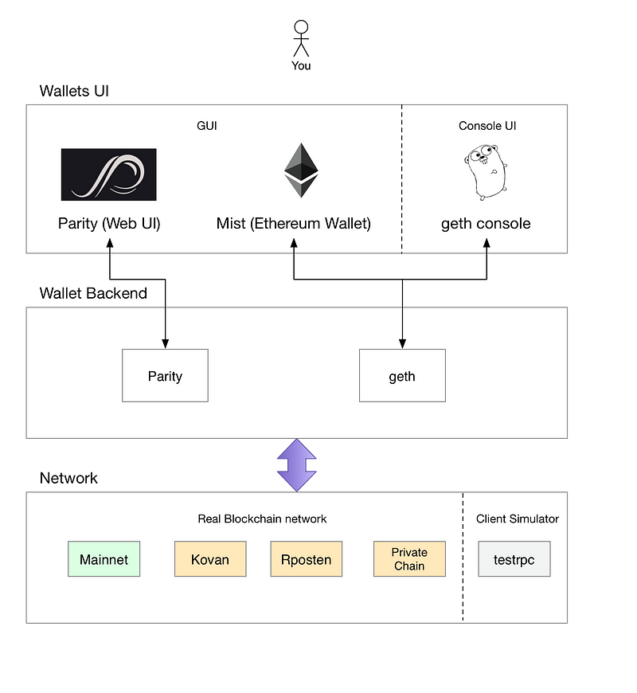
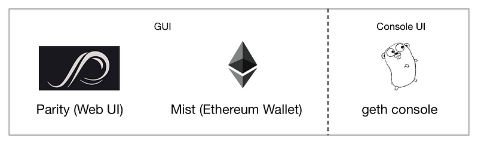
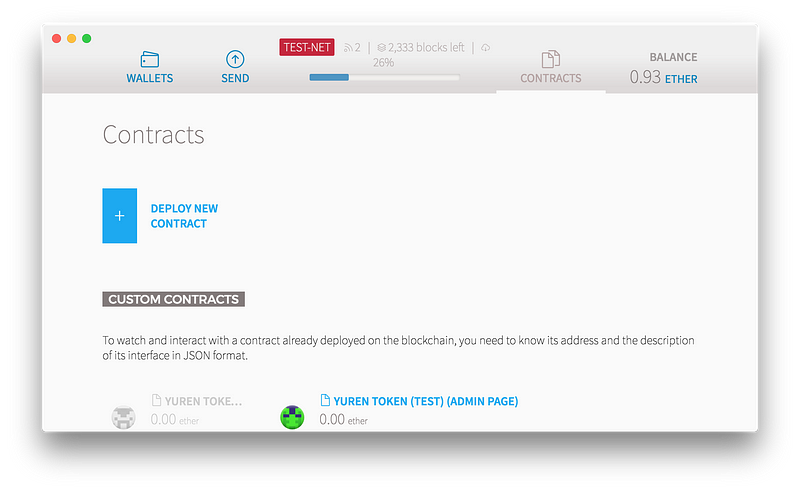
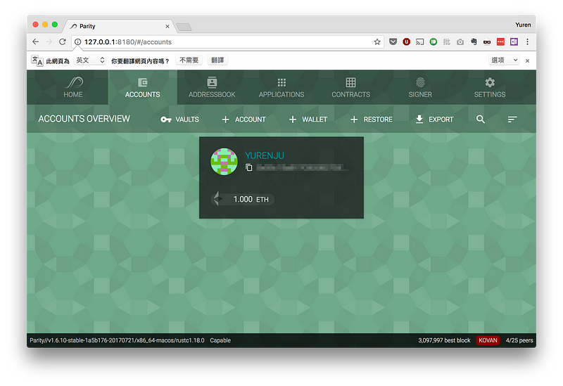
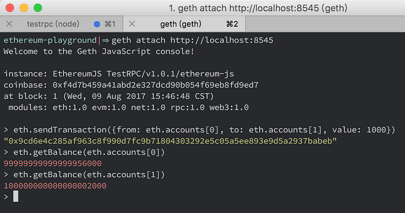
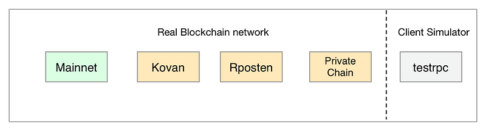
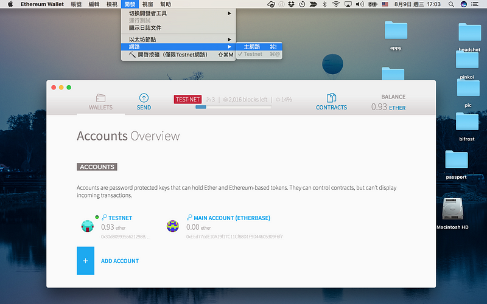
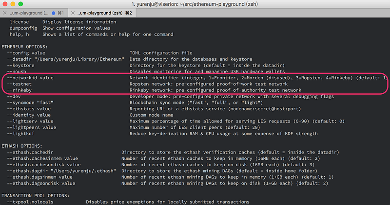
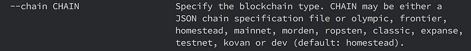
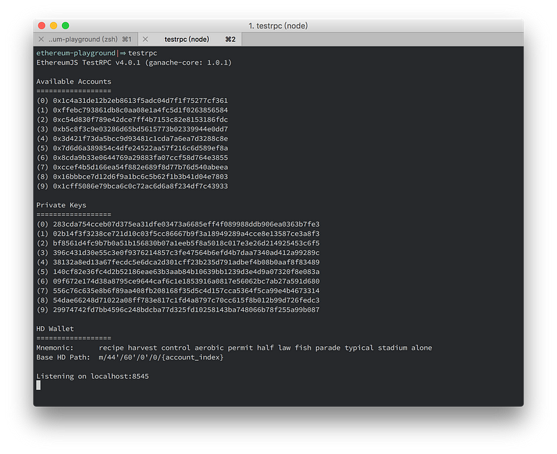

最近想開始試試 Ethereum 的 Smart Contract，入門時卻遇到很多問題，感謝 [Taipei Ethereum Meetup](https://www.meetup.com/Taipei-Ethereum-Meetup/) 與 [Chih-Cheng Liang](https://medium.com/u/5c031577a87d) 的協助，最近終於比較搞清楚一些基礎知識，寫下來分享給其他也想學習 Smart Contract 的新手。

以下的介紹就只包含基礎知識到涵蓋到要如何開始照著官方的 [Create your own crypto-currency](https://ethereum.org/token) 指引開始寫 Smart Contract，剩下的可能之後會再發其他文章介紹。

一些中英對照：

- Ethereum: 以太坊
- Ether: 以太幣
- Smart Contract: 智慧合約 / 智能合約
- Wallet: 錢包
- Faucet: 發測試用以太幣的服務

### Smart Contract 簡介

Smart Contract 是在區塊鏈上的合約，合約跟執行的結果都會儲存在區塊鏈上面。比如說你要發行貨幣，並且提供轉帳 (transfer) 以及買賣功能就是一個合約，比如說在區塊鏈上一間公司的股東發起投票也是一種 Smart Contract。

如果你是軟體工程師應該會想：這我也可以自己開發出類似的系統啊？

沒錯，區塊鏈上的應用基本上你都可以在沒有使用區塊鏈的情況，用你慣用的方式實作，上面舉的這兩個例子，你都可以自己寫系統來做，只是這些做出來的系統通常是集中式 (centralized) 的架構。

Ethereum 的 Smart Contract 不一樣的地方是：

1.  Ethereum 本身就是一個虛擬貨幣金流系統，所以處理跟虛擬貨幣金流相關的事情會非常容易。
2.  它是分散式系統，計算結果與寫入的資訊會存在分散式的帳本裡面經過許多人驗證。如果有人想要竄改就會變成要攻擊整個系統內的非常多節點才有辦法辦到。

你可以想像提供轉帳或是股東投票是你自己寫的系統時，一旦被入侵主機竄改後的結果。但是在 Smart Contract 下當資訊已經被寫入區塊鏈後，要被修改就會變得困難許多（但不見得不會被入侵，安全性其實也是個挑戰）。

如果你需要什麼應用是希望寫入後的結果是透明、不容易被竄改並且是分散式架構，你可以考慮將這個應用放到區塊鏈上。

### Wallet, Backend &amp; Network

這是我剛開始覺得最混亂的部分，剛開始入門 Ethereum 與其他區塊鏈一樣都會需要有錢包 (Wallet)。而錢包大致上可以分成有圖形化使用介面 (GUI) 或是只有指令介面。剛開始會先使用有 GUI 介面的，但是真的要開發時還是會需要指令介面的程式會更實用。

Wallet Backend 是負責真正對區塊鏈的操作，目前我有用過的 backend 有 geth 跟 parity。

至於這些 Wallet Backend 則可以用設定的方式連接到許多不同的 Network (網路)，有公用網路也有私有網路，甚至有測試用的模擬網路等。

#### Wallet UI

[Mist](https://github.com/ethereum/mist/): 就是那套可以在 ethereum.org 官網下載的錢包軟體，其中裡面內建了 geth 核心，所以 Wallet backend 是使用 geth，Mist 主要就是 GUI 介面。若沒有更改過 geth 的設定，使用 Mist 第一次同步要花非常久的時間。

使用測試網路的 Mist

[Parity](https://parity.io/): 這是另外一套 Wallet，特點是同步區塊的速度比起 Mist/geth 要更快。其介面是 web。使用 `parity ui` 指令就會直接在你的預設瀏覽器上開啟 Parity Web UI。它的 backend 跟 frontend 放在一起，並沒有特意分成兩個專案，所以在架構圖 backend 那欄也是 parity。

geth console: 這是包含在 [geth (ethereum-go)](https://github.com/ethereum/go-ethereum) 的一個指令介面，跟 JavaScript 的 console 非常類似，可以用指令的方式執行各種功能如查看餘額、匯款、讀取 script 等等功能。比如說要匯款就可以用以下指令：
`eth.sendTransaction({from: eth.accounts[0], to: eth.accounts[1], value: 1000})`

#### Wallet Backend

**Parity**: 剛有介紹過了 Parity 本身包含了 Web UI 與 ethereum client。不過因為 Parity 也提供了與 geth 相容的介面，所以如果你想要用 Parity 作為 backend，Mist 作為 frontend 也是可以，詳情可以看這個 [reddit](https://www.reddit.com/r/ethereum/comments/53eh1w/how_to_use_the_ethereum_wallet_with_parity/)。

**geth (ethereum-go)**: 除了 console UI 以外，geth 還是一個完整的 ethereum client，這也是為什麼 mist 裡面會包含一個 geth，因為 mist 本身只有 GUI 介面，真正對乙太坊的操作都是由 geth 提供。所以由 geth 本身提供全功能的 ethereum client，搭配上 geth console 的指令介面，寫合約程式時就可以使用這個工具做一些開發者習慣的操作。

#### Network

我剛開始在這邊被困了很久，因為官網上面的 token tutorial 寫得並不是很清楚。

Ethereum 有很多不同的網路可以選擇，真正的以太幣 (ether) 是放在 mainnet 上面，但是在開始把 smart contract 發佈到 mainnet 之前，你可以有很多種方式測試。

**公開的測試網路**：網路上有一些公開的測試網路如 Rposten 或 Kovan，這些是公開在網路上的服務，也可以用 etherscan.io 查詢到相關的交易與合約。

**私有鏈 (private chain)**：跟上面的網路一樣，只是是可以由你自己創造，由於是自己創造的關係可以 mining 的速度調快一些，讓你很快就可以有測試用的以太幣可以用。

**testprc**：這是一個 node.js 模組，他會提供一個模擬網路提供你測試用。上面也放了許多以太幣與跟其他 ethereum 相容的介面，所以可以用 `geth attach &lt;TESTRPC_ADDRESS&gt;` 直接連上來測試。

文末再來解釋一下要怎麼連到這些網路。下面先列出幾個我遇到的疑問跟可能的解答。

### 同步帳本需要花費非常久的時間

這是我剛開始遇到的第一個問題，如果你使用 Mist Wallet 也就是官方網站上可以下載的那個錢包，我花了隔夜的時間在 Mist 上把所有的區塊同步完。

如果你需要快一點的選擇，可以用 [Parity Wallet](https://parity.io/)，但我自己是想照著官方指引先做一次，所以我還是選擇用 Mist （但是我現在知道其實我可以用 parity 作為 backend 搭配 Mist 的介面了，為時已晚～～）。

### 發佈 Smart Contract 需要以太幣

不論是 mainnet 或 testnet 都需要以太幣把合約部署到區塊鏈上，所以你會需要一點以太幣，顯然測試時用主網路很不理智。雖然測試網路也需要以太幣，只是這個測試用的以太幣只存在測試網路不會在外面流通，也可以透過一些管道取得測試用的以太幣。

那怎麼取得這些測試用以太幣呢？網路上會有人建立一些 faucet service 讓你可以輕易地取得測試用的以太幣，可以從那邊取得，但這就延伸出第二的問題。

#### 測試網路不只一個

想要取得測試網路的乙太幣在 Taipei Ethereum Meetup 的 slack 上面詢問後才知道，原來測試網路不只一種。我目前用的有 Kovan 跟 Ropsten，而 Mist wallet 預設是 Rposten，而使用 Parity 可以選擇許多不同的測試網路。

**2017/8/10 更新**：mist 在 0.9 版本以後支援切換到 rinkeby 網路，撰寫文章時我用的是 0.8.10。

不同的測試網路會有不同的 faucet service 可用。例如我現在使用的 Rposten 網路可以用以下指令取得測試用的以太幣如下：
`curl -X POST  -H &#34;Content-Type: application/json&#34; -d &#39;{&#34;toWhom&#34;:&#34;**YOUR_ADDRESS**&#34;}&#39; [https://ropsten.faucet.b9lab.com/tap](https://ropsten.faucet.b9lab.com/tap)`

如果在不同的測試網路，可以在網路上找那個測試網路的名稱加上 faucet，比如說 `kovan faucet` 。取得測試網路的以太幣後，你就可以照著[官方的指引](https://ethereum.org/token)開始寫 Smart Contract。

### 連接公開網路

我們要先講的是公開的區塊鏈網路要如何連接，這邊會講用 Mist, geth 以及 parity 分別要怎麼切換網路。

#### Mist

在 Mist 0.8.10 的介面裡面，你可以選擇 mainnet 或 testnet，mainnet 就是主網路，會使用真的以太幣的地方。testnet 在 Mist 0.8.10 內則是指 `Rposten` 測試網路，在 0.9 版開始新增了 Rinkeby 測試網路，所以就有兩個測試網路可以選。

我在看網路上的文章時有提到 Mist 會偵測背景如果有跑 geth 的話，就會直接連接到那個已經開著的 geth，不過我目前試過如果在 geth 切換到 rinkeby 網路是會出錯，還不太確定是什麼原因，目前猜測有可能是因為我是用 0.8.10 版本的 mist，升級有可能可以解決這個問題。

#### geth

下達 `geth --help` 後會看到可以用 `--networkid`, `--testnet`或 `—-rinkby`指定不同網路：

除了 Frontier 是主網路外，測試網路可以選擇 (3) Rposten 或 (4) Rinkeby，至於每個網路代號的意義可以參考[這篇文章](https://ethereum.stackexchange.com/a/10313)，這邊就不細講了。

另外根據 [StackOverFlow 上的這篇文章](https://ethereum.stackexchange.com/a/10449)，用 `--testnet` 或 `--networkid` 不一樣的地方是用 `--testnet` 還會額外的幫你確認你的 genesis 檔案是正確的。

#### Parity

parity 同樣的用 `--help` 就可以看到使用 `--chain` 可以指定各種測試網路，它可以指定的測試網路非常多，也包含 Kovan 測試網路。

### 建立私有網路

**建立私有網路** 跟下一節 **使用 testrpc** 是我昨天 (2017/8/8) 在 Taipei Ethereum Meetup 聽到的，這邊有[當天的錄影](https://www.youtube.com/watch?v=-iXqJhSdVp0)，感謝講者 [李婷婷 Lee Ting Ting](https://medium.com/u/f939717fd7fb) 的分享。

這邊用 geth 來建立私有網路，建立私有網路時需要一個 genesis.json 檔案來記錄這個私有區塊鏈網路的所有初始條件。在演講中她提供了一個最小化的 genesis.json：
` {
  &#34;config&#34;: {},``  // 每個 block 操作的 gas 上限，用在測試時調得愈高愈好，
  // 避免測試時操作時花費的 gas 觸及上限，請參考[此文](https://github.com/ethereum/homestead-guide/blob/master/source/ether.rst#gas-and-ether)。
  &#34;gasLimit&#34;: &#34;2000000000000&#34;,``  // 挖礦的困難度，調低一點會讓挖礦速度變快
  &#34;difficulty&#34;: &#34;1&#34;,``  // 預先有以太幣的帳號，可以在這邊預先設定好某些帳號裡面的以太幣數量
  &#34;alloc&#34;: {}
} `

有了 genesis.json 後就可以用 `geth init` 初始化區塊鏈：
`$ geth init genesis.json --datadir privatechain`

`privatechain` 是一個不存在的目錄，執行上面的指令後會被建立。建立後就可以進入 `geth console` ，先用 `personal.createAccount(&#39;&#39;)` 建立帳號並且用 `miner.start()` 開始挖礦以及 `miner.stop()` 停止挖礦。
` // networkid 是用來代表這個 network 的代碼，mainnet 是 1
// 還有一些測試網路在 2~4 之間
// 測試時就使用一個大一點的數字如 123 或 10000 就行了
$ **geth --networkid 10000 --datadir privatechain console**``// 新增一個錢包地址
&gt; **personal.newAccount(&#39;&#39;)**``// 開始挖礦
&gt; **miner.start()**``// 第一次挖礦會有這個訊息，跑個幾分鐘後就會開始挖礦了。
INFO [08-09|19:00:53] Generating DAG in progress               epoch=1 percentage=0 elapsed=2.953s``// 這邊的訊息代表開始挖到礦了
INFO [08-09|19:01:02] 🔨 mined potential block                  number=9 hash=476c02…e3084e
INFO [08-09|19:01:02] Commit new mining work                   number=10 txs=0 uncles=0 elapsed=275.342µs
INFO [08-09|19:01:03] Successfully sealed new block            number=10 hash=3788e4…eda782``// 停止挖礦
**miner.stop()** `

這時用下面的指令就可以看到目前的以太幣有多少，也可以用其他各式各樣的指令。
`&gt; **eth.getBalance(eth.accounts[0])**
285000000000000000000`

### 使用 testrpc

[testrpc](https://github.com/ethereumjs/testrpc) 是一個 node.js 模組，模擬了一個 ethereum client 的行為讓在開發時可以不用在真的區塊鏈上跑。用以下指令安裝：
`$ npm install -g ethereumjs-testrpc`

安裝完以後就可以用以下指令啟動：
`$ testrpc`

這時 testrpc 會建立一些帳號，並且新增一些測試用的以太幣，最後面有個網址可以使用 geth console 連入，這整個網路都是模擬的，並不是 private chain，只是一個模擬網路提供開發者測試的模組。

開啟另外一個 terminal，輸入以下指令就可以連進去 testrpc 所創建的模擬環境了。
`$ geth attach [http://localhost:8545](http://localhost:8545)`

### 結語

Ethereum 目前在一個進展非常快的階段，網路上的文件甚至官方的教學都很有可能過時。

在我嘗試 Smart Contract 的這段時間，遇到了 Faucet Service 沒辦法發出錢，又遇到了 Mist / geth 花費太久的時間同步區塊，最後又遇到正好 geth 把 `web3.eth.compile.solidity()` deprecated 掉。

身為一個剛入區塊鏈的人，覺得入門的門檻反而是這些高速進展而不知道哪份文件可以參考的情況。不過這種狀況大概會隨著 Ethereum 的穩定就比較不會有這樣的狀況了。

上次去了 Taipei Ethereum Meetup 覺得真的很有幫助，果然跟已經在玩的人聊聊可以獲得很多新知。有興趣的也可以線上或來實體聚會參加這個社群！

[Taipei Ethereum Meetup](https://www.meetup.com/Taipei-Ethereum-Meetup/)
