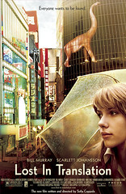

大年初一。又在不斷轉台，時光迅速飛逝下結束了一天。浪費了一天、去！  
  
好不容易在剛剛放棄了無聊的轉台手指運動，準備回房間補充睡眠時，很不巧的在 [HBO](http://www.hboasia.com/) 看到了這部片：Lost In Translation (愛情不用翻譯)。  
  
  
  
起先女主角(Scarlett Johansson) 吸引了我的目光，她演過另外一部片也是我相當喜歡的。不過主要的原因是她很漂亮 :p  
劇情很平凡，劇中男主角在日本拍攝電視廣告，而女主角則是跟著他丈夫(攝影師)一起到日本來。完全沒瓜葛的兩個人，因為住在同一間飯店而相遇。或許是身上有些相同的特質吸引著對方吧。男主角對自己的婚姻感到迷惑，並且在日本這 kuso 的發源地感到不適應。相同的，女主角也有類似的狀況。  
  
我喜歡這部片的拍攝手法。對話不多，但卻可以透過角色的互動、演技來揣摩角色的內心。愚蠢比睿智，西方思想比上日本傳統思想，失去原有目的的婚姻，比上了初邂逅的女主角。片中他們吸食大麻、心靈的互動讓我想起了[重裝reset](http://reset.dynalias.org/blog/)的 『[美麗新世界](http://reset.dynalias.org/blog/archives/000089.html)』的連載小說。  
  
很喜歡這部電影，如果過年看動作片看膩了，不妨看看 Lost in Translation, 愛情不用翻譯。  
  
重播時間：  
SHOWTIMES  
  
13 Feb 2005 10:05 PM  
17 Feb 2005 9:00 PM  
25 Feb 2005 12:30 PM  
26 Feb 2005 1:55 AM