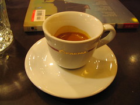
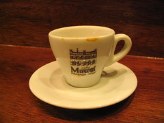

每次去黑潮咖啡都有很多收穫。  
  
在奇先生的 BOF 結束後，我搭捷運到了黑潮咖啡。其實到咖啡館之前還有點醉，在路程中一直覺得手很麻。進咖啡館坐一下就好多了。今天黑潮老闆很忙，聽說是放店員們去看表演，店裡客人又很多，看老闆真是忙到翻了。  
  
老闆在忙碌中對我做了一個手勢，說：『小杯的？』，這邊真是陌生的台北中，一個讓人覺得很溫暖的地方。在我看了一會兒書，酒意漸漸消退時，老闆端了一杯 espresso 來，用的是 musetti 的豆子，約五分滿少一點。  
  
  
  
唔，舌根的酸味，太正了 = =  
過了一陣子，老闆又送來第二杯，相同的是 musetti espresso，份量減少到四分之一，看起來就很濃 XD  
事實上這杯的確比第一杯濃很多，但酸味倒是少了點，老闆說是因為苦味壓過酸味了。  
  
  
  
細節我就不寫了 :-)  
  
另外老闆要出書囉，在這邊幫忙廣告一下，熱愛 espresso 的朋友們一定要注意一下這本書，書名可能是『espresso 咖啡機』，在下個月會出版。黑潮咖啡的老闆是目前我所認識，對義式咖啡研究最徹底的人，不僅店內有琳瑯滿目的 espresso 咖啡豆，不管是填壓器、espresso 機器都讓我大開眼界，有興趣的朋友可別錯過囉！  
  
相關文章：  
[『我在找小巷轉角，再走十步路的那間咖啡館。』](http://yurenju.blogspot.com/2005/11/blog-post_10.html)  
[《咖啡 黑潮》續](http://yurenju.blogspot.com/2005/11/blog-post_18.html)