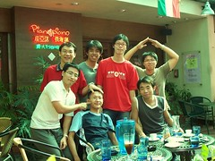

  
[好啦，我承認右邊那個是我哥 XD](http://www.flickr.com/photos/yurenju/170151056/)  
Originally uploaded by [yurenju](http://www.flickr.com/people/yurenju/).

2006年6月17日，高應大的同學畢業典禮，而從 Pianopiano 畢業的朋友們今天也難得聚在一起。自從那天炎熱的午後電話吵醒了我之後， 就開始了這次的聚會。  
  
接到慶大的電話後，才知道祥哥、ueet 全部都到了高雄，這種場合怎麼可以缺咖勒，而且好心的朱大哥又要開車載我，我當然就義不容辭的殺到了 Pianopiano 啦。所有那時常出現在 Pianopiano 的成員也全部都到位了。  
  
這場咖啡聚會，就從下午一直延伸到了晚上，然後喝酒喝到天亮，小睡到十點多吃飯，然後又開始喝咖啡…。大夥聚集在高雄的機會也不多了，也只有這樣馬拉松的聚會，才能填補那種『最後一次』的感慨吧。  
  
所以各位，酒不要停。  
  
PS. 不過今天真的是熱昏了，真佩服他們想抽煙配咖啡的慾望阿。  
  
\[[Pianopiano blog](http://linshi.twbbs.org/blog/Pianopiano)\], \[[聚會照片](http://picasaweb.google.com/yurenju/Pianopiano20060617)\]