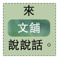

  
作者：黑碳  
部落格：[Should Be Key In That](http://www.wretch.cc/blog/sheanye)  
  
如果有緣，那就讓一切隨緣吧，我把所有都交給緣分  
  
是否認識彼此?!也許已沒有那麼重要  
  
就像這個世界，究竟是不是我們所認識的那個世界，真的有那麼重要

嗎?!  
  
很多小時候所了解的是非對錯好壞之分  
  
隨著慢慢長大而不斷與自已心中的那一把尺相互牴觸  
  
BLOG上的一切記錄著生活的一部份  
  
哪天末日審判時或許能派的上用場吧，希望那裡也有制度程序可言  
  
BLOG就像提供服務的窗口一樣，每個來到此地的人們  
  
拿著號碼牌走到所需的窗口前得到他人協助  
  
每個心情，跳躍的、低下的  
  
每篇文章，真實的、造作的  
  
為自己找到了出口，不斷的投入，不停的卸下，然後重組再更新  
  
在此之前想著該寫些什麼，不斷的問著自己，後來把一切都交給了緣分  
  
我不應該問自己為什麼寫下，而是每個來到此地的大家想獲得什麼  
  
如果您喜歡我提供的服務，那就讓一切都隨緣吧