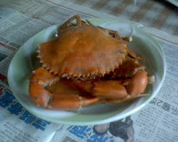

不知道為什麼，今天早餐又吃螃蟹了。有鑑於上次的殘骸太噁心，這次總是記得吃之前要拍了。  
  
螃蟹果然是秋天的聖品阿。為了不要讓大家氣得牙癢癢，特地跟我媽問了如何挑選螃蟹。  
  
首先是地點，如果你要來東港買螃蟹的話，我媽都是在菜堂橋（[地圖](http://www.urmap.com/?link=QxRl-YROLUYLPgY0P3d3Pg3053d4-g20m5d4UTs0P21P-gjI%2B4d4-g20%2B4dlaYR0m5E3U2WI621d0--h%2BO2skPTfm0lKg--fjWfLg%2B5ffU441YKEmfKEE3YI%2B32l06O05213-2OIL%2BdjagQILQ13agRIm5d4UgR0lRdjPYjIms1P-gRIm5d5-gY0%2B3d4UTQ0Psd)）買螃蟹。如果你要買野生的，而不是養殖的，你可以找賣數量比較少的攤子，像是蟳只賣個二、三隻，其他的螃蟹又賣個幾隻的，順便觀察他的衣著是不是像漁夫，通常這個是到大鵬灣自己抓的野生蟹。  
  
再論挑選螃蟹，根據我媽的說法，將螃蟹翻過來，稍微用力的壓區分公母那塊的邊緣，挑選比較硬的會比較好吃。  
  
大概就這樣，祝大家都可以吃螃蟹當早餐。