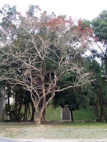

  
用完午餐。時間慢慢的走到上課時間後，我才悠閒地走到平常習慣抽煙的地方。  
  
走上這個階梯後有個平台，很少人會經過這個地方。每次點燃根菸，一靜下來，就可以聽到鳥叫蟲鳴，中午炙熱的陽光穿過濃密綠蔭，變成細碎的光影，映在石塊鋪陳的小徑上。吸一口 Black Vanilla，一部分跟肺泡交換尼古丁，另外一部份飄揚在口鼻之間，享受 Black Vanilla 令人愉快的特殊香草味道…。  
  
天那，真是太悠哉了，我指導老師看到這篇一定會想殺了我…。