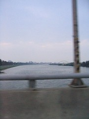

下午兩點，小白敲敲我。  

> orangewalk 前天半夜 說 要請我吃薑母鴨ㄝ  
> 可是 我跟他兩個去吃的話 一點感覺都沒有阿  
> 因為他要去台北工作了 下次回來不知道是啥時  
> 明天喔…高雄？  
> 東港  
> 哈哈  
> 東港！

不過就衝著以後又很久才能見面，所以就千里迢迢的從嘉義跑回東港，就為了吃一頓薑母鴨。這樣的劇情也讓我想到四、五年前她去澳洲的時候，小白跟我也請她吃頓飯，幫她餞別。四年過了，如今她又要離鄉背井的去台北（雖然說近得多），又是相同的陣容。  
  
感覺很微妙。  
  
回到東港，在離家不到十分鐘，從小時候就營業的薑母鴨吃飯（以前卻一次都沒吃過！）。她一點都沒變。講話的神情，開朗的個性，還有那雙會笑的眼睛，甚至連手機都跟四年前一樣是 GD92。在短短的幾個小時內，對時間的感受有些錯亂。四年的時間，感覺起來就是閉眼、張眼。再次打開雙眼，這個世界幾乎沒有變化，我們三個人還是聚在一起，吃飯，閒聊。  
  
其實經歷了很多事情吧。如果時間沒在我們的外表留下什麼，那就是在看不著的地方，刻下痕跡。  
  
十五年前我們國小一年級，坐在同一間教室。  
  
四年前，我們在高雄碰頭，吃完飯後，告別即將前往澳洲的她。  
  
現在，我們在東港，關心著其他老同學的去向。  
  
那下個十五年呢？或許我們只是把薑母鴨換成羊肉爐。而這段平淡而綿長的小故事，還是繼續走下去。