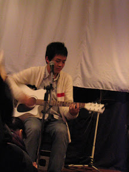
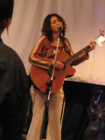
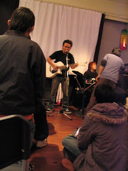
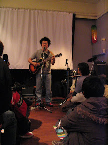

嘿，我有三個月以上沒踏入步道咖啡館，現在能很從容的去這間咖啡館，也算是進步了。這次的表演除了自然卷奇哥以外，還有很多很棒的歌手和團體，像是 Easy, 貓貓虫, 郭紋汎, 滅火器樂團等。  
     
  
第一個貓貓虫因為燈光太暗我就沒照了，而且相片的品質很差，因為我又小又舊的 A70 ISO 開到 400 雜訊顆粒就大的跟水梨一樣。我又不太想用閃光燈打正在演唱的歌手們。所以相片就將就啦。  
  
以前我沒有在像是 Womb Bloc 這麼小的演展空間聽過音樂。不過這種感覺真的很棒。每個歌手都用不同的方式，感動底下的觀眾。貓貓虫表演的時候那種投入的神情，就像她把靈魂灌注到那首歌當中，接著輕輕的飄向我，傳遞感動。Easy 的方式就更直接，如果貓貓虫的感動是像冰塊加到紅茶裡面，慢慢的融合彼此的溫度，Easy 就是用他乾淨卻有爆發性的歌聲，直接震撼每個聽眾。郭紋汎更讚，真是把她的吉他發揮的淋漓盡致。而且聽到她的音樂，卻讓我想起洛娃伊，不知道為什麼，就有這種很奇怪的聯想…。  
  
滅火器，恩，很讚。  
  
最後壓軸的當然是奇哥囉。奇哥真的是超搞笑的，從頭笑到尾，呵。他唱了風和日麗、蘑菇之歌、像你這樣的女孩、自然卷、水開了沒、你的命，有聽到過癮 XD  
  
而且有遇到小莫耶，好幾個月沒有看到他了，不過每次看到都是草草打個招呼…。