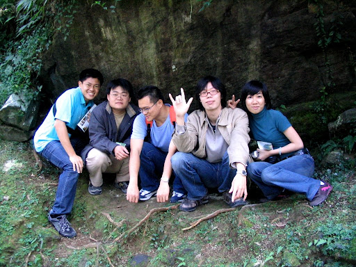  
  
短短的寒假，不出去玩很對不起自己。所以這幾天跟研究室的朋友們一起到南投到處走走。比起上次去[奮起湖](http://yurenju.blogspot.com/search/label/%E5%A5%AE%E8%B5%B7%E6%B9%96)的陣容，這次多了兩個學長、兩個同學，當然固定班底還是照常出席。  
  
首先到溪頭走走。因為在今年內還有來過溪頭，對於這邊的一切並不陌生。只要走入溪頭的任何一條石舖小徑，甚至是尋常的馬路，都可以感受到森林深沈而緩慢的脈動，綿延無盡的柳杉林吐吶，與空氣混合而成的清新氣息，充斥任何角落；隨處可見台灣桫欏巨大的蕨類身影、羽狀葉片與捲曲的芽；因為舖滿碎木屑而質地柔軟的林間步道；當然還有無數著名的景點如大學池、溪頭神木、空中走廊。不過因為我的照相機外出取材後有點虛，所以中途就沒電了（囧！），照的比較少。  
[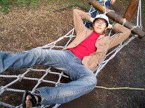](http://picasaweb.google.com/yurenju/TravelOfSakuraInNantou/photo#5031410385141455890) [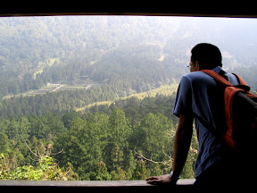](http://picasaweb.google.com/yurenju/TravelOfSakuraInNantou/photo#5031410367961586674) [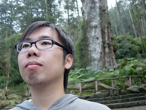](http://picasaweb.google.com/yurenju/TravelOfSakuraInNantou/photo#5032325104159932018) [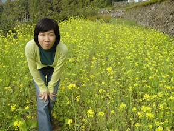](http://picasaweb.google.com/yurenju/TravelOfSakuraInNantou/photo#5032325104159932034)  
  
有趣的是我到了之前跟家人來的同一個地點拍照，如果沒寫日期，根本就覺得是同一掛人來玩的吧？ :)  
[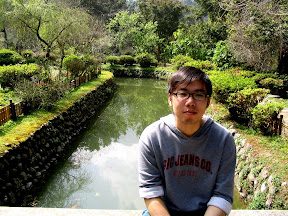](http://picasaweb.google.com/yurenju/TravelOfSakuraInNantou/photo#5031410355076684754) [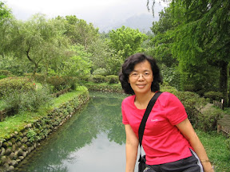](http://picasaweb.google.com/yurenju/ChiTou/photo#4940734659073933330)  
  
第二天，我們到九族文化村。兩大目的：玩、看櫻花。其實這一站還蠻好玩的，而且寒假學生票只要 350 元，又可以玩又有櫻花看，值回票價。我們玩的到底有多愉快勒？看看 KI 幼稚園向日葵小班的成員玩海盜船的表情跟動作就知道了：  
  
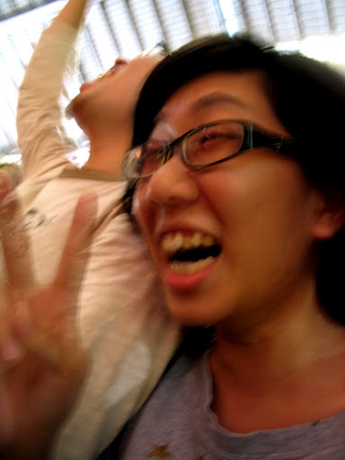  
  
笑阿笑阿笑得好開心阿。我們非常歡樂的玩著各種設施，當然那些刺激的是沒辦法拍照的了（因為我都有玩…）。  
  
[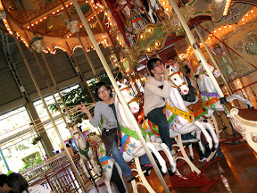](http://picasaweb.google.com/yurenju/TravelOfSakuraInNantou/photo#5031410402321325122) [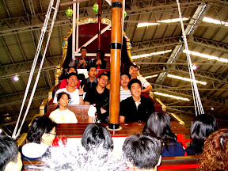](http://picasaweb.google.com/yurenju/TravelOfSakuraInNantou/photo#5031410406616292434)  
  
玩完所有比較刺激的遊樂設施後，我們就作空中纜車到最上面去看櫻花。九族的櫻花開的非常非常美。幾近枯枝的櫻花樹上開滿豔紅色的櫻花。兩旁延伸向上的櫻花樹讓道路變成了紅色大道，許些飄落的花瓣零星的點綴著灰色的路面，而從空中纜車的視角俯視，交織在森林中紅色的櫻花，更是美不盛收。  
[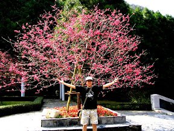](http://picasaweb.google.com/yurenju/TravelOfSakuraInNantou/photo#5031410488220671250) [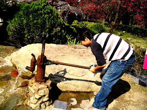](http://picasaweb.google.com/yurenju/TravelOfSakuraInNantou/photo#5031410513990475074) [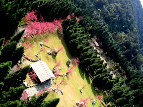](http://picasaweb.google.com/yurenju/TravelOfSakuraInNantou/photo#5031410462450867426) [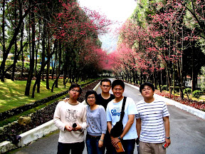](http://picasaweb.google.com/yurenju/TravelOfSakuraInNantou/photo#5031410591299886546)  
  
玩完九族文化村以後，將果、黑武士跟小杰因為部份的人要過情人節（我瞎了），所以就先回去。我、小朋友、阿宅、阿佩跟阿憲組成的 KI 進香團，則繼續往日月潭前進。上次來日月潭是晚上，什麼都拍不到。這次在午後時分就漂亮的多。湖邊到處看看後，很理所當然的又去 [February coffee](http://february.idv.tw/) 吃飯、喝咖啡。這間咖啡館我真的很推薦（之前[中投二日遊](http://yurenju.blogspot.com/2007/01/blog-post_22.html)也有來），在日月潭這種風景區，February coffee 的簡餐價位跟平常沒什麼兩樣（附飲料兩百上下），咖啡又還 OK，如果哪些朋友想在日月潭吃飯，可以試試 February coffee，走走前面的梅荷園後再進來吃吃喝喝，順便一緩九族文化村長時間步行的勞頓，精神變好不少。  
  
[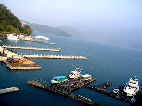](http://picasaweb.google.com/yurenju/TravelOfSakuraInNantou/photo#5031410595594853858) [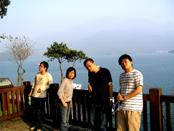](http://picasaweb.google.com/yurenju/TravelOfSakuraInNantou/photo#5031410604184788466) [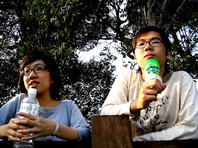](http://picasaweb.google.com/yurenju/TravelOfSakuraInNantou/photo#5031410617069690386) [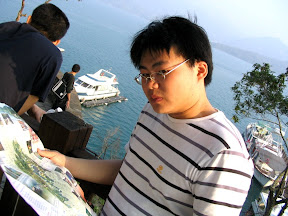](http://picasaweb.google.com/yurenju/TravelOfSakuraInNantou/photo#5031410621364657698)  
  
很輕鬆愉快的度過這個歲末觀光旅行，情人節雖無情人，但旅館民宿小酌瓶比利時啤酒，二月時到二月咖啡館喝杯 Cappuccino，吹著日月潭的微風。  
  
我聳聳肩，還算愜意。  
  
PS. 剩下的照片在 picasa 相簿的《[南投櫻花之旅](http://picasaweb.google.com/yurenju/TravelOfSakuraInNantou)》