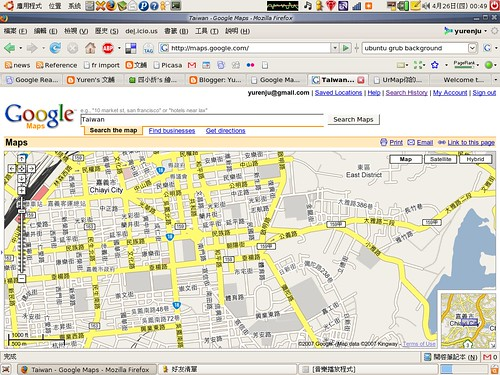
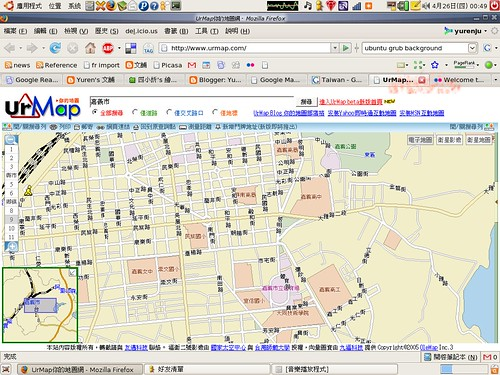

這是來自 [Shih-Hsien’s BLOG](http://sanwangx.brain-c.com/) 的[消息](http://sanwangx.brain-c.com/archives/2007_04/25_283/)，Google Maps 終於支援臺灣街道圖了！從 Shih-Hsien's BLOG 的 Urmap v.s. Google Maps 的比較圖可以發現，Google 的標示的確比較清晰美觀。趕緊來看嘉義的地圖 Google Maps 與 Urmap 的差別：  
  
   
  
真的是感動到想哭阿。Google Maps 真的清楚很多。當然目前搜尋上還有問題，無法使用，但也是遲早的事情囉。希望國產的 Urmap 能夠好好加油！L10N 應該是可以做的比 Google Maps 好的，加油！