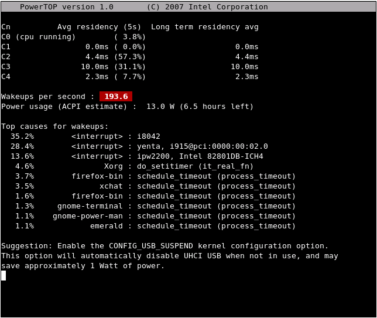

[PowerTop](http://www.linuxpowertop.org/index.php) - Linux 底下的電力檢測程式。如果您使用 Intel CPU 的筆記型電腦，可以用 PowerTop 這隻程式來檢測目前應用程式所耗費的電量。  
  
以下是官方網站提供的畫面：  
  
  
其實我自己也裝了，不過 PowerTop 執行時，他跟我說有些 kernel 的選項如 CONFIG\_TIMER\_STATS 要打開。已經從人類退化到猴子的我就沒有再去調那些選項。  
  
就算不能用，這東西聽起來還是挺讚的，可以利用這程式來檢視到底哪些程式在消耗電力。在 [Tips & Tricks](http://www.linuxpowertop.org/known.php) 裡面也提到目前他們檢測出來特別消耗電力的程式，像是 gnome-power-manager, Firefox, Gaim (Pidgin), ibm\_acpi, Evolution, ipw2100 等。這也太糟糕了吧，上面這些程式我都有跑！不過 Intel 也很好心的提供了各種 Patch 檔來改善電力耗費，希望 Ubuntu 下的應用程式可以趕快收錄這些 Patch 囉。  
  
延伸閱讀：[Kanru’s 探險日誌 - Intel 新玩具 — PowerTop!](http://blog.kanru.info/archives/265)

  

---