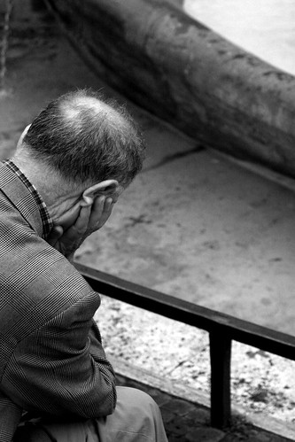

  
  
事情要回溯到幾天前，那是一個寒冷的小小年夜，一個在屏東竟然都可以呵出熱霧氣的夜晚，我、我哥還有高先生一起在我家前面的露天咖啡館閒聊。我們的話題從高先生手上的定焦鏡，小小白，聊到最近各自感情近況。  
  
最後，竟然聊到結婚的話題。高先生很認真的說，如果工作穩定，他是以結婚的前提交往。也順便提到我哥老大不小，也該考慮這檔事情了。三個男人，在咖啡館竟然聊著這種話題。  
  
原來，我們也是漸老的男人們啦。  

Blogged with [Flock](http://www.flock.com/blogged-with-flock "Flock")