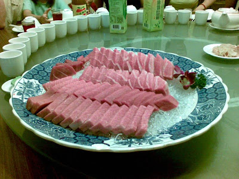
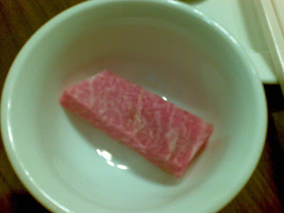
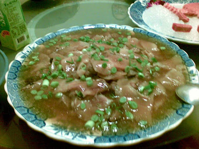
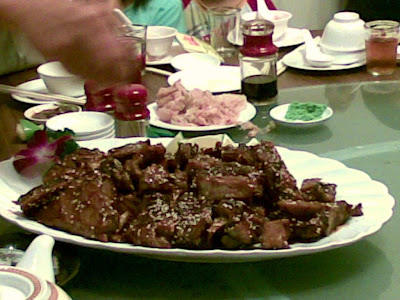
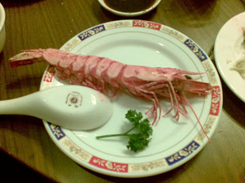
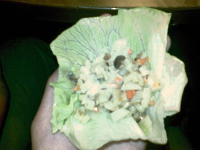

我得要毫不誇張的說：這是我近幾年吃到最豐盛的一次請客。一般來說要吃到這麼豐盛的菜色是非常難得，更何況上場的菜都是頂級貨阿。請原諒我又貼了一次炫燿文。  
  
陳爸爸請客的重點就是：頂級貨、吃到爽，還有讓隔壁桌看到傻眼！  
  
因為很多食材都是陳爸爸自己帶來，所以餐廳根本就點不到那種菜。還記得上次吃到巨無霸油魚子，隔壁桌指著我們的巨無霸油魚子跟老闆說：『我們也要那一道菜！』老闆說：『本店沒有這道菜…』，可見這麼優的菜色，餐廳都不見得會拿出來賣。完全只有內行人可以從漁市取得的秘密菜色。  
  
黑鮪魚生魚片 - 三角仔  
  
  
近拍，看起來比較像牛肉吧？  
  
  
只會在陳爸爸請客中出現的大排翅羹。重點是排翅要完整，份量超多！  
  
  
蒲燒黑鮪魚排，其中有一塊是腹肉拿來烤，吃起來入口即化。  
  
  
野生明蝦(應該是明蝦)，肉質超級扎實。  
  
  
殺人於無形的生菜沙拉。這種才是最可怕的。因為看起來沒什麼，吃起來卻很驚人。這生菜沙拉裏面包的是鮑魚鬆。我以前只吃過蝦鬆從來沒吃過鮑魚鬆…，簡單的說就是鮑魚切丁當作生菜沙拉。好吃…  
  
  
另外還有處女蟳等餐點沒拍，我比較不驚訝的就沒拍了 XD  
  
還有件很有趣的事情，這次同樣的也有老饕叔叔也在請客的行列。這位老饕叔叔前幾個禮拜也在別的餐廳宴請各路朋友，他端出來的菜色跟陳爸是毫不遜色。今天我們正在吃的感動到想哭的生魚片時，他吃了一口便說：『有點硬』。接下來就詳細的分析如果這個生魚片可以怎樣怎樣才可以達到更好吃的境界，不愧是嘴超歪的老饕，一點點瑕疵都吃的出來，太強了…。