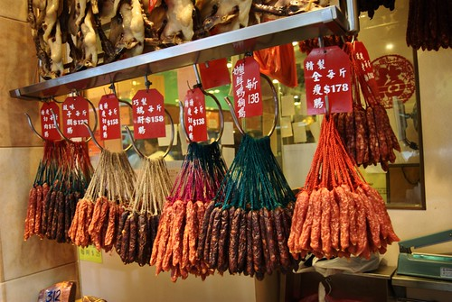
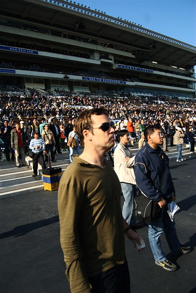
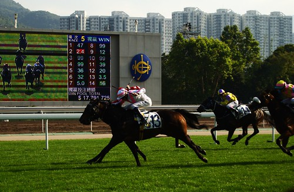
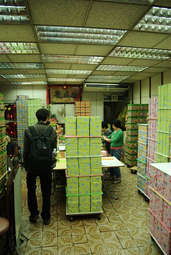

最後一天到了。今天終於沒有滿滿的行程，所以我們睡到九點才起床。起床後去逛了一下時代廣場，不過實在不是時機，商家都沒開。不過 Chialin 還是買了個唇蜜。而這個時候 [kyozi](http://kyozi.blogspot.com/2009/01/2009-hongkong-street-view-2.html), znikang, 輝哥則去北角看叮叮車與人爭道。  
  
會合之後，我們去了燒臘店。所以茶餐廳、飲茶、燒臘都吃到了。  
  
  
然後我們去了最後一個行程，賽馬。  
  
媽的，所有團員都玩瘋了。  
  
  
連外國人都很迷。  
  
  
不過現場氣氛真的很嗨。  
  
最後，我們為了買伴手禮又回到了北角。這間蛋捲叫做德成號。我們去的時候裡面有堆積如山的蛋捲。不過老闆娘跟我們說，要買只能等農曆年後了。因為現在看到的蛋捲全部都是被訂走的，他們現在接受的訂單要到農曆年後才有得拿。但是我們使出『我們是遠從台灣來的』的招讓我們拿到了一磅蛋捲。但是一盒蛋捲沒辦法讓大家分送吧，後來我們就在[貓空](http://yurenju.blogspot.com/2009/01/outback.html)把他嗑掉了。  
  
  
  
然後香港行就結束了。我們最後到航廈的貴賓室吃得粗飽，喝了點酒還有咖啡，香港行就這樣結束了。  
  
我只能說實在太累了。不過也很有趣！如果明年還要一起出國的話…聽說是要去越南或者是新疆，肯定又是個又累又讚的行程阿。