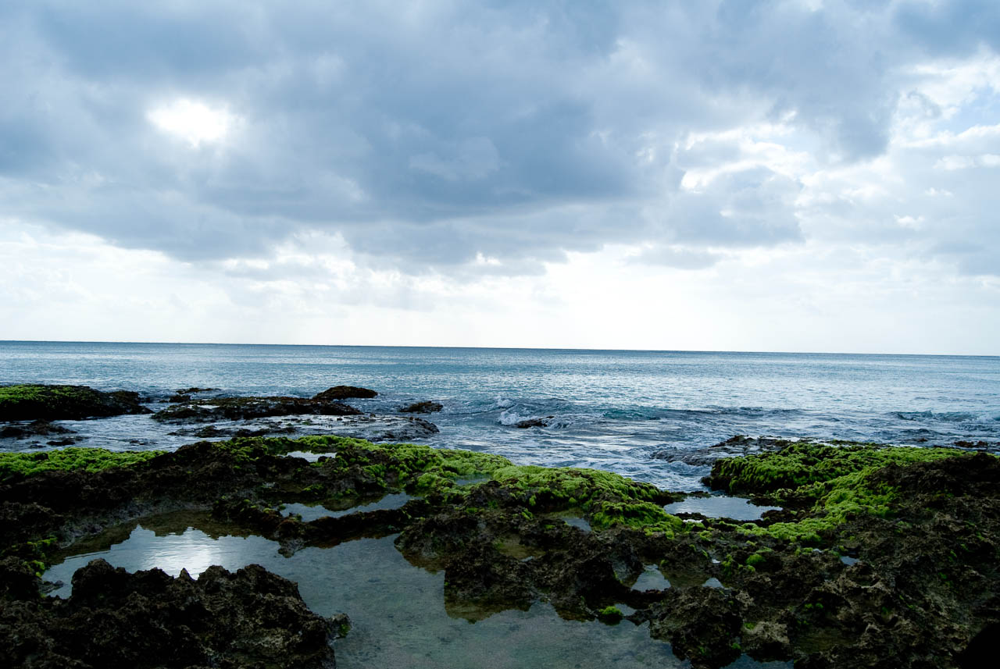
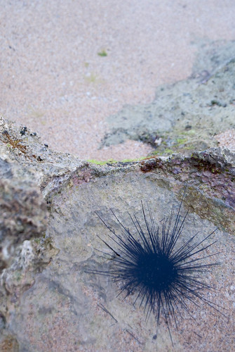
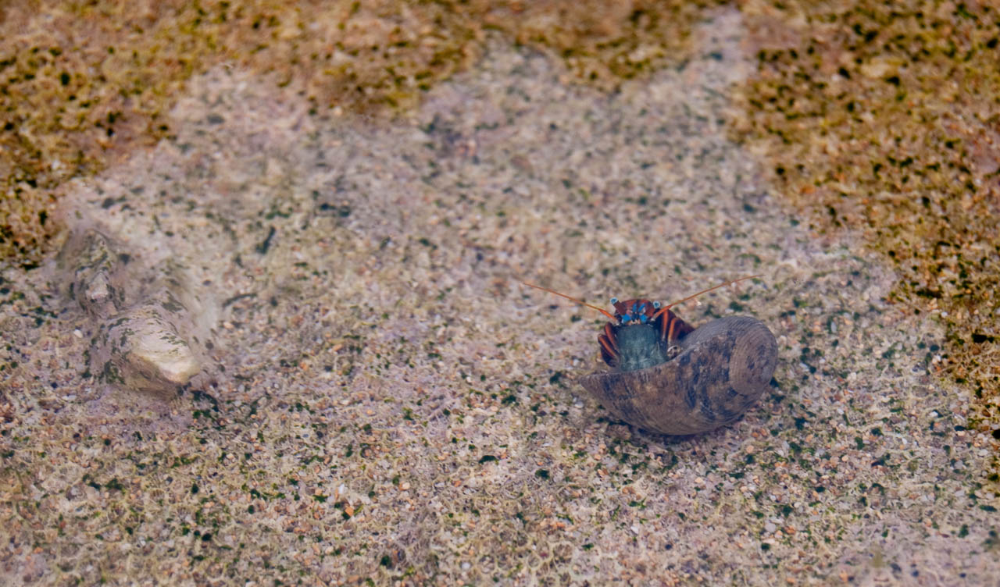
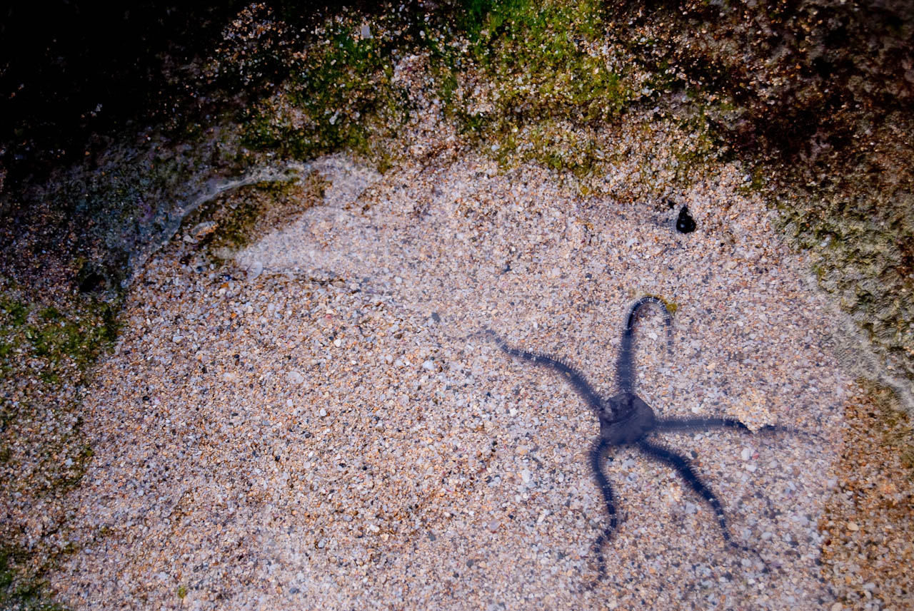

  
  
小時候就被大人帶壞了，所以每次到海邊都會到處看看有啥生物。這次到墾丁當然也是帶台南人看一下岩岸生物。  
  
  
  
海膽。雖然常看到，但是從來沒吃過。我一直覺得很奇怪，東港人好像很少吃海膽，我整家人也只有我爸吃過一次。  
  
  
  
這隻寄居蟹超鮮艷的，不過他很害羞的只有探出頭來而已。  
  
  
  
很多人以為這是海星。其實這種生物叫做陽隧足。一般岩岸很常出現。  
  
這次去看到不少熱帶魚，不過鏡頭實在很難拍到。有人要借我支打魚的鏡頭嗎，我想夏天應該會去小琉球喔 :P