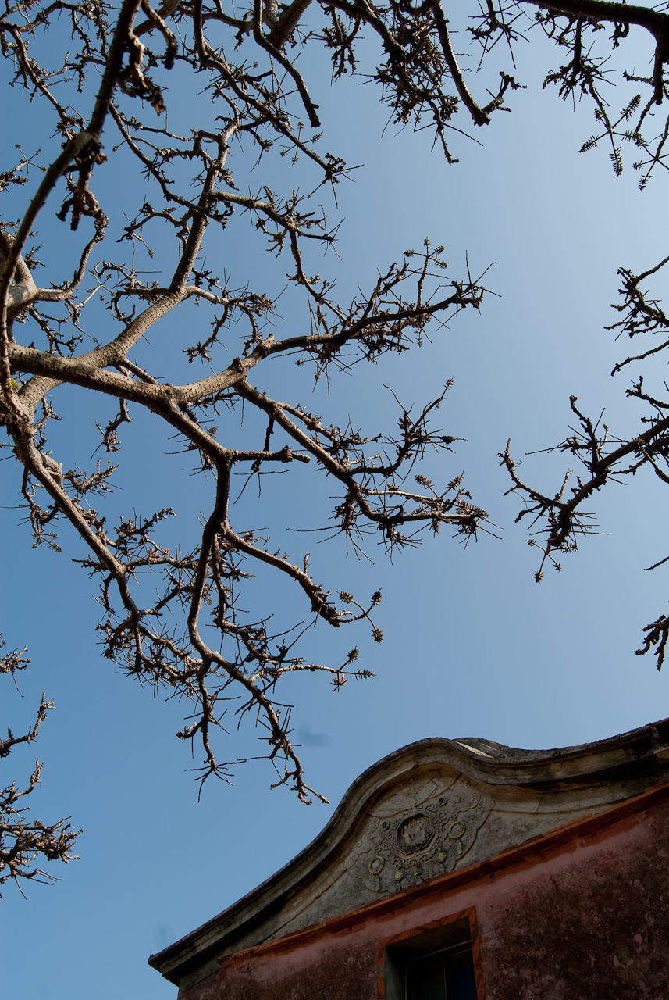
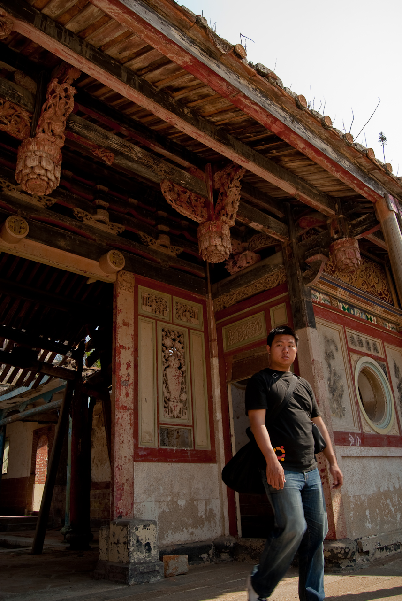
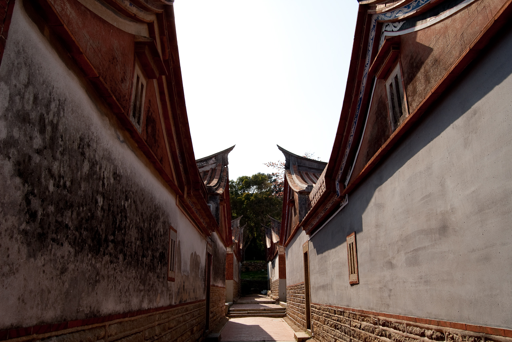
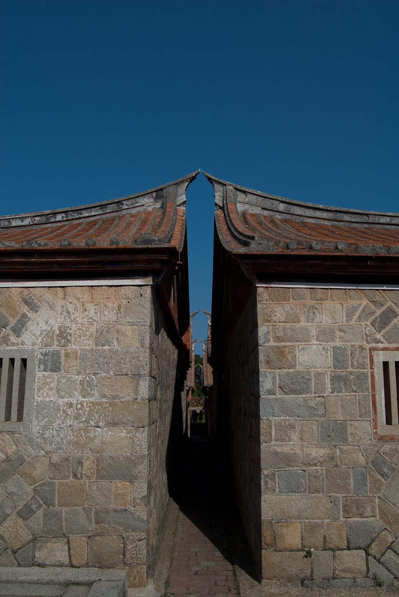
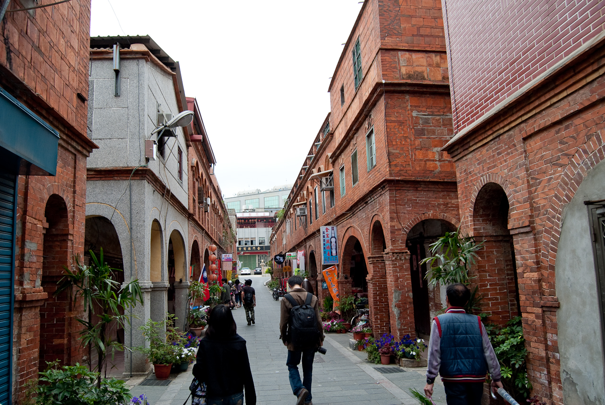

  
  
金門的傳統建築還蠻有特色的。不管是在規劃好的觀光地點，或是在人煙罕至的古厝都有濃濃的古老味。  
  
  
金門有不少廢棄的古宅，凋零的建築雜草叢生，或是重新規劃的教堂都帶點滄桑的感覺。  
  
其中金門有個規劃好的園區，裡面就都是金門傳統建築。裡面可以看得到金門建築都是以花崗岩作為建材，所以雖然砲擊很多，但卻難以攻陷。  
")  
")  
  
  
不過市區也是很有特色就是了，其中模範街（應該沒記錯吧？）兩旁的建築看起來都是比較老的。不過路上碎碎念的阿伯倒是說這邊變很多啦，呵呵。  
