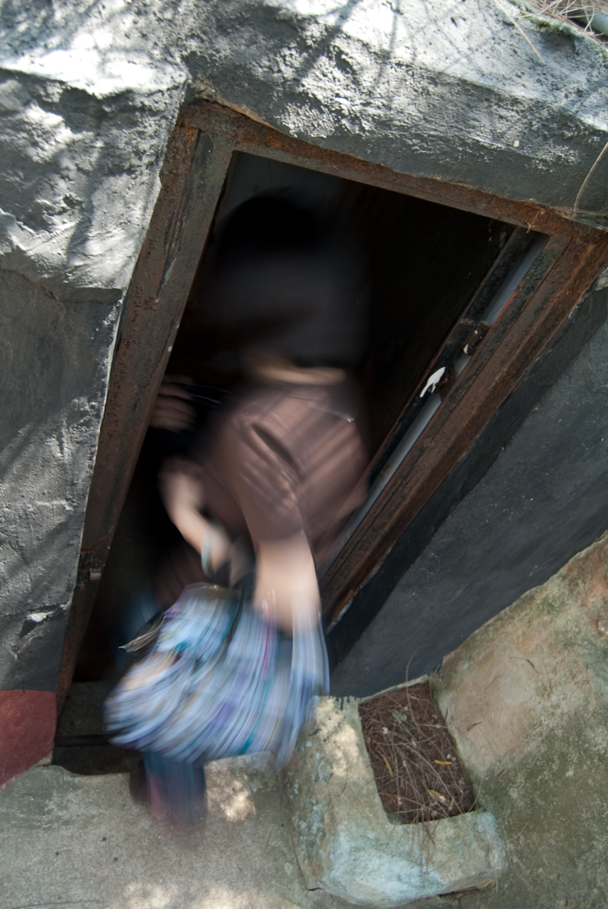
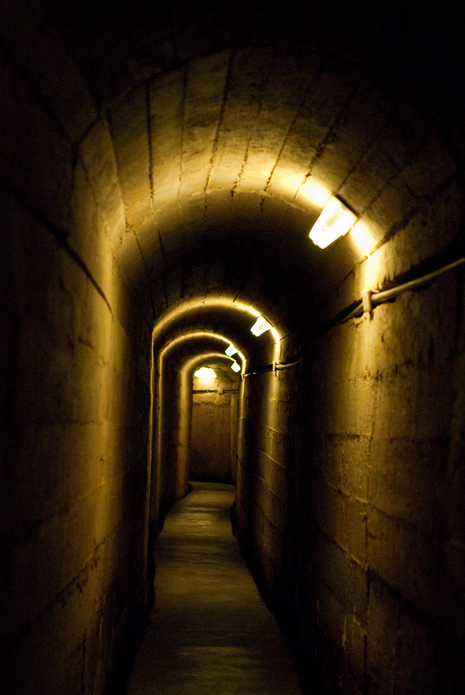
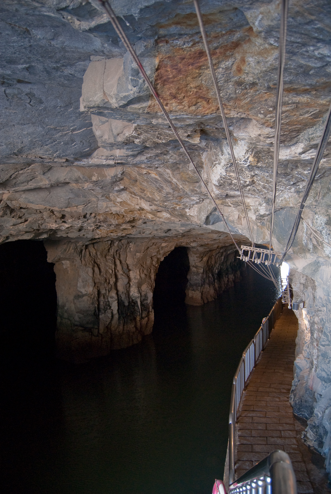
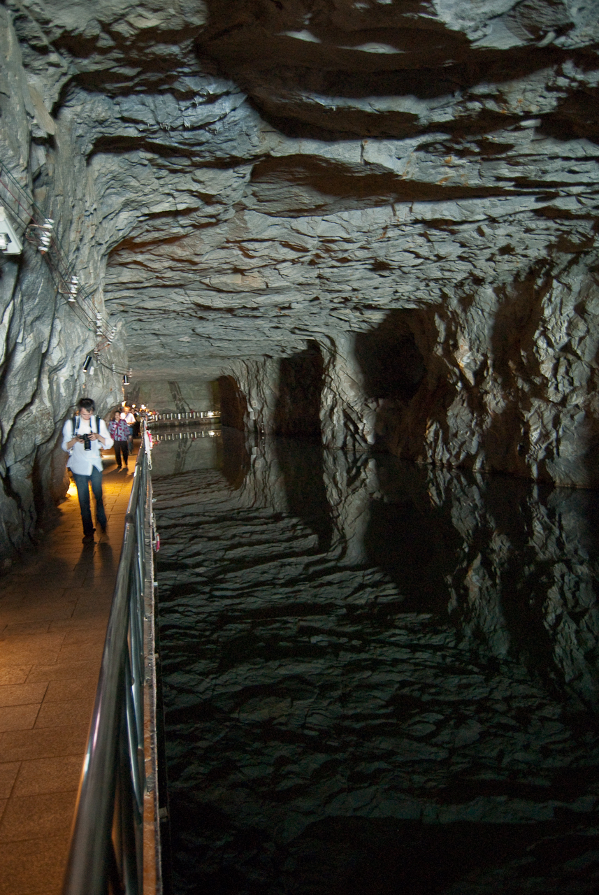

以往拿來抵擋老共的防禦工事，現在變成觀光景點，我們也去了幾個點逛逛（不然金門也沒那麼多地方好讓我們玩三天 XD)  
  
  
瓊林地下坑道是一個還蠻經典的景點。  
  
就算在裡面已經封住很多往其他地方的道路，光是遊客可以走的坑道就已經長得驚人。以前在面對老共轟炸的時候，這些花崗岩坑道應該幫了不少忙 :)  
  
小金門港口旁邊的小艇坑倒是我們第一個到的港口坑道，裡面真是大的嚇人  
  
用炸藥要弄出這種坑道花了不少力氣吧。而且裡面真的很壯觀，是金門必去的景點。  
  
而金門本島上也有類似的坑道，而且水面跟坑道壁面形成了倒影，超壯觀 :)  
