這次去加羅湖露營前，我們在大同派出所前原本決定要直接在柵欄處露營。不過路上經過的山青告訴我們夜間路程有點難走，所以我們又依照原訂計畫在四季國小過夜。簡單整理一下，大夥就在車上跟旁邊的涼亭睡了。不過事實證明不是個好主意，因為路上來回的車輛實在太吵了，應該要靠裡面一點睡的。不過除了幾次太吵被吵醒以外，倒是也睡得還蠻沉的。  
  
早上四點多大家就陸陸續續醒了，這個時候天剛亮呢。  
  
稍微整裝後，我們就開車前往車行終點 – 林道柵欄處前進。我想這個時候全員的心理跟裝備都已經準備好要承受第一次重裝登山的衝擊了吧？  
  
[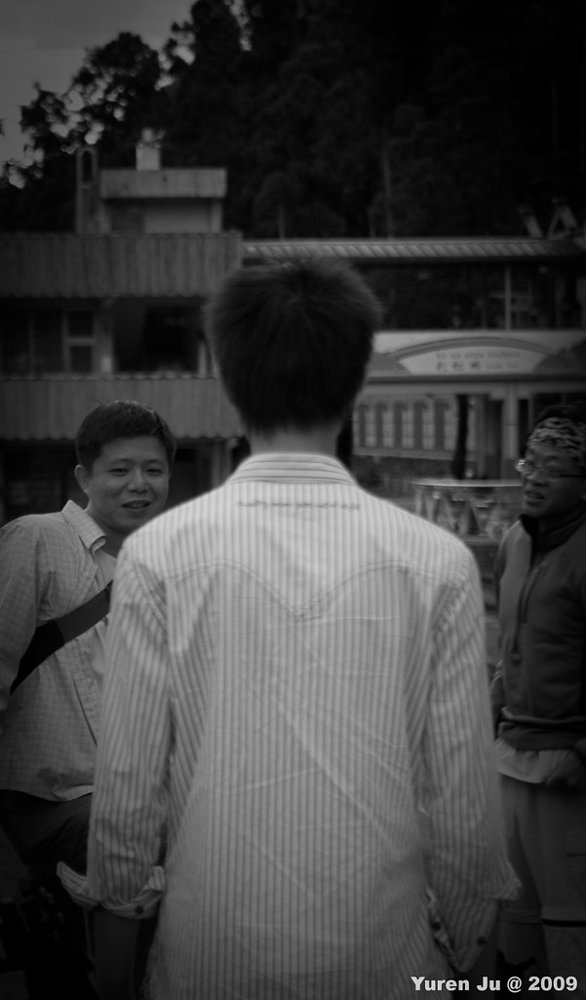](http://www.flickr.com/photos/yurenju/3694185867/ "Flickr 上 yurenju 的 閒聊")  
  
到柵欄處後開始整裝。這時 Payton 力勸 Kyozi 不要帶腳架上去。說實在的，在這種狀況多帶一公斤都會讓負擔增加很多。不過如果 Kyozi 有腳架上去照片會更讚吧 :D  
  
最終決定要帶什麼裝備上去後，大家就開始沿著林道往上爬囉！  
  
[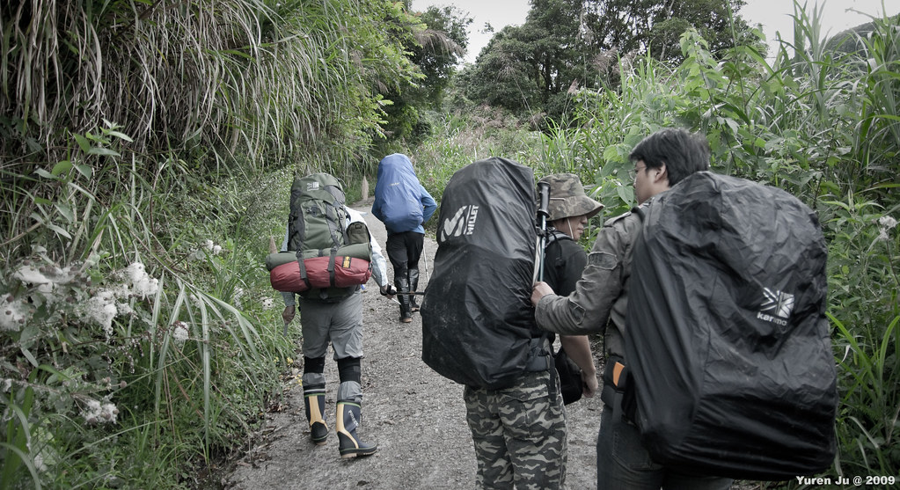](http://www.flickr.com/photos/yurenju/3709360853/ "Flickr 上 yurenju 的 YRJ_4208")  
這時大家身上都已經上重裝了。  
  
[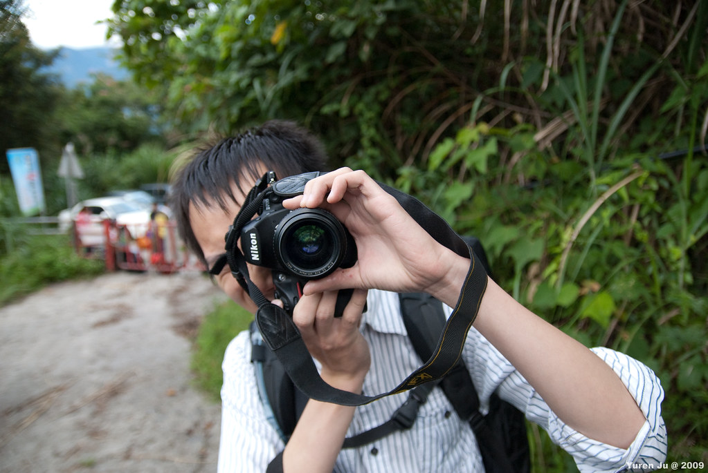](http://www.flickr.com/photos/yurenju/3694997894/ "Flickr 上 yurenju 的 剛走進柵欄，大家都還很開心")  
還看得到柵欄、剛開始走林道的時候，氣氛還非常的歡樂。  
  
[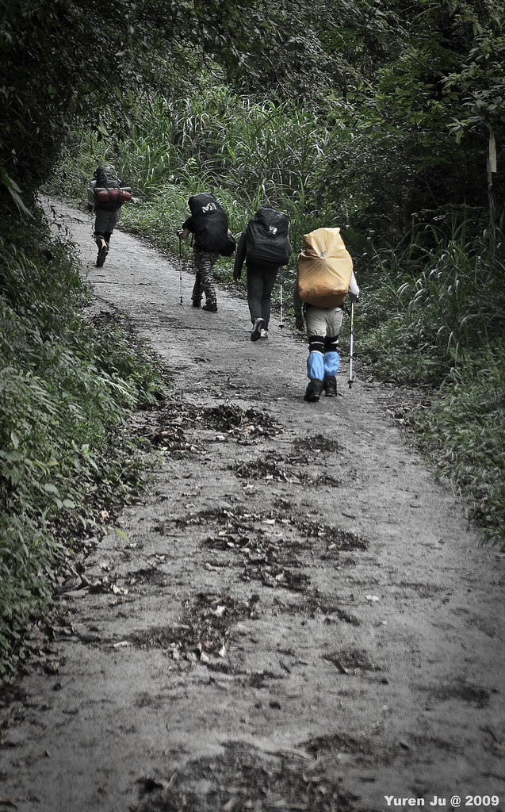](http://www.flickr.com/photos/yurenju/3709403295/ "Flickr 上 yurenju 的 林道前段路況不錯")  
大家就背著十餘公斤的重裝，開始往上爬。  
  
下一分鐘。  
[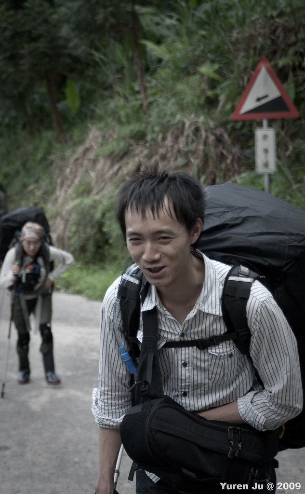](http://www.flickr.com/photos/yurenju/3710214854/ "Flickr 上 yurenju 的 剛爬沒幾分鐘，心裡頭油生著要回家的念頭吧")  
Chialin 說，她開始爬的第一分鐘就開始後悔了，我只能說我們還沒開始爬山，還在走林道阿。  
  
過沒多久…  
  
[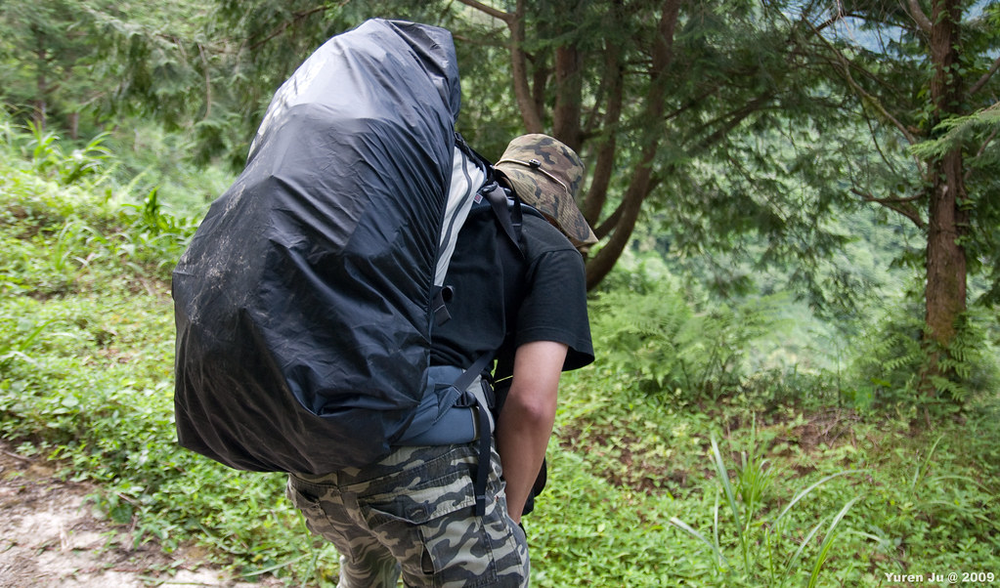](http://www.flickr.com/photos/yurenju/3709412913/ "Flickr 上 yurenju 的 YRJ_4224")  
志康先噴了，不過只是乾嘔而已，看起來是吃了早餐又激烈運動。  
  
雖然說很累，不過路上的風景還是很漂亮的。  
[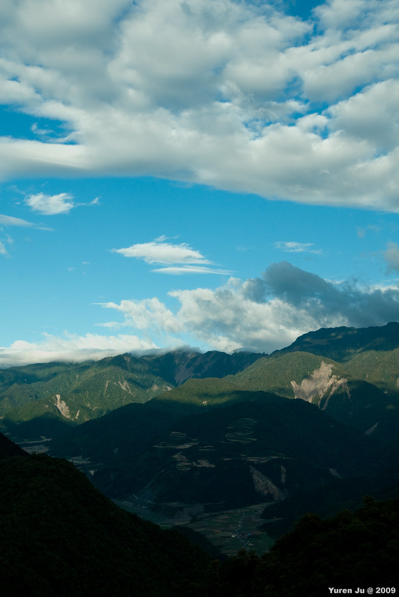](http://www.flickr.com/photos/yurenju/3711723698/ "Flickr 上 yurenju 的 天氣大好阿！")  
  
後來身體適應重裝運動的感覺後就好多了，走起林道也不會那麼痛苦。不過…  
[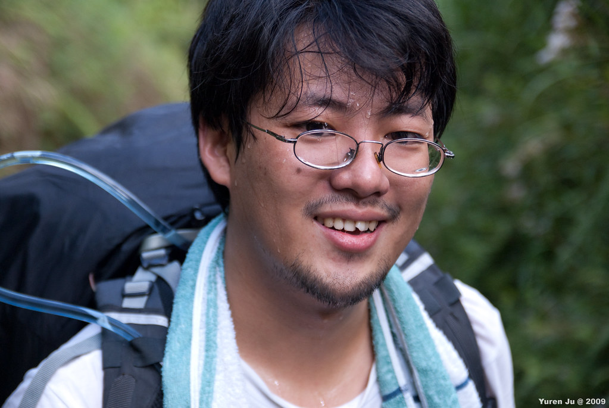](http://www.flickr.com/photos/yurenju/3694261673/ "Flickr 上 yurenju 的 輝哥你也太誇張了吧")  
輝哥。  
  
他因為太鐵齒，所以上山的時候背了一個約 2.5 公斤的西瓜。當我們大家都已經很習慣重裝運動時，他還是很累。路途到一半的時候，他就去草叢拉屎，過沒多久他也吐了。如此一來就構成上吐下瀉了。  
  
後來繼續往前走，陸續遇到兩個坍方處。  
[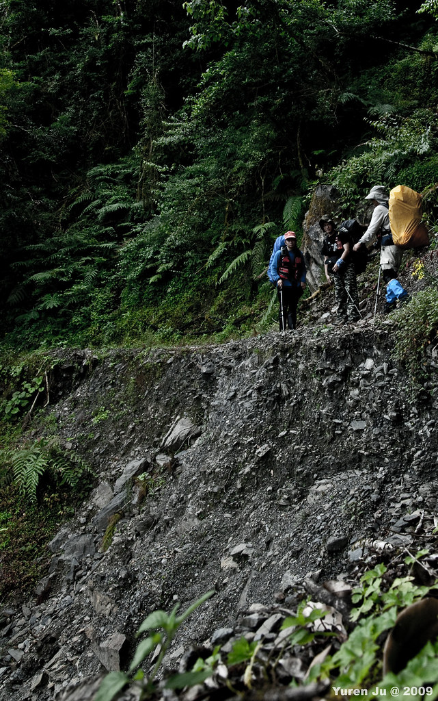](http://www.flickr.com/photos/yurenju/3709428467/ "Flickr 上 yurenju 的 坍崩處")  
  
後來就到加納富溪休息了。  
  
[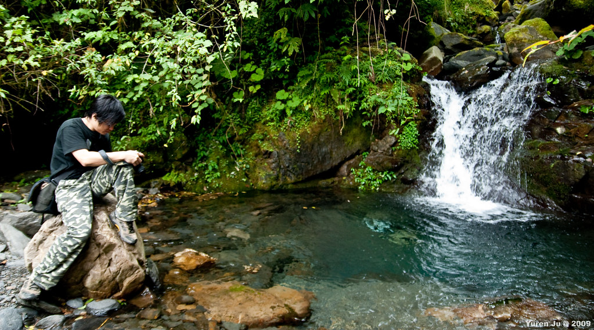](http://www.flickr.com/photos/yurenju/3710266732/ "Flickr 上 yurenju 的 YRJ_4279")  
  
吃掉輝哥為了讓大家在山上享用搞得很累的西瓜，泡在冰的溪水裡面更好吃。  
[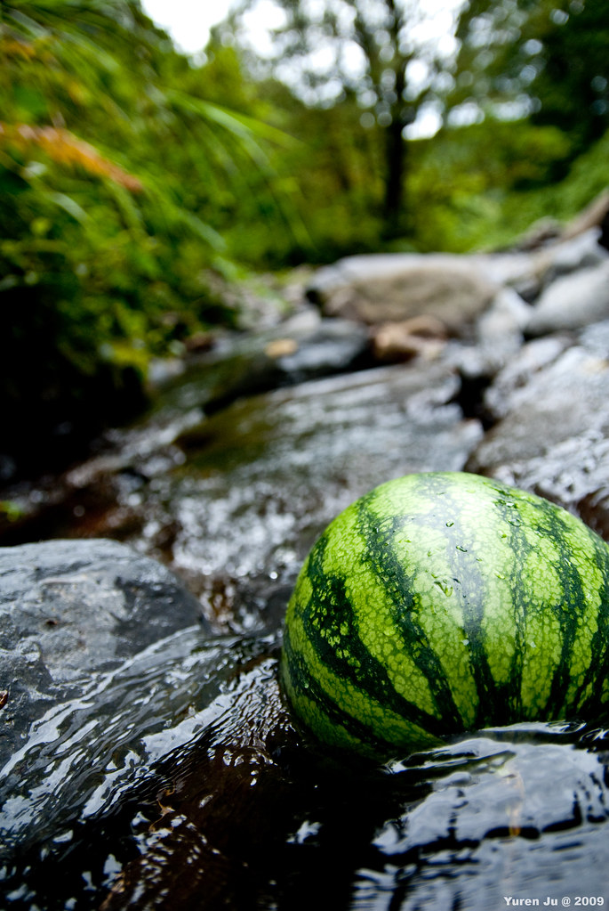](http://www.flickr.com/photos/yurenju/3711766390/ "Flickr 上 yurenju 的 輝哥貢獻的西瓜")  
  
吃早午餐之後，我們就終於要開始登山了，首先遇到的就是巨木登山口的下馬威～很陡的陡上。  
  
[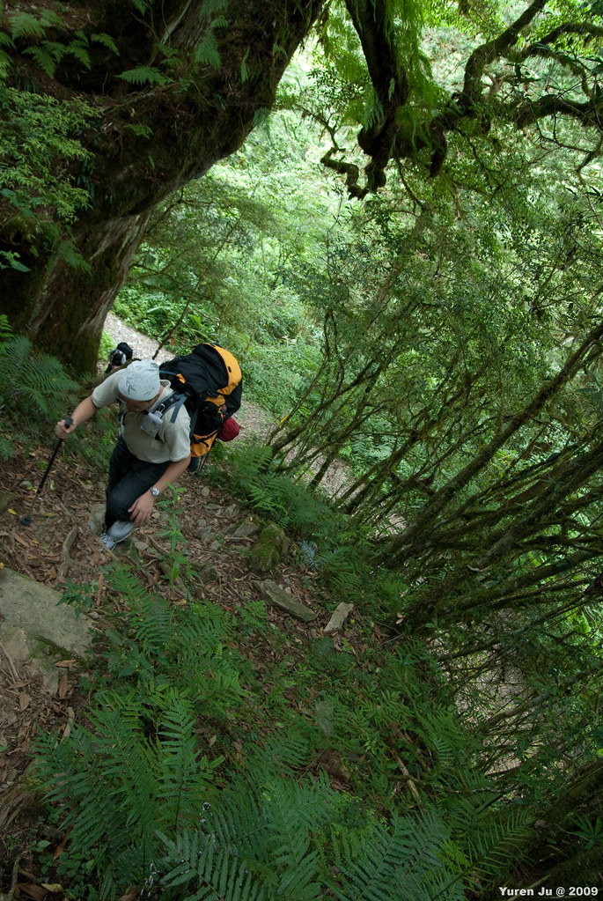](http://www.flickr.com/photos/yurenju/3695120924/ "Flickr 上 yurenju 的 剛到登山口就來個硬的")  
  
不過這當然沒有消耗我們拍照的欲望啦。這次總共有五台單眼（Nikon D700, D200x2, D80?, Olympus），兩台 Panasonic LX3，跟Sony T系列一台還有Payton的相機（不知道品牌）。照片的產量可不是蓋的。  
  
[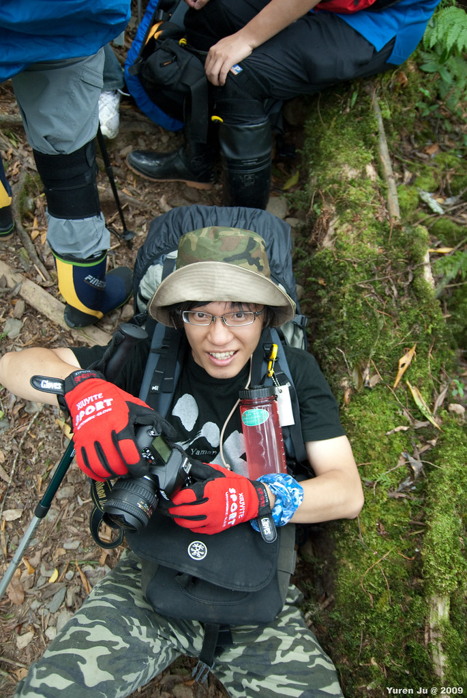](http://www.flickr.com/photos/yurenju/3694317649/ "Flickr 上 yurenju 的 Znikang!")  
  
前往加羅湖的路上佈滿樹根，它在陡上的路途中，幫助我們往上爬。  
  
[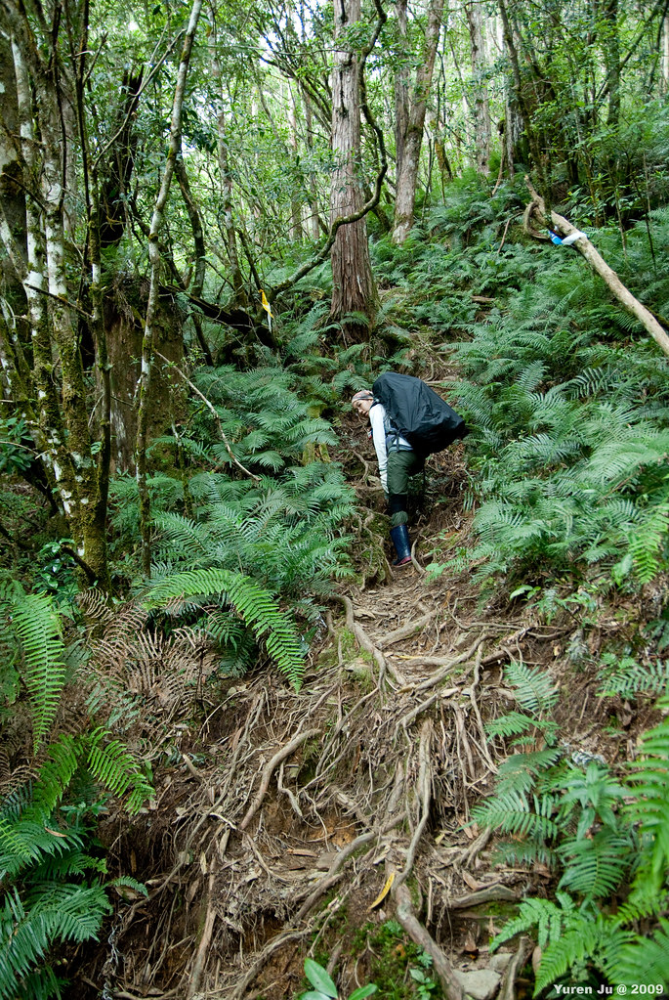](http://www.flickr.com/photos/yurenju/3694353153/ "Flickr 上 yurenju 的 chialin 這次很厲害，水跟食物都是自己背的喔")  
  
中間我們也休息了很多次。Chialin 休息時都不放掉背包的。  
[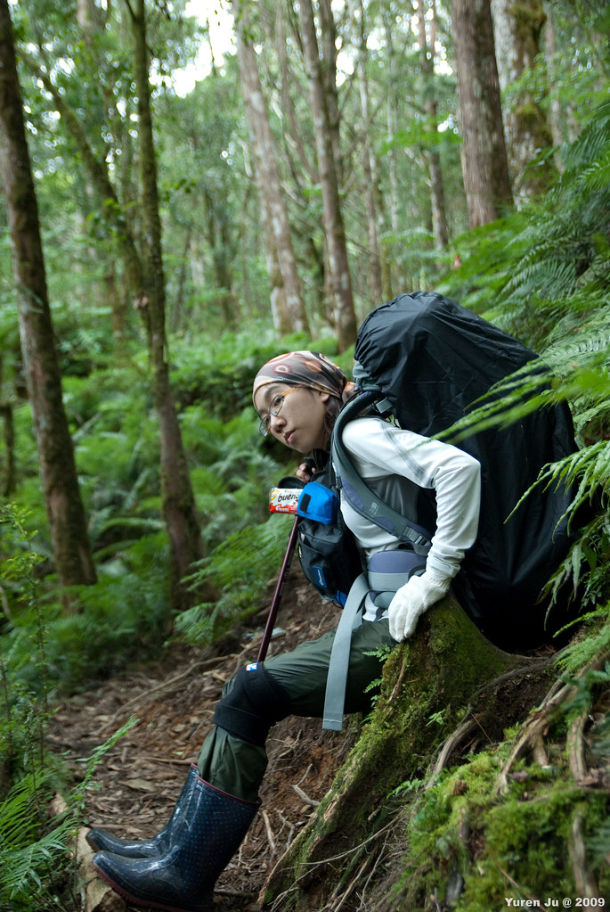](http://www.flickr.com/photos/yurenju/3695172350/ "Flickr 上 yurenju 的 chialin 你出場的照片太多囉")  
  
每次休息的時候大家都攤在地上，哈。  
[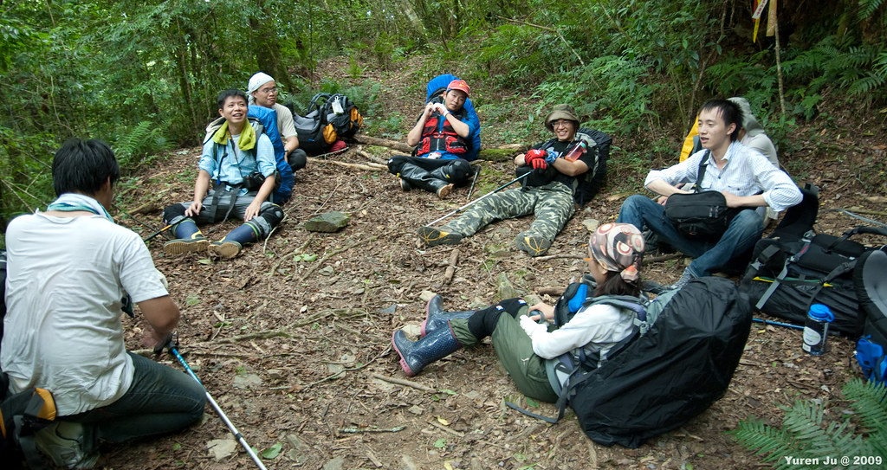](http://www.flickr.com/photos/yurenju/3709485179/ "Flickr 上 yurenju 的 大家都攤了，哈")  
  
經過數個小時的奮鬥後，我們終於戰勝密集的等高線，到了接近山頂的地方。而在這個地方行走的感覺跟密集等高線又有不同的痛苦…。  
  
這邊的芒草跟箭竹都跟人一樣高，不停的從臉上與手邊刮過會快速的消耗你的毅力。雖然這段路非常平坦，但是還是走得很辛苦。  
  
  
這是走這段路的標準裝扮：帽子、頭巾跟登山杖。簡而言之，把盜賊的技能點滿就是了，感謝 Znikang 很標準的示範。  
  
過沒多久後，我們就走到加羅湖囉！大家趕快換上輕裝、把帳篷搭一搭。這個時候我們就展開了MORPG (多人 Offline RPG)『Payton 的奇幻冒險』前往探索附近的其他湖泊。但過了一小時多候，我們開的這個副本全部的人都被打掛了，所以我們又回到了營地…。在這個路程中，我們沒有看到任何一個湖。  
  
回來之後，就開始生火煮飯了。Chialin 這個時候使用了她的技能『用看的生火』僅僅用眼睛注視，就把營火升起來了！  
[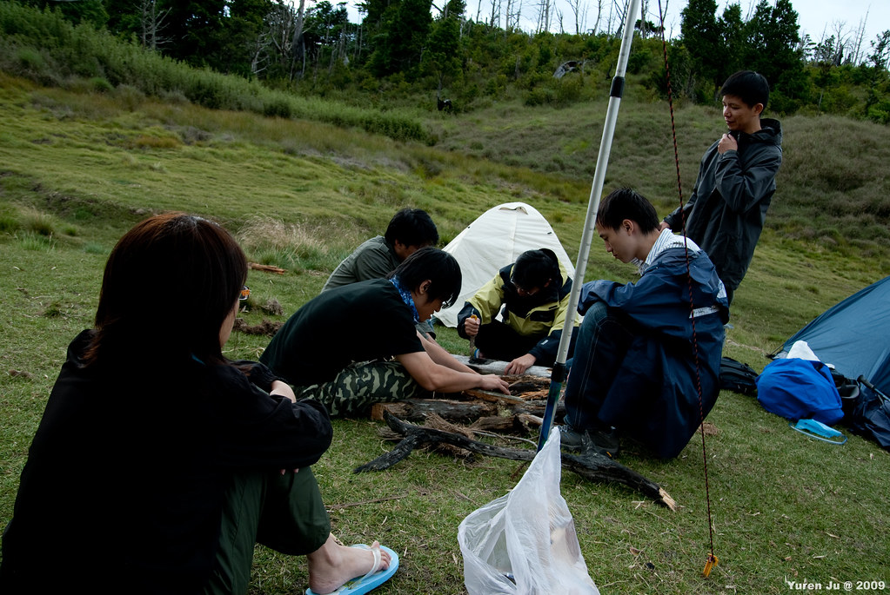](http://www.flickr.com/photos/yurenju/3695212930/ "Flickr 上 yurenju 的 用看的生火…")  
[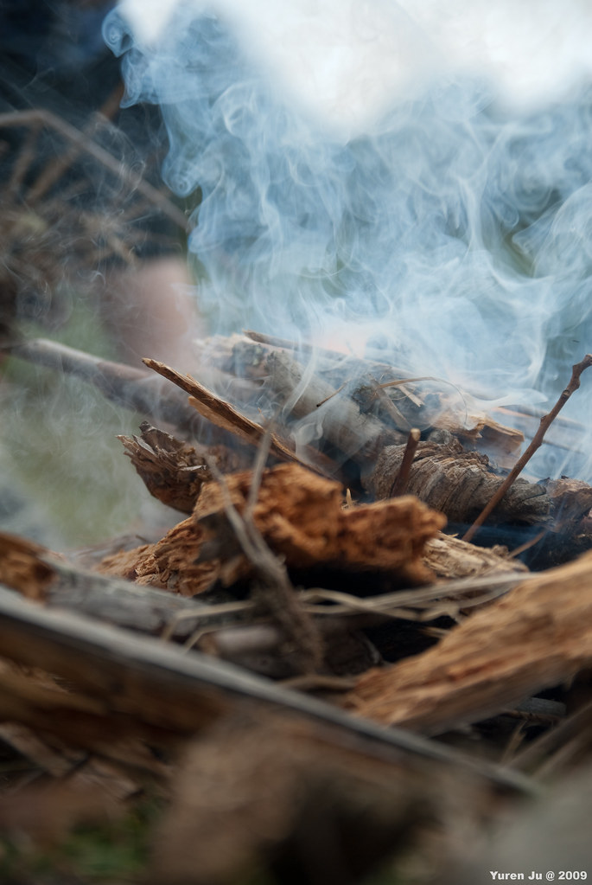](http://www.flickr.com/photos/yurenju/3710961719/ "Flickr 上 yurenju 的 升起來囉！")  
  
接下來就開始吃吃喝喝啦。這次大家真的帶了過多的時候，讓晚餐實在吃得超飽的阿！  
[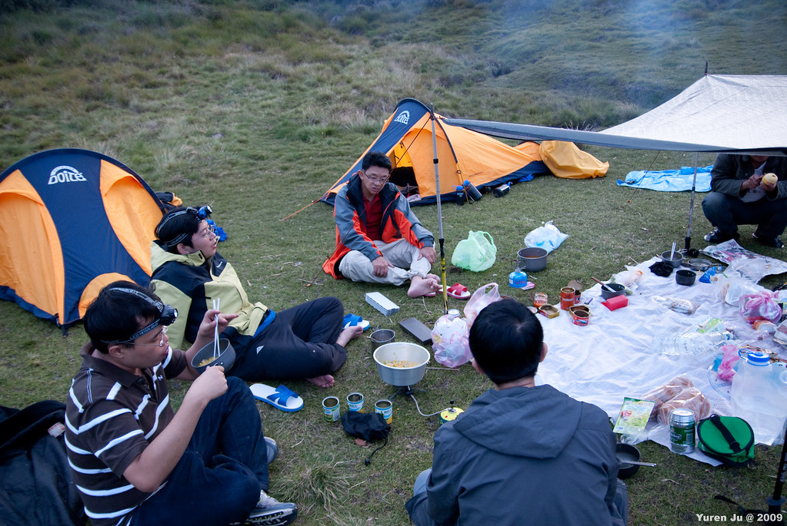](http://www.flickr.com/photos/yurenju/3694421963/ "Flickr 上 yurenju 的 吃飽喝足了")  
  
這次有兩樣食物真的讓我印象深刻。第一個是 Merck 提供的海尼根，飯後喝個一點真的超棒的！第二個是 Payton 提供的臘腸，又老又鹹，不管是用煎的還是用水煮的都很難入肚。  
  
第一天的行程就差不多這樣到了尾聲囉。