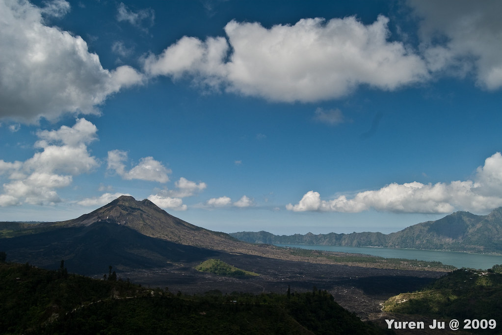
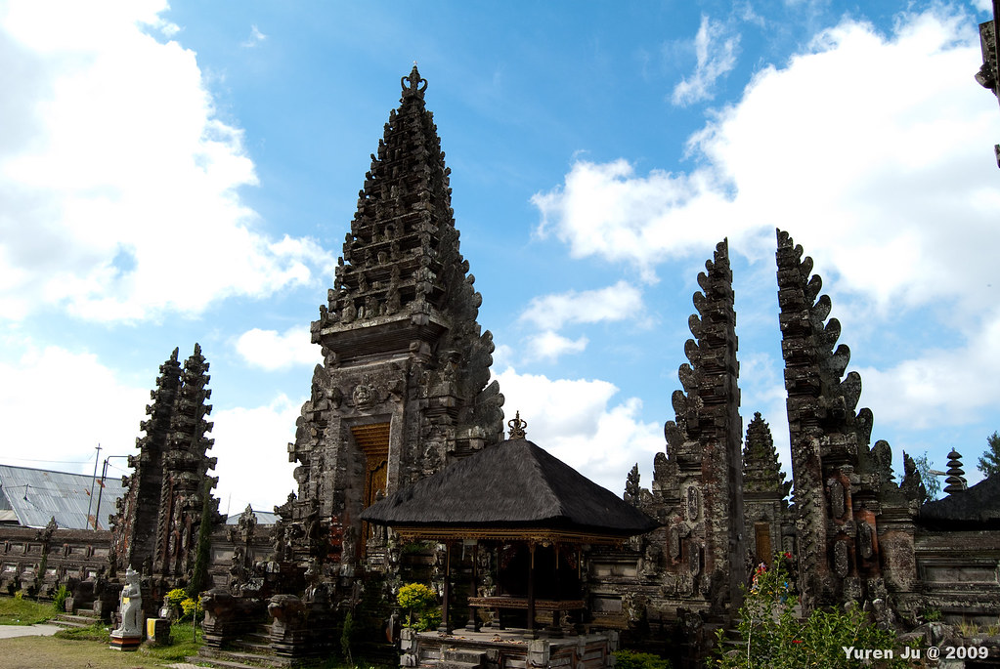
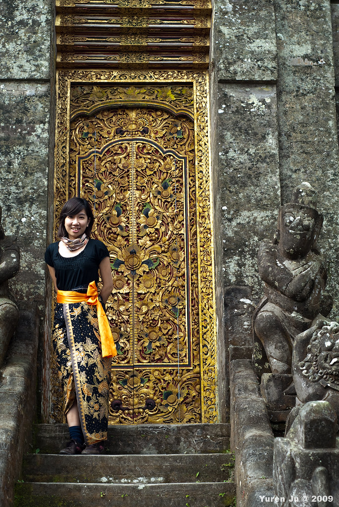
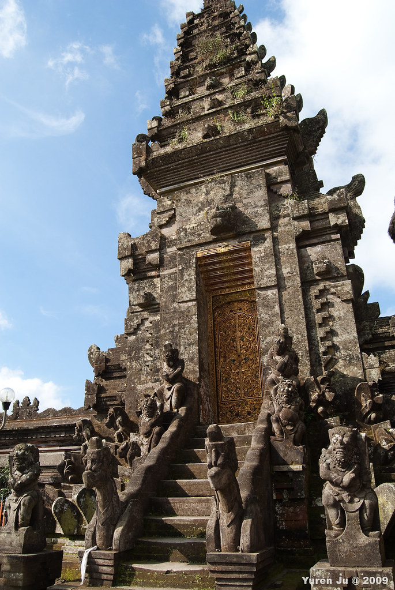
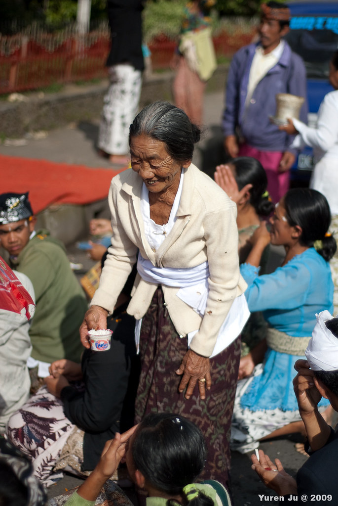
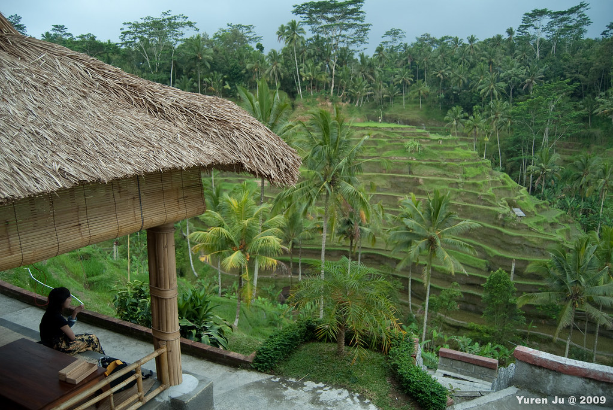
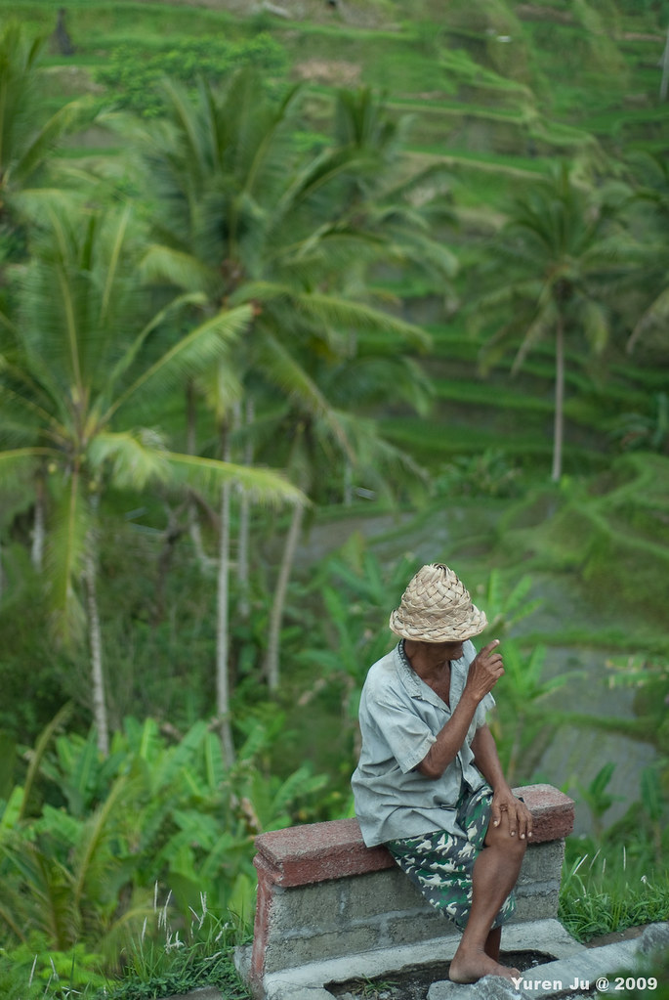
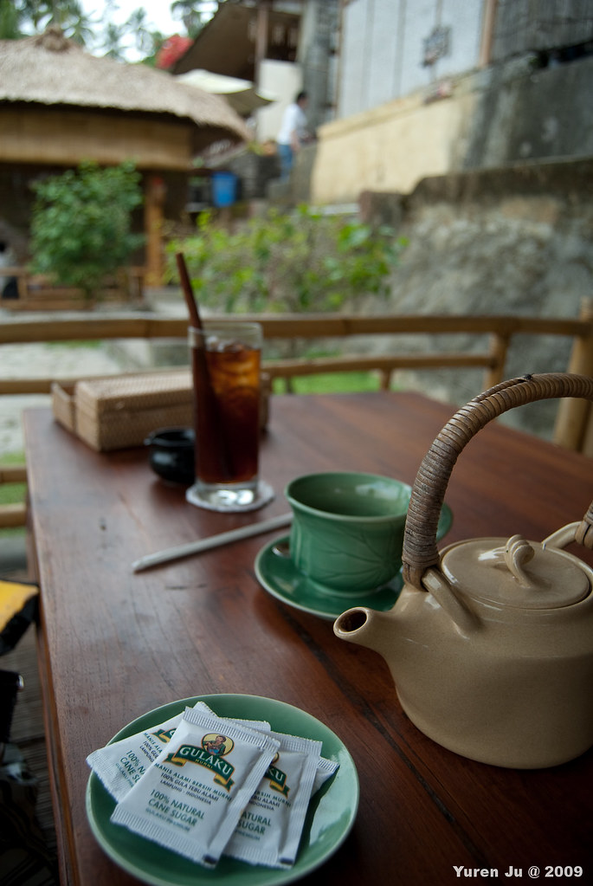
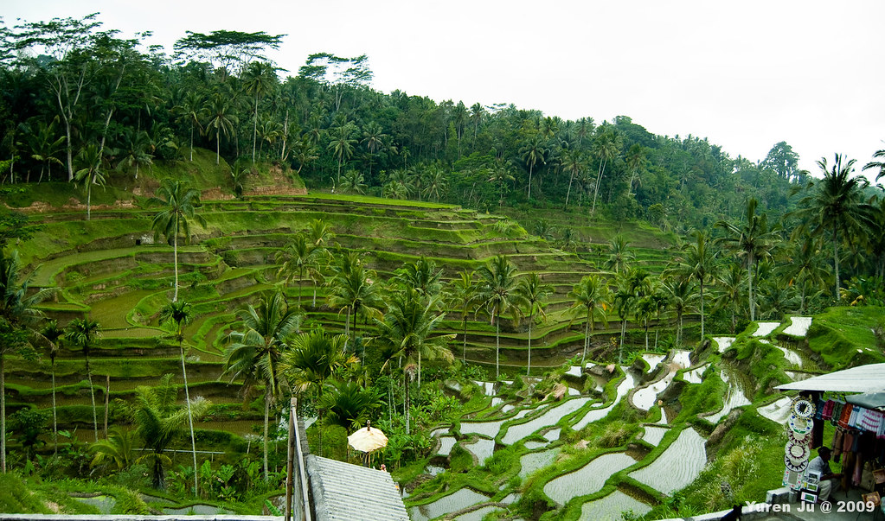
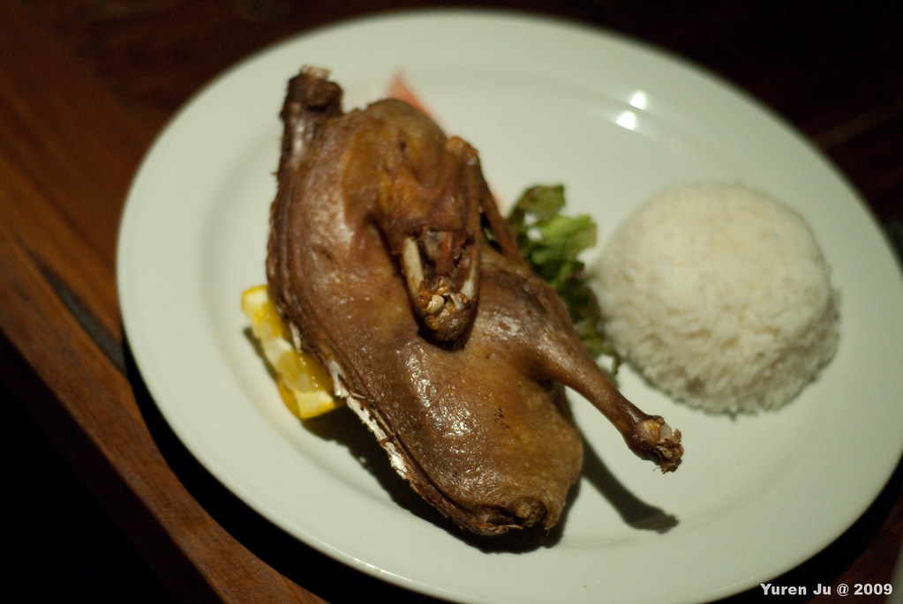

約莫兩點，我們到了巴杜火山旁的一間餐廳，在這邊享用吃到飽的午餐，而旁邊就是巴杜火山。  
  
很幸運的，今天天氣很晴朗。Widi 說很多旅客到這邊卻什麼都沒看見，常常是起大霧的的天氣。不過這種景就是很難拍阿。哪位大大教一下吧…。  
  
  
  
照片實在沒辦法拍出火山壯觀的感受，不過我們在這邊吃午餐 + 下午茶的感覺真的很悠閒。餐廳的海拔大概是 1,400 公尺左右，天氣比起平地要涼的多。而一邊吃飯喝茶，旁邊就是壯觀的火山還是讓人心曠神怡阿。  
  
接著我們到了就在餐廳附近的巴杜廟 (Pura Ulun Danu Batur)  
  
  
  
  
  
  
  
這個門雕的真的非常的美麗。Chialin 的沙龍跟金色的門也很搭。  
  
  
  
很可惜的是一般遊客只能到廟前的廣場而已，裡面應該是只有信徒才可以進去（吧）  
  
  
  
我們出去的時候，外面正好在拜拜，這位老婆婆正在幫信眾的頭上黏米  
  
  
  
來巴杜廟真是對的選擇，這邊幾乎沒什麼遊客，但是廟卻是壯觀的驚人。雖然沒辦法進去，但是還是蠻棒的。  
  
最後我們到了 Tegalalang (德戈拉朗)，我們在一大片梯田前面，喝著下午茶。  
  
  
  
農夫  
  
  
  
我們喝的東西。出國買吃的東西，最好是點你知道是什麼的東西。我跟 chialin 胡亂點了兩個茶類，結果一個是薑茶，另外一個是肉桂茶（這兩個我都很討厭）。  
  
  
  
喝完下午茶後，今天的行程就結束囉！  
  
  
  
最後晚上我們回到 Ubud 市區，吃了髒鴨飯後 Ending 了。  
  
  
  
\[update\]  
補上地圖  
  
在較大的地圖上查看[2009 峇里島 day 2](http://maps.google.com.tw/maps/ms?ie=UTF8&hl=zh-TW&brcurrent=3,0x3442ae17715a4b9f:0xbaeaecff55cfad73,1&msa=0&msid=102940795217138094975.000472ea59f57103136df&ll=-8.431621,115.328979&spn=0.543377,1.098633&z=10&source=embed)  
  
後記  
  
在 Tegalalang 這個該死的農夫幫他拍照還跟我要錢，最後給他 1,000 Rp, 約台幣三塊錢。在峇里島只要跟你招手的絕對都要錢，除非他跟你說是 free 的。