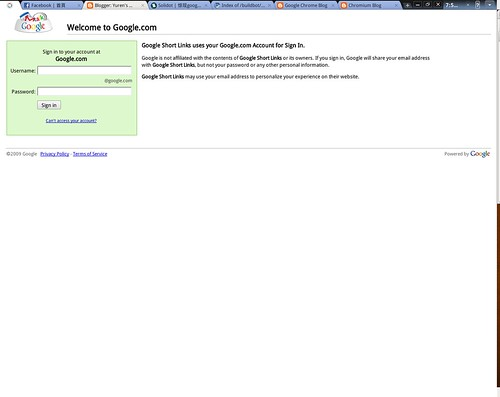
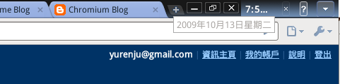
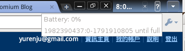
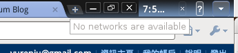
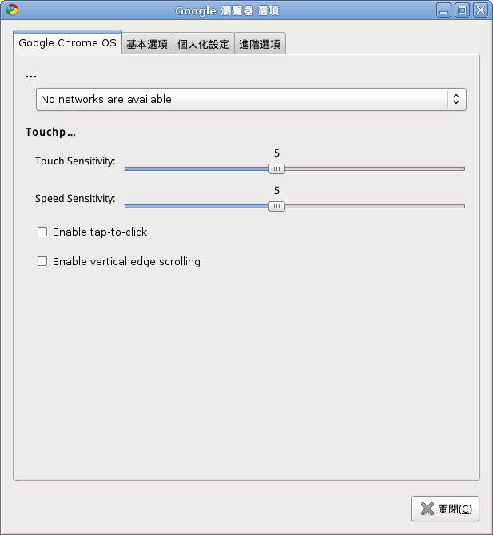

這算是八卦吧。  

  
  

[solidot 的一篇文章](http://linux.solidot.org/article.pl?sid=09/10/13/0921225)指出 Google Chrome 的開發網站 chromium 目前可以下載到客制化版本的 Google Chrome，網址為：  
[http://build.chromium.org/buildbot/snapshots/chromium-rel-linux-](http://www.blogger.com/goog_1255434724784)**[chromeos](http://www.blogger.com/goog_1255434724784)**[/28808/](http://build.chromium.org/buildbot/snapshots/chromium-rel-linux-chromeos/28808/)  
  
  
看檔名感覺起來好像是跟 chrome OS 相關的東西。下載之後執行起來的結果跟一般的 chrome 差不多，不過多了幾個東西。根據以下的不同，我想可以合理的懷疑這是 Google Chome OS 之後會採用的客制化 chrome browser。  
  
  
首先，左邊多了一個登入 .google.com 的 tab。  

  
  
右上角多了時間  
  
  
電池  
  
  
網路  
  
  
選項裏面則可以調整 touchpad  
