從上次 Kyozi 跟 Znikang 開貨車從台北殺到屏東東港的 [2006 年東港迎王](http://yurenju.blogspot.com/2006/10/blog-post_22.html)，事隔三年，我們又再度參與了這個活動。回去看以前的照片真是青澀的可以阿。  
  
這次請了一天的特休回去看禮拜五的儀式。依照[行程](http://20091010.blogspot.com/2009/09/blog-post_15.html)禮拜五是王船繞境，早上就先去東隆宮看看有啥東西。  
  
去的時候正在進行儀式，不過沒翻什麼資料，所以不知道儀式內容 = =  
[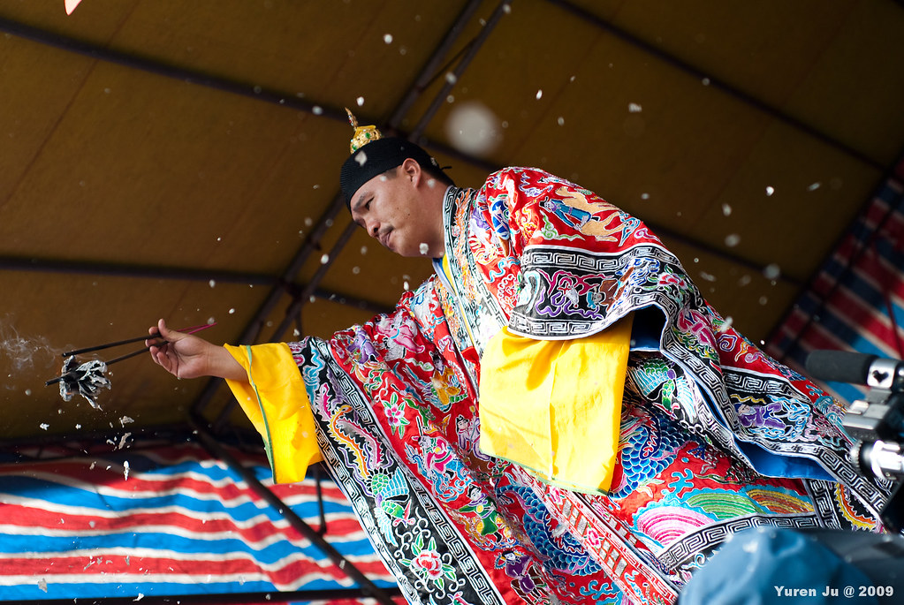](http://www.flickr.com/photos/yurenju/4025660639/ "Flickr 上 yurenju 的 飄散")  
  
  
  
是真的道士，鄉土劇裡面演的道士沒有這麼有氣勢吧，哈。  
[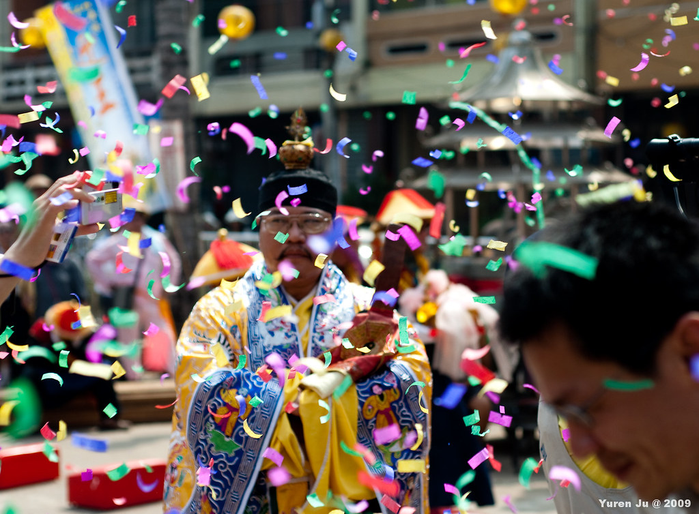](http://www.flickr.com/photos/yurenju/4026432072/ "Flickr 上 yurenju 的 師公")  
  
參與活動的有很多是老杯杯。  
[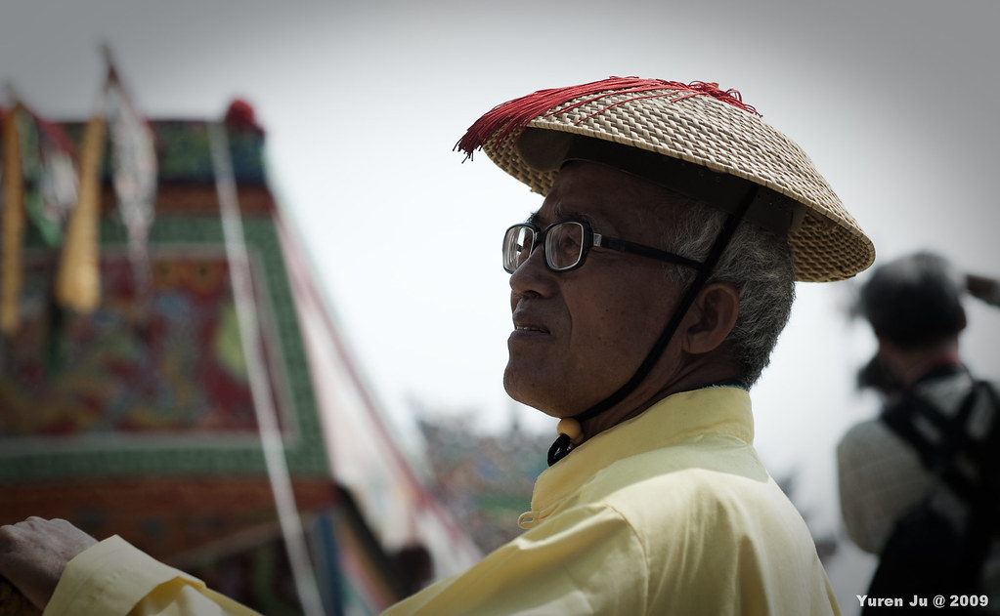](http://www.flickr.com/photos/yurenju/4026433256/ "Flickr 上 yurenju 的 憂國憂民")  
  
看完前面的儀式，走一下東隆宮我就回來吃飯了。中餐後去陳爸爸家坐一下，就到東隆國小前面等王船繞境過來。  
  
台灣民俗活動嗩吶是一定要的  
[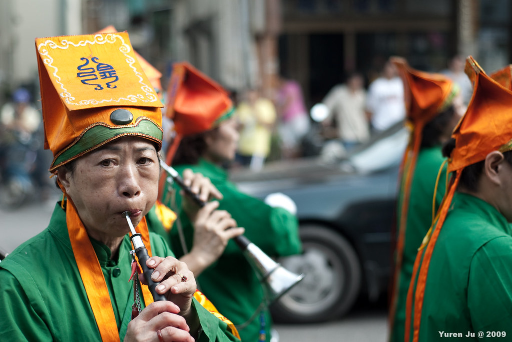](http://www.flickr.com/photos/yurenju/4025680719/ "Flickr 上 yurenju 的 嗩吶")  
  
王船  
[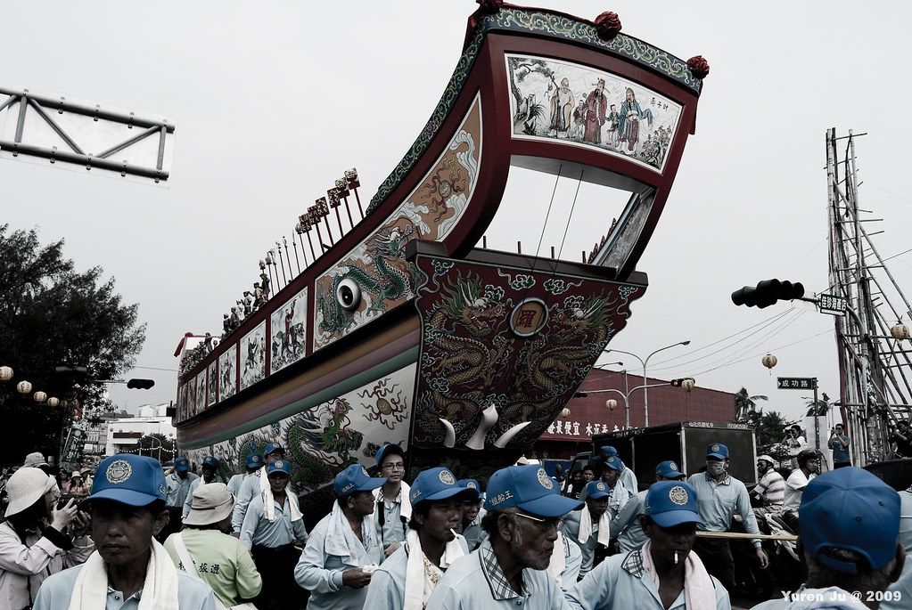](http://www.flickr.com/photos/yurenju/4025682967/ "Flickr 上 yurenju 的 王船")  
  
後來又一路上跟著到豐魚橋跟 Clouser 會合，他拿 70-300mm 在超遠的地方拍阿 XDD，我拿 50mm 可沒辦法退到這麼遠，哈…。後來我們就先回我家聊天喝茶順便等 chialin 一黨人從台南來。這次真的等超久的，早知道中間就先睡一覺。  
  
載 chialin, 兔兔跟康姐到東港後我跟老哥先帶他們去家裡附近的熱炒店吃飯，剛好 kyozi 他們也從台北到東港了，就一起吃個飯，稍作休息就衝啦。  
  
成員介紹：小銘、kyozi、志康、輝哥、chialin、康姐、兔兔，當然還有我啦。Clouser 跟阿貓我沒拍到他們 XD  
[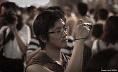](http://www.flickr.com/photos/yurenju/4025695145/ "Flickr 上 yurenju 的 小銘")[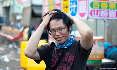](http://www.flickr.com/photos/yurenju/4025707485/ "Flickr 上 yurenju 的 花輪: Hi baby")[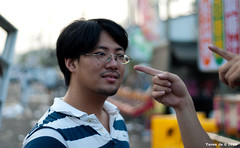](http://www.flickr.com/photos/yurenju/4025707967/ "Flickr 上 yurenju 的 人是他殺的")[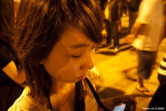](http://www.flickr.com/photos/yurenju/4027192895/ "Flickr 上 yurenju 的 YRJ_6043")[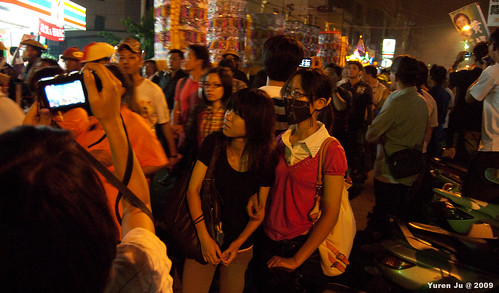](http://www.flickr.com/photos/yurenju/4026452540/ "Flickr 上 yurenju 的 好像到了另外一個國度的兩個人")  
  
在東隆宮待沒多久王船就出發囉。  
[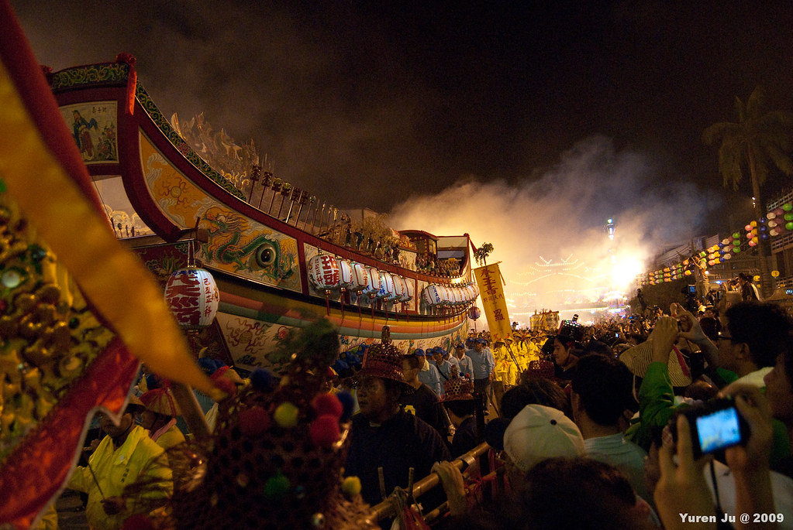](http://www.flickr.com/photos/yurenju/4026450516/ "Flickr 上 yurenju 的 王船出發")  
[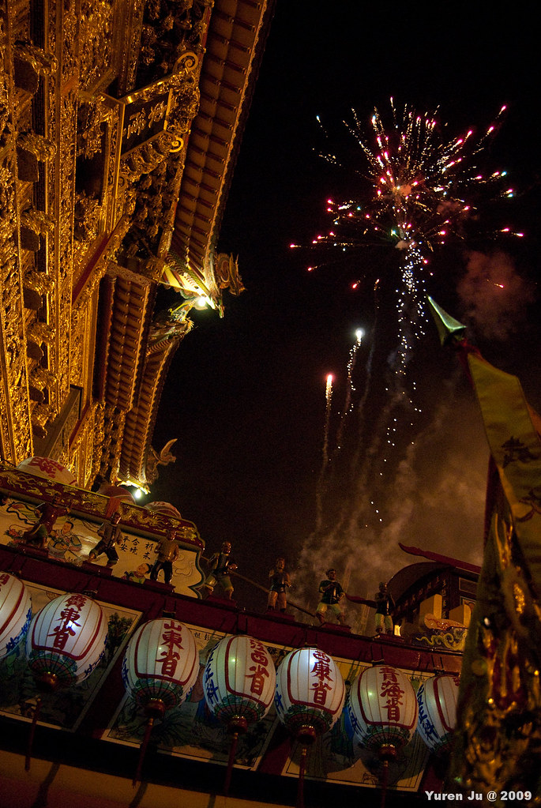](http://www.flickr.com/photos/yurenju/4026451244/ "Flickr 上 yurenju 的 煙火。")  
  
當然鞭炮煙火是少不了的，一路上都是。  
[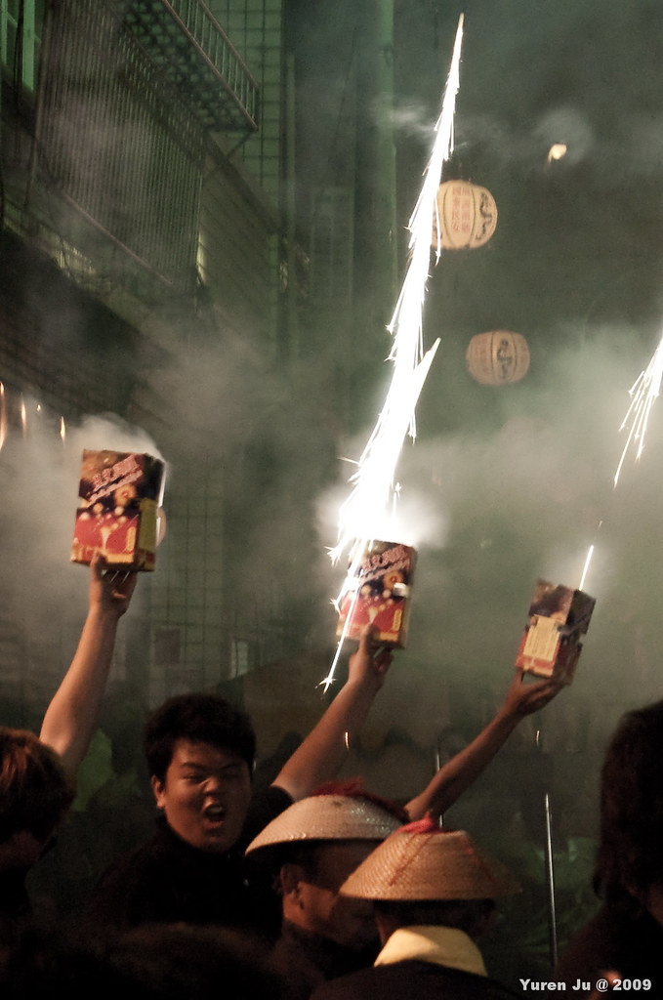](http://www.flickr.com/photos/yurenju/4025698623/ "Flickr 上 yurenju 的 看起來很刺激")  
  
最後走到了鎮海公園準備送王。這時候就進入了漫長的等待，中間我還偷睡了一下下。有了爬山的經驗後，就知道黑色大塑膠袋的好用，我們帶了兩個鋪在地上就坐下了，反正要等很久。到了五點多，人潮瞬間往外移動，就時候就知道要開始燒王船了。過沒多就鞭炮聲大響，下面的金紙慢慢的燒起來，靠杯的是我們站在下風處，好囧阿。所以就開始移動拍照，到另外一邊後鞋子褲子都濕了。  
  
[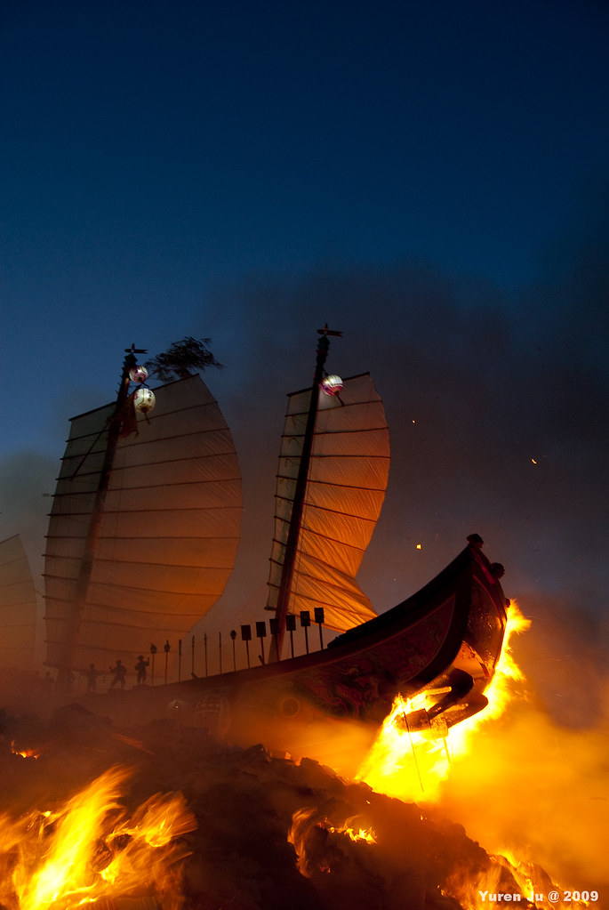](http://www.flickr.com/photos/yurenju/4026458216/ "Flickr 上 yurenju 的 燒王船 (I)")  
[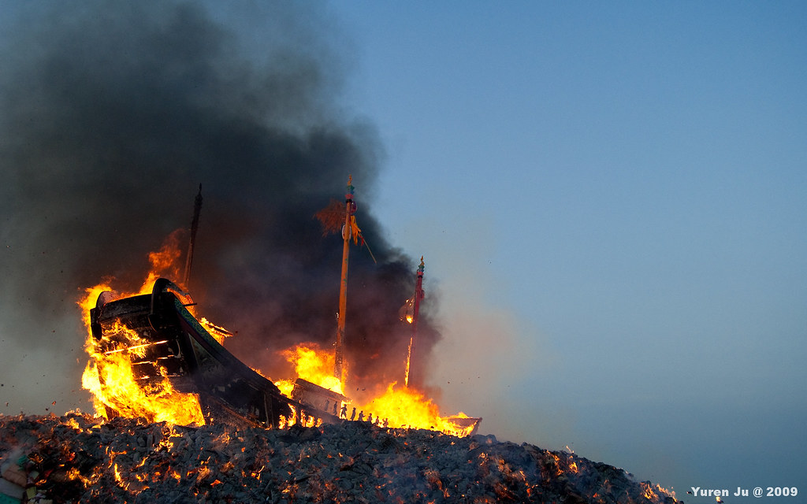](http://www.flickr.com/photos/yurenju/4025706263/ "Flickr 上 yurenju 的 燒王船 (III)")  
  
拍完照後，跟往常一樣天已經亮了，大家也蠻累的。  
[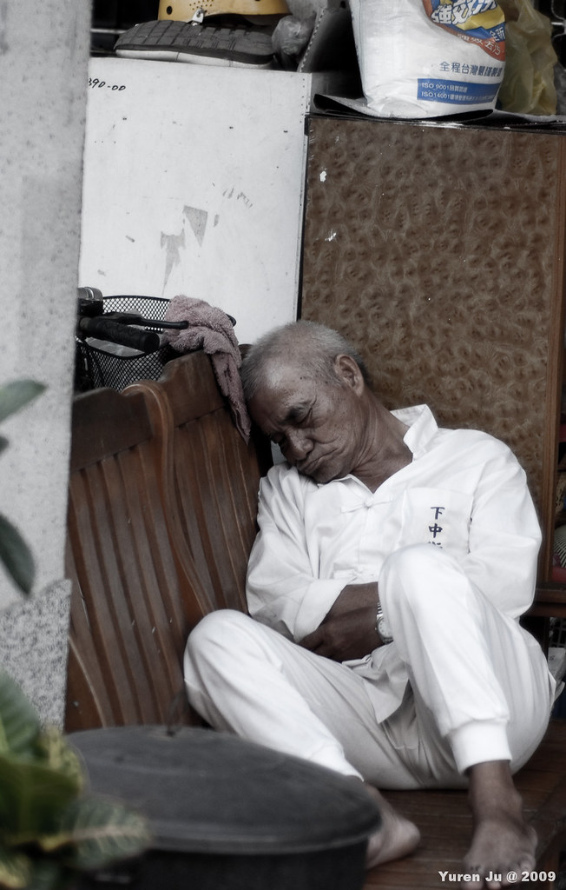](http://www.flickr.com/photos/yurenju/4025708419/ "Flickr 上 yurenju 的 累了")  
  
[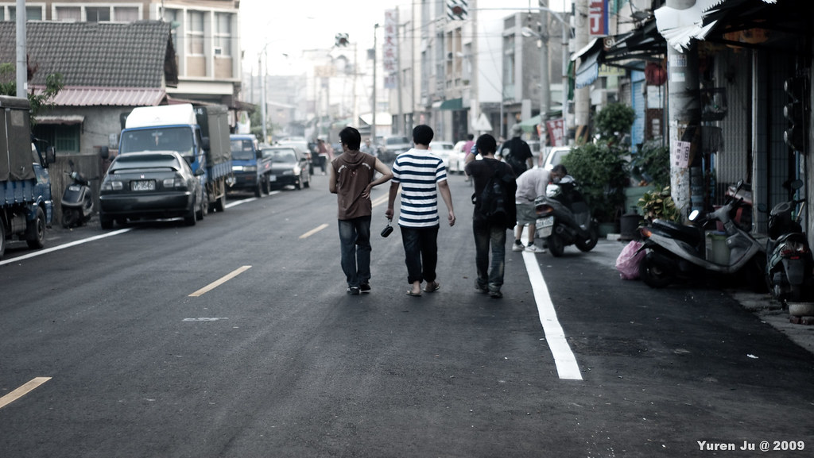](http://www.flickr.com/photos/yurenju/4026462080/ "Flickr 上 yurenju 的 歸途")  
  
走路回家後，就先在我家睡一下。中餐當然還是到亞士都餐廳吃飯。接下來 kyozi 他們去高雄繼續玩，我載 chialin 一黨人去左營坐車後這趟旅程就結束啦。  
  
這次感覺還不錯，不過下次真的要看請神啦。送王已經看了三次了。我想第一天的感覺一定跟最後一天差很多。不過下次也是三年後的事情囉。  
  
\[update\]  
[照片 slideshow 在這](http://www.flickr.com/photos/yurenju/sets/72157622618639230/show/)