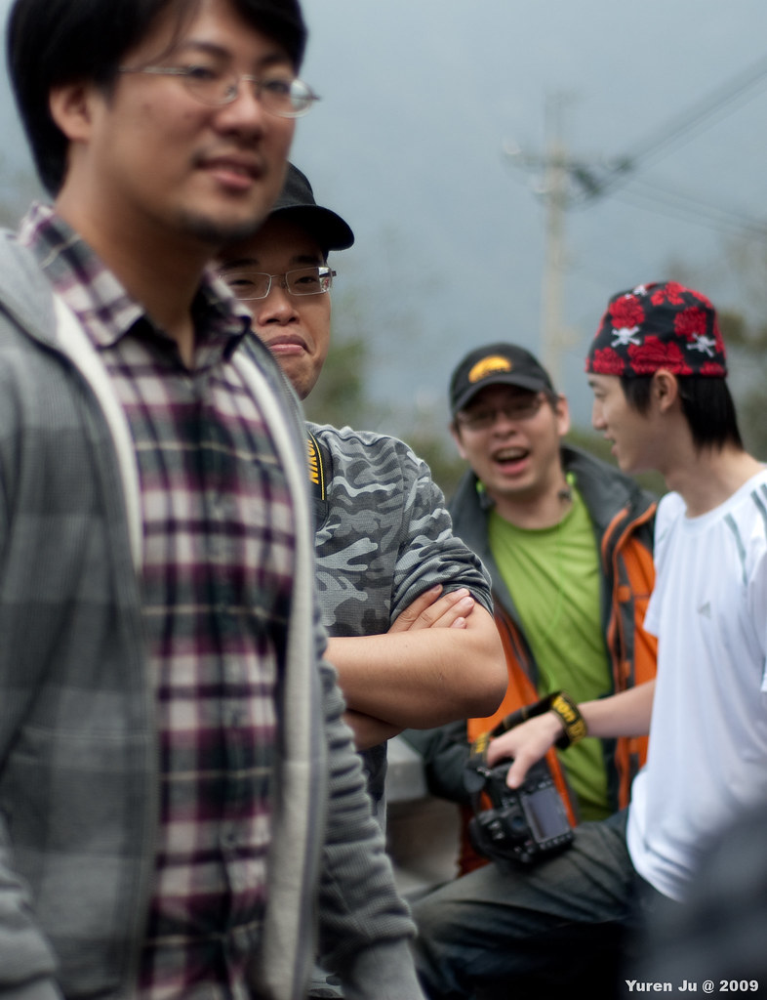
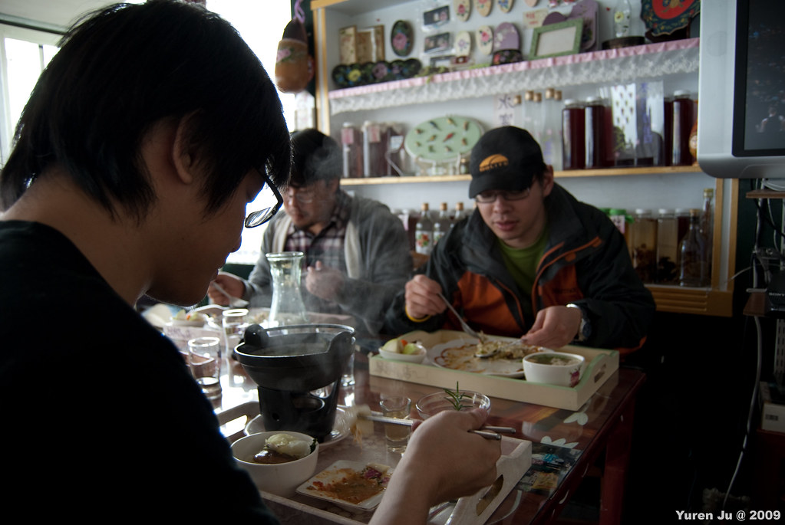
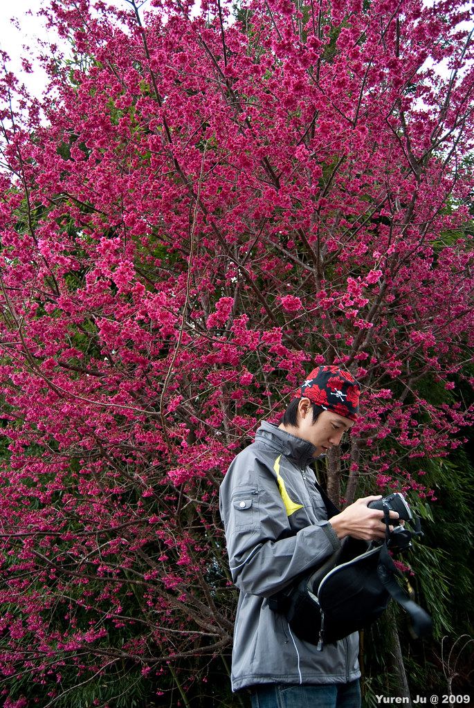
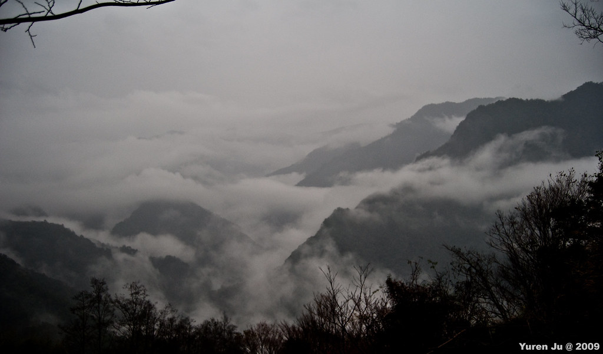
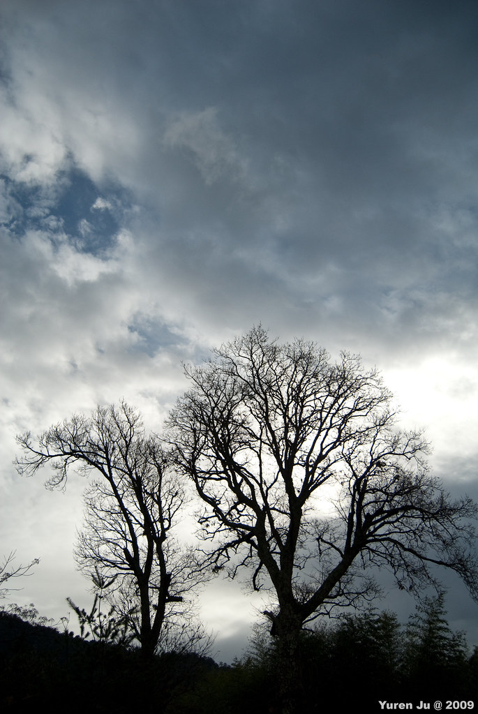
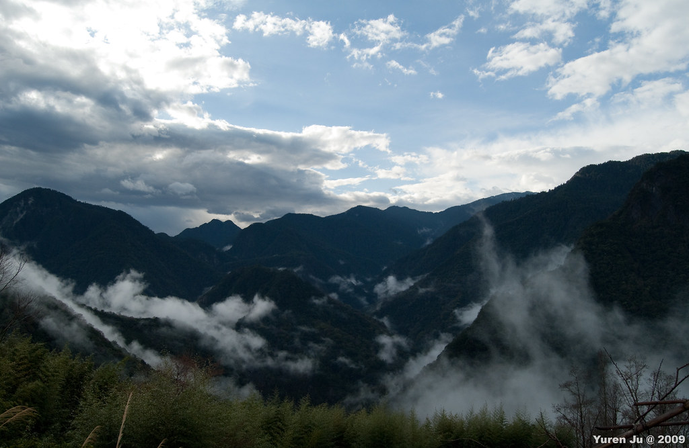
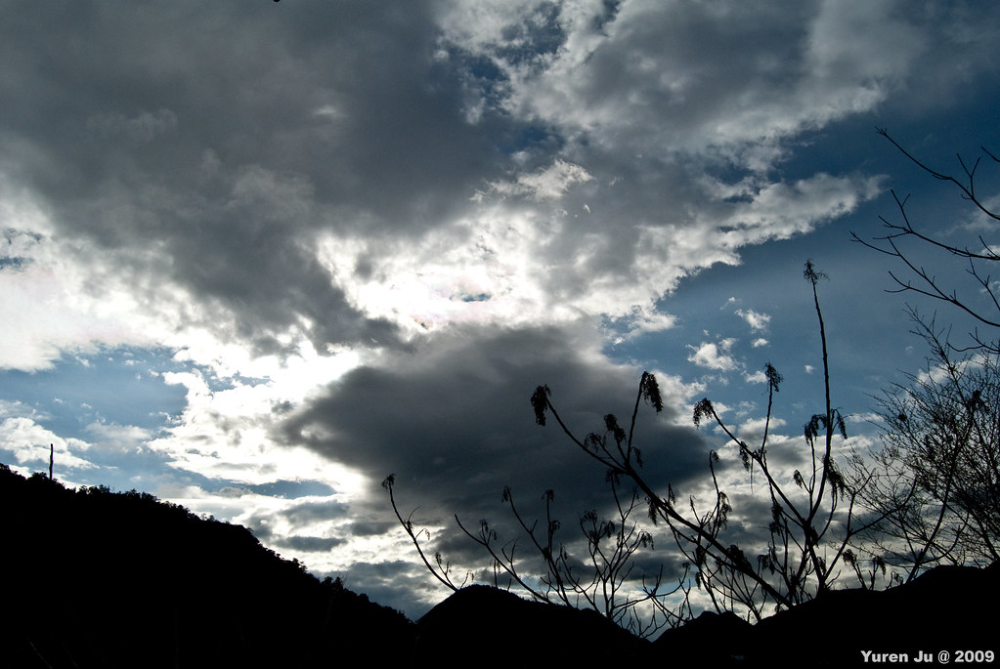
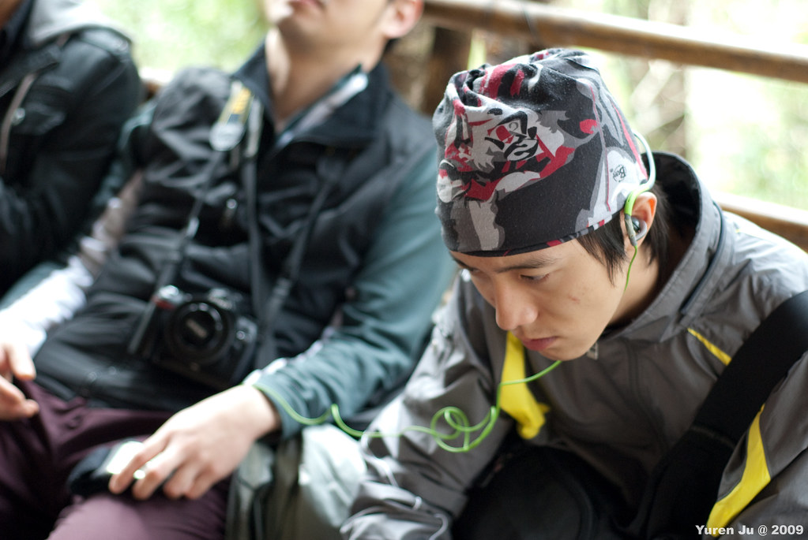
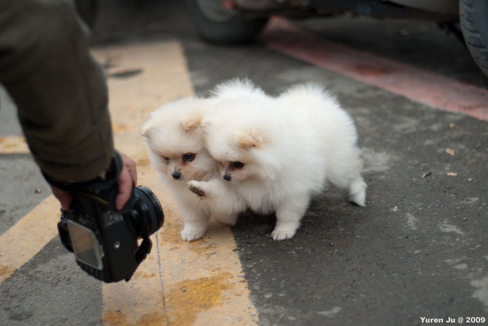
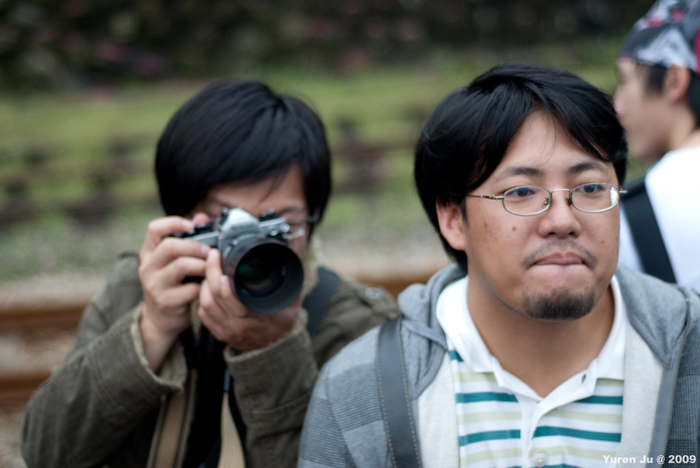

大圖請[參照 blogger 原文](http://yurenju.blogspot.com/2010/02/smangus.html)  
  
維特的腳 (Wirt's leg) 旅行團開張後，我們陸陸續續的在群組上討論要去什麼地方玩。River 給了我們一個不錯的建議，就是到新竹深山的司馬庫斯健行。所以我們就帶著郊遊的心情到司馬庫斯了（大心）。  
  
而這次成員清單中再次出現了康姐跟兔兔，這次繼[東港迎王](http://yurenju.blogspot.com/2009/10/2009.html)後她們兩個再度參加我們的活動。不過這次行程路況不適合薄底的運動鞋，真是辛苦囉。其他的成員很傳統的是 Chialin、River、Kyozi、Znikang、小銘、輝哥、大熊 (Merck)。  
  
兔兔康姐、大熊、River 彼此都是第一次見面，正巧前幾次活動都錯開了。  
  
另外這是今年最後一次跟大熊出來玩了，接下來他就要飛到澳洲去，除非要去看袋鼠無尾熊才有機會再看到他囉。  
  
  
  
  
  
  
禮拜六我們兩台車從台北出發到新竹後，往司馬庫斯的路上我們就走走停停的停車下來拍照。中間在宇老時識途老馬 river 推薦我們吃了一間『以娜的店』，真是他媽的好吃。而且接下來的兩天中，基本上吃的都很糟，我們要感謝上帝的部落讓我們體驗到以娜的店真是好吃到要落淚靠杯，阿們。  
  
  
  
大概是冬季快過去的關係，前往司馬庫斯的路上都有零散的山櫻花綻放。雖然沒有滿山遍野的開花，不過有幾株真的是開得很豔麗。  
  
  
  
但從入山查哨後，路況開始變得不妙。從大條柏油路開到小條柏油路，又變成滿是坑洞的路，最後就變成連柏油都沒有的路。這讓司機們開得很專心，我們在車上也心驚膽戰阿（不過除了康姐，他整路上都很安穩的睡覺）  
  
更不巧的是到司馬庫斯後，雨開始下的不停。不過雨中還是蠻漂亮的啦。  
  
")  
  
短暫的討論後，我們還是決定要到比較近的點走走，所以就決定往司立富瀑布前進。往瀑布的路上兩旁都是竹林。如果去除掉下雨的天氣走在這條路上一定很舒服吧…。  
  
因為後來道路實在太泥寧，我們沒有繼續往下走，而回頭到餐廳吃晚餐了。至於晚餐真是難吃到爆，我看 river 都快要翻桌了。吃完飯後我們去看了一下教堂的例行部落解說分享，聽到一半我們就回房間了。小銘跟輝哥去買了瓶小米酒 (嘿)，我們就邊喝邊打嘴泡的結束了第一天…。  
  
  
  
第二天，很不幸的雨還是繼續的下…。不過安排了雨備內灣的行程後，在我們最後逛整個部落的時候天氣逐漸的好轉，我們就又決定往巨木群前進囉。  
  
雖然沒下雨了，但天空還是陰陰的。不過還是有點藍天露出來。  
  
  
  
司馬庫斯飄在山間的雲霧非常的漂亮。這片雲霧飄渺的山嶺是這趟來最大的收穫。在司馬庫斯不論什麼時候都可以輕易的看到雲霧在山間圍繞。配上住家的炊煙上升，感覺很寧靜。  
  
  
  
雖然雲層有些厚重，不過襯著藍天山脊還是蠻漂亮的。  
  
  
  
走到後來大家有點渙散阿。不過聽音樂的時候倒是很專注。  
  
  
  
到了神木群厚實在有點失望。看起來阿里山的神木好多了。不過前往神木群這段路的景色還是蠻棒的。回來村落後，我們吃了泡麵跟點心就回程往內灣了，這時候司機們又再次體驗了到司馬庫斯崎嶇的山路…。  
  
靠著志康的祈禱，我們順利在沒油之前抵達了內灣。剛進去內灣的時候，遇到兩隻超可愛的小狗。  
  
  
  
梵谷胖版  
  
  
  
在內灣就是一整個在吃東西。整個酒足飯飽後，我們才回程台北。這次是我們第一次用租車的方式來解決交通問題。感謝輝哥幫忙處理了這部份的事情。也感謝 Znikang 跟 Kyozi，這次的路況真的很差阿。也感謝這次一起出來玩的朋友，這次行程差了天氣以外，還是一樣很精彩搞笑。  
  
其他的照片請看 [2010 司馬庫斯](http://www.flickr.com/photos/yurenju/sets/72157623404443984/)。