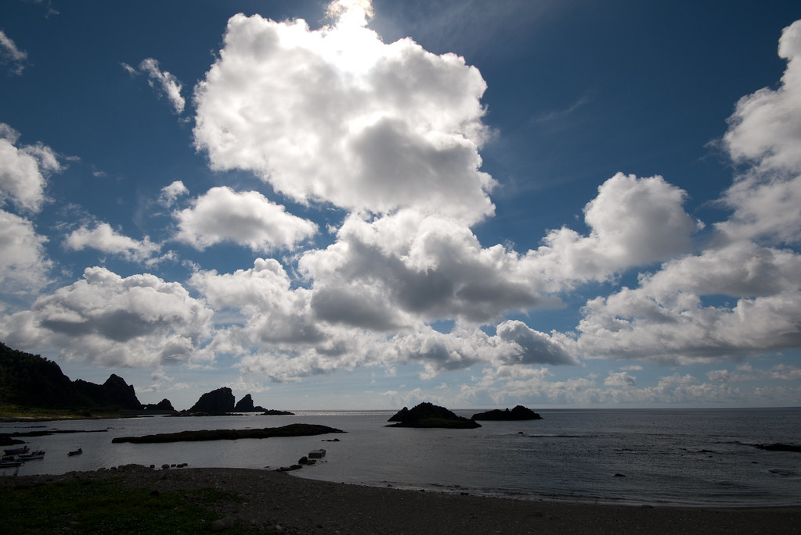
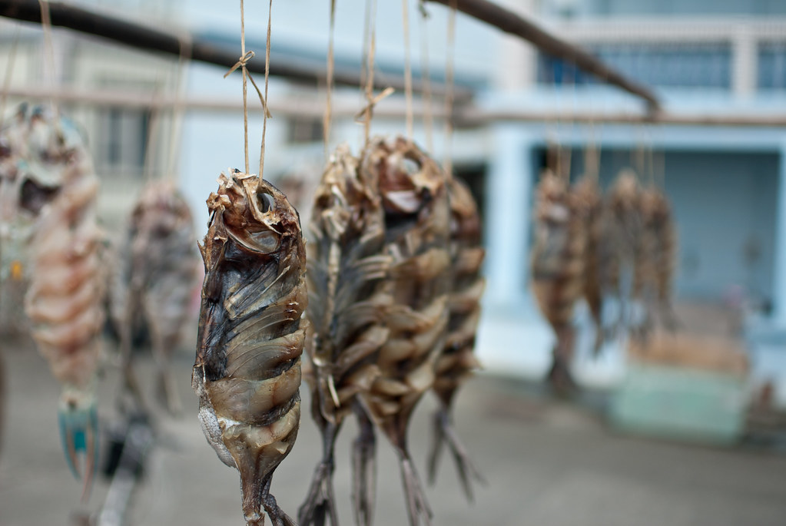
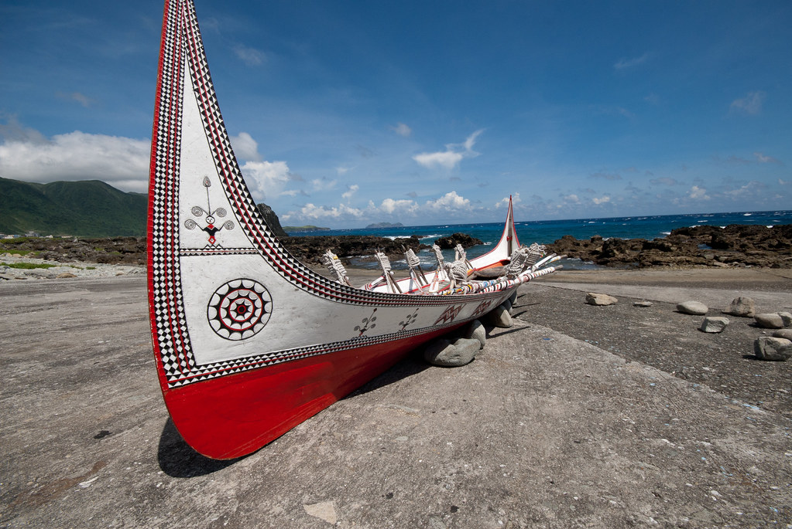
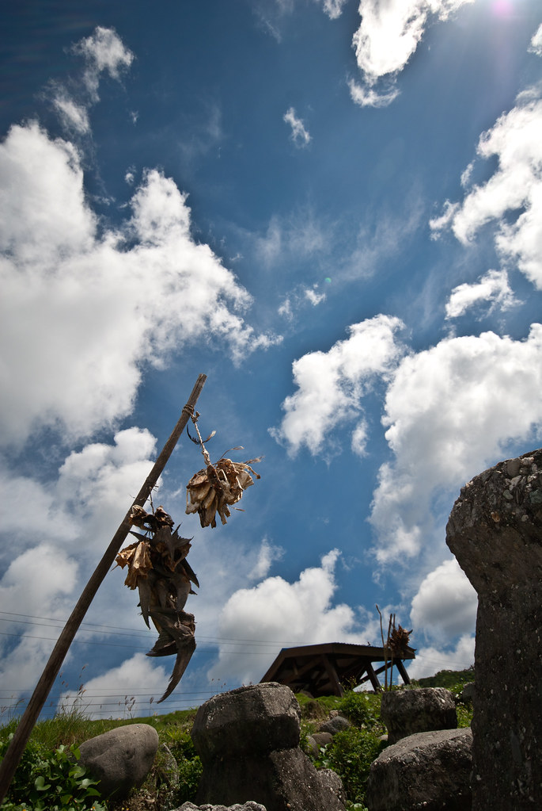
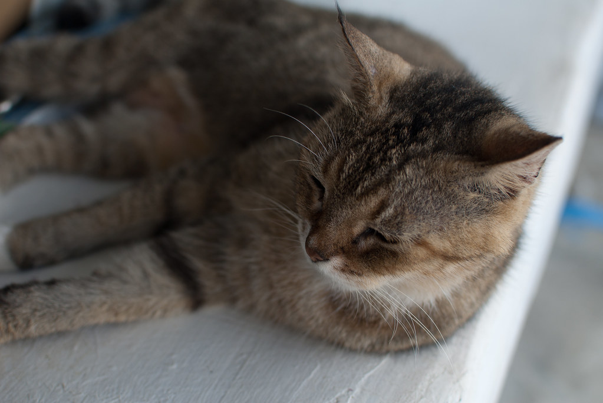
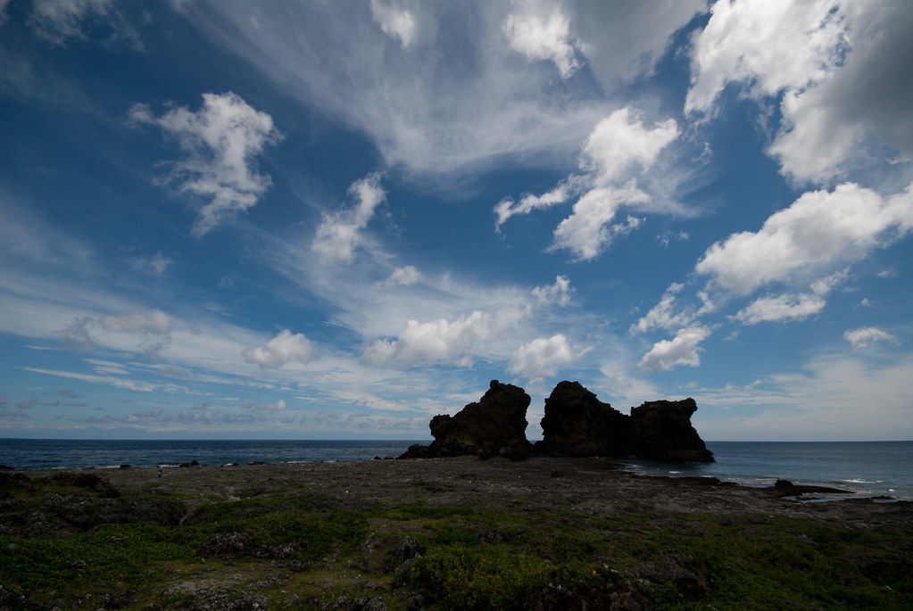
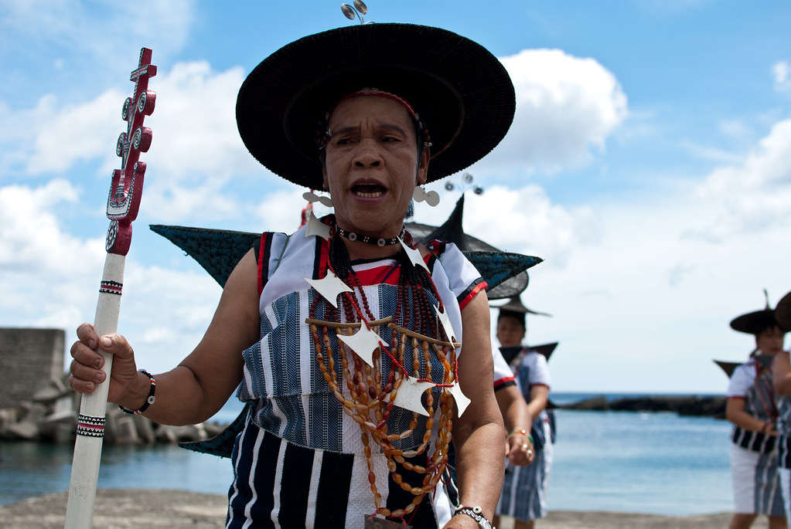
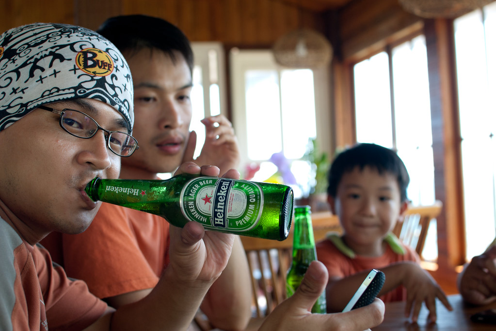
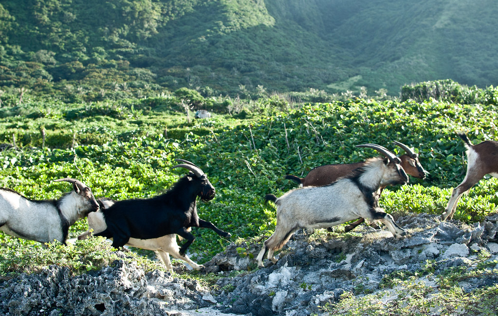
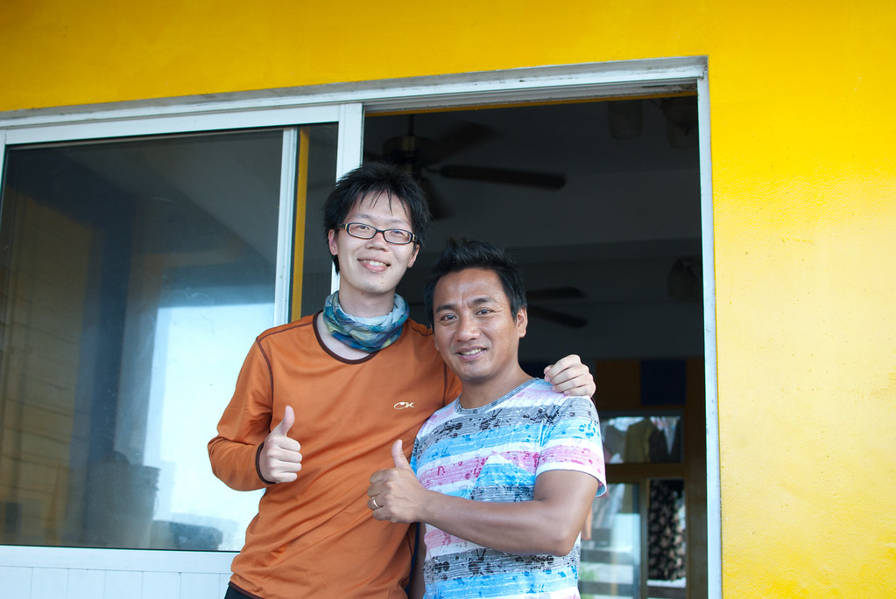

  
  
老天很眷顧我，今天天氣也一樣的晴朗。由於我們的民宿在蘭嶼東邊的野銀部落，所以今天我們就朝北繼續環島。路上也是看到什麼有趣的就停下來拍照。  
  
  
  
這曬魚乾的味道我在昨天晚上的風味餐見識過了。不過曬製過程就…別提了。  
  
  
  
拼板舟在許多海邊都有擺。還挺有特色的。  
  
  
  
後來另外一邊看到的曬魚乾，這看起來比較像飛魚。  
  
  
  
我們騎到了有賣米酒奶茶的『人魚與貓』，可惜人魚要十一點才開張，而貓還在睡覺。只好小作休息後又繼續前進。  
  
  
  
東北角附近的海與天空，蘭嶼真的太讚啦。  
  
  
  
騎沒多久後，遇到原住民正在跳傳統舞蹈。原來是有一群大陸來的蘭嶼後代來旅行，主人特別安排的傳統舞蹈表演。正巧經過就停下來看一下。  
  
  
  
在我們去的季節，東北角的風勢非常大。我們花了很久的時間才跨越那個風口。不過持平而論，既然我這個很久沒騎車的都可以環島（雖然有點累），其實蘭嶼單車行的難度也不算太高。不過我覺得要注意的地方在於運送單車的過程。我們單車過去的時候有放在車袋裡面，而正好車袋有點防水，所以沒什麼沾到海水。沒用車袋的人感覺騎了三天後鏈條就有點繍斑了。（所以我回家還是有擦過車子跟重新上齒輪油，車袋也再洗過…）  
  
  
  
繞過一圈後，我們又找了個地方喝酒，真是超愜意的阿。啤酒真的是蘭嶼良伴，不過如果自己帶過去會比較便宜（不過這樣又要自己找冰塊）  
  
而今天最後的休息點是野銀部落南邊的泉水出口。這感覺是山上泉水的出口，正巧在海邊附近。不過我沒跳下去玩水就是了，泡泡腳而已。  
  
離開的時候一群山羊正好在遷移。  
  
  
  
然後回到民宿後就遇到民雄了！超強的！聽說民宿老闆是他親戚，今天好像是來拍攝節目的。  
  
  
  
最後，傍晚的時候我們騎機車上氣象站看風景後就結束了這天囉。晚上當然就是喝酒吃零食，聽老闆幹古（雖然我只聽得懂兩成），度過輕鬆的夜晚囉。