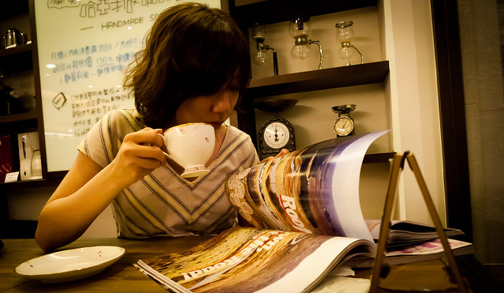

這張是 Chunminy 照的

  
COSCUP 結束後的第一個週末，還是一樣很忙阿。  
  
禮拜五跟 Kyozi, Znikang, Chunminy, Kunhui, Chialin 原本約要到金色三麥京站店喝酒，沒想到現場候位的人數真是爆滿。後來覺得等不到後，我們一行人就從京站往中山捷運站的方向走，想說遇到可以喝酒的地方就停下來 XD  
  
後來我們走到中山站附近發現一間日式家庭料理松八食堂，我當斥侯去問問有什麼酒可以喝，就進去吃了（話說不論有什麼酒我們都還是會進去喝吧）。  
  
這間日式家庭料理我覺得還蠻不錯的。老闆娘的女兒應該覺得我們很煩，因為每次點餐都問他有沒有打折還是招待 XD  
  
而且這次又認識了一個新朋友，也是輝哥梅酒的供應來源大派，我們就在歡笑聲中度過了禮拜五的週末夜晚。今天感冒的關係狀況很不好，一走出店門口就上下都想吐，還好順利回到家了。  
  
第二天醒來，中午跟阿憲還有紅中要去出一張嘴吃飯。話說回來我覺得出一張嘴好像沒以前好吃耶。好久沒看到他們兩個，沒想到大家都沒什麼變（除了史太太頭髮變卷以外）。吃完飯我們又坐公車跑去敦南誠品小逛一下。最後在火車站前的哺乳室道別。  
  

  
  
坐捷運回家的時候，驚覺今天是禮拜六不是禮拜日！所以我跟 Chialin 又跑去哈亞咖啡去喝咖啡囉。這次沖手介紹了我一支巴拿馬.唐.迪亞哥 #2 (Panama Cafe Don Diego #2 09-10 Catura/Typica)，這是杯測第五名的豆子。我以前沒什麼喝過比賽豆，這支豆子真的讓我很驚訝，咖啡的層次超多的，連 Chialin 喝過他原本那杯後再來喝這杯都可以感覺到這杯的層次感，真的很不錯。  
  
所以這禮拜六我們就很忙碌的度過，然後用悠閒的咖啡時光結尾囉。  
  
