一眨眼 2010 年又結束了。前陣子還覺得今年過的似乎過的沒有去年精彩，不過仔細想想還是去了很多地方。不過今年有點可惜的是 Kyozi 跟輝哥下半年很多時間都待在大陸，有不少活動沒有一起去。以後要把握時間一起出來玩樂。  
  
所以相較於 [2009 的回顧](http://yurenju.blogspot.com/2009/12/2009.html)，今年還是過得很精彩囉 :-)  
  
在 2009 的最後一天，在彩虹公園跟 Kyozi, Chialin 看完跨年煙火後，隔天我們騎車前往宜蘭，開始新年的第一個活動 - [宜蘭行](http://yurenju.blogspot.com/2010/01/blog-post.html)。我們去礁溪泡溫泉，到傳統藝術中心、羅東夜市去人擠人，到金車威士忌酒廠參觀。  
  
[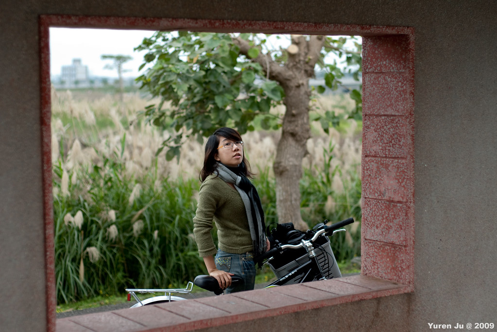](http://www.flickr.com/photos/yurenju/4247660621/ "Flickr 上 yurenju 的 窗檽")  
  
  
二月份的時候很難得的邀了 River, Merck 跟兔兔、康姐一起去了[司馬庫斯](http://yurenju.blogspot.com/2010/02/smangus.html)。這次糟糕的路況真是讓人印象深刻，千里迢迢到了司馬庫斯，結果下雨的天氣讓人有點掃興。不過第二天稍微好轉的天氣讓我們在雲霧圍繞的司馬庫斯得到了一些寧靜與感動。另外這次也是幫 Merck 之後的澳洲旅程送行，不過我們在十月份又在山上碰頭了 :-)  
  
[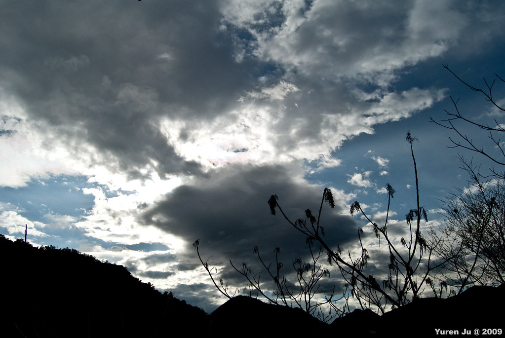](http://www.flickr.com/photos/yurenju/4346841523/ "Flickr 上 yurenju 的 YRJ_7188")  
  
[過年的時候](http://yurenju.blogspot.com/2010/02/2010.html)我自己跑去來義逛逛，沒想到莫拉克風災造成的傷害還沒恢復，So sad。大年初一的時候幾個國中同學聚了一下，補齊了幾個同學的記憶。初三跑去跟 Chialin 的高中同學來了趟台南小吃之旅，初四跟五專社團老人們聚會，最後跟 Chialin 在好久沒去的 La Strada Cafe 結束了過年假期。  
  

[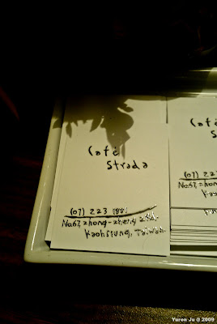](http://1.bp.blogspot.com/_iOO0fC4NKLE/S39hyyoB7hI/AAAAAAAAIMk/V7QgyIJ3BRc/s640/IMAG0186.jpg)

  
  
三月份我們搭上放天燈的最後一次機會，跟固定班底們一起去[平溪](http://yurenju.blogspot.com/2010/03/2010-pingsi-sky-lanterns.html)玩。我記得小羊跟 Znikang 的願望是世界末日吧 XD  
看到這個天燈影片又覺得很想明年再去玩。  
  
  
  
三月底的時候 Kyozi 開了一團[阿里山賞花團](http://yurenju.blogspot.com/2010/04/2010-alishan.html)，這次有點感冒，不過我們還是凌晨兩點多就起來準備衝大塔山日出。大塔山的階梯海真的讓人腳軟阿。不過微微從雲霧露出的太陽還是讓人覺得很美麗。  
  
[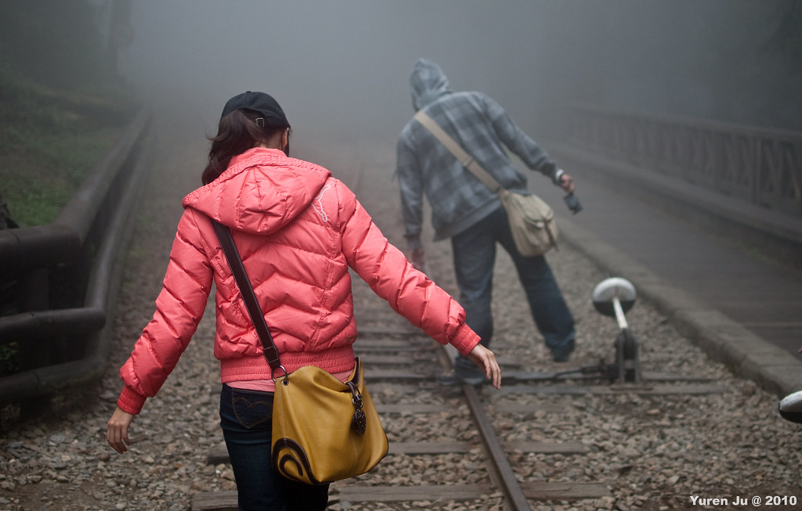](http://www.flickr.com/photos/yurenju/4479283844/ "Flickr 上 yurenju 的 YRJ_8091")  
  
四月份的時候到台南幫 Chialin 二姊跟姊夫[拍攝婚禮](http://yurenju.blogspot.com/2010/04/chialin.html)，這才理解婚禮攝影的難度阿！  
  
  
  
四月份我們又去[萬里玩了飛行傘](http://yurenju.blogspot.com/2010/04/blog-post_18.html)，這次我運氣超好飛了很久又很遠，往下看省道距離腳邊好幾層樓的感覺非常奇妙。  
  
[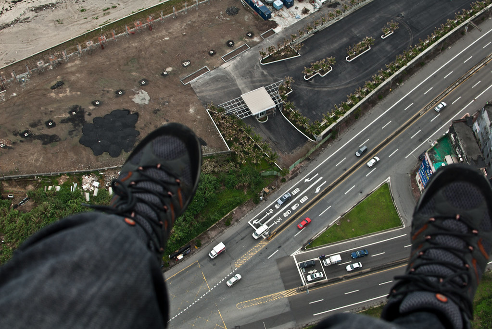](http://www.flickr.com/photos/yurenju/4529223233/ "Flickr 上 yurenju 的 野馬飛行")  
  
六月份的時候我跟同事們[一起前往蘭嶼度假](http://yurenju.blogspot.com/2010/06/2010.html)，我們在夏日炎炎的熱帶島嶼騎單車，喝啤酒，然後發呆睡覺。  
  
  
  
七月的時候我跟 Chialin 誤打誤撞的走了[坪頂步道](http://yurenju.blogspot.com/2010/07/blog-post_25.html)，沿著古圳溪流的古道走起來非常涼爽挺適合天氣好的週末去健行的 :)  
  
[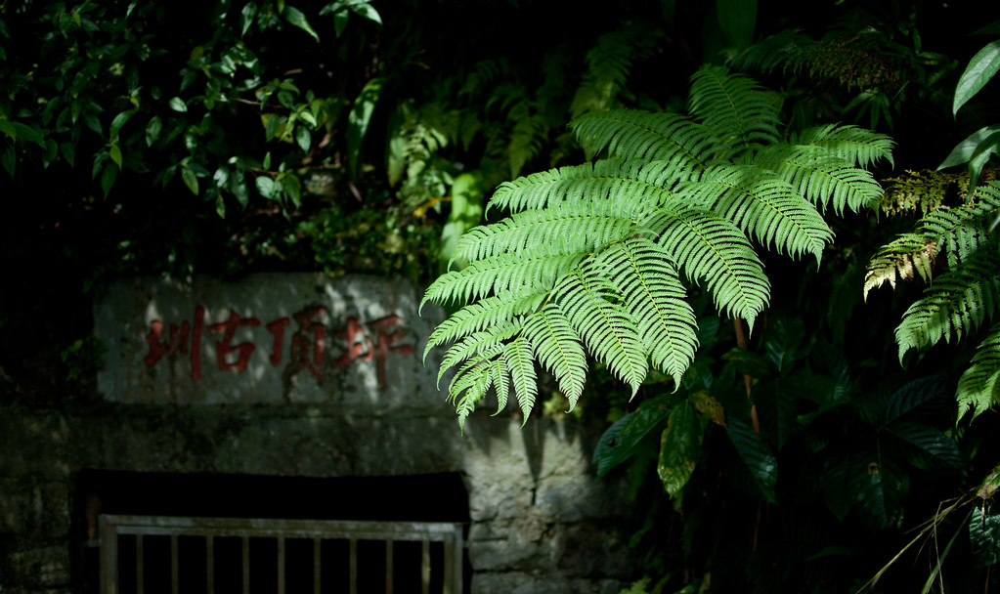](http://www.flickr.com/photos/yurenju/4827092488/ "Flickr 上 yurenju 的 坪頂古圳")  
  
八月是個忙碌的月份，開放源碼的一群夥伴[舉辦了 COSCUP](http://www.flickr.com/photos/yurenju/sets/72157624716596566/)，我們在非常忙碌的工作氣氛中完成了千人的研討會。  
  
[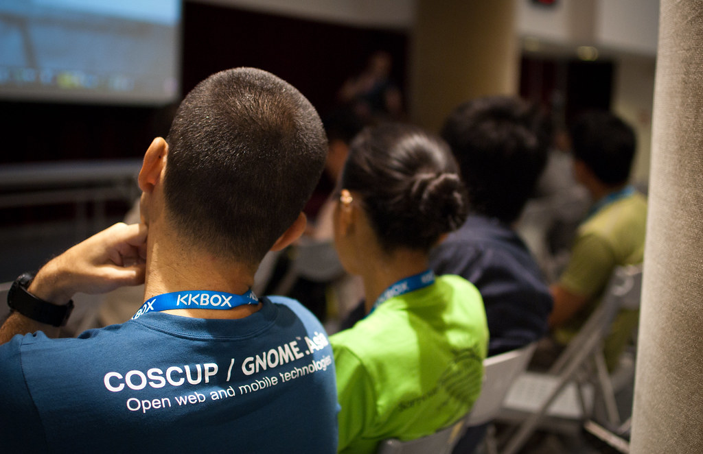](http://www.flickr.com/photos/yurenju/4897836291/ "Flickr 上 yurenju 的 COSCUP / GNOME.Asia")  
  
九月份的時候跟著 Chialin 公司辦的員工旅遊去[體驗了朔溪](http://picasaweb.google.com/yurenju/OotKfJ)，既有挑戰性又有趣 :-)  
不過回來的時候稍微累了一點。  
  
[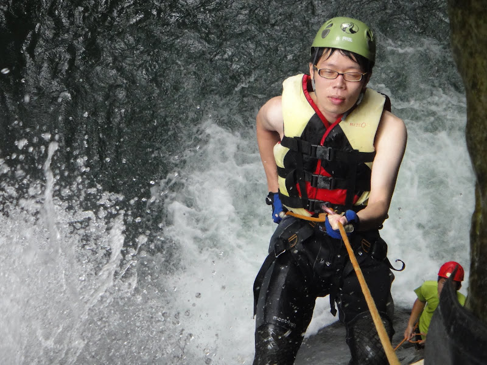](http://picasaweb.google.com/lh/photo/MfV8J11c5kxy9JMKc-0XgA?feat=embedwebsite)  
  
十月份的時候我籌備了今年的唯一的高山活動 - [能高越嶺](http://yurenju.blogspot.com/2010/10/blog-post.html)。這次多了小祥、Rex 還有 Jerry 參加，而且很久不見的 Payton 也參加了能高越嶺。雖然是唯一的一次，不過高山上的美景還是每次都讓我讚嘆不已阿。  
  
[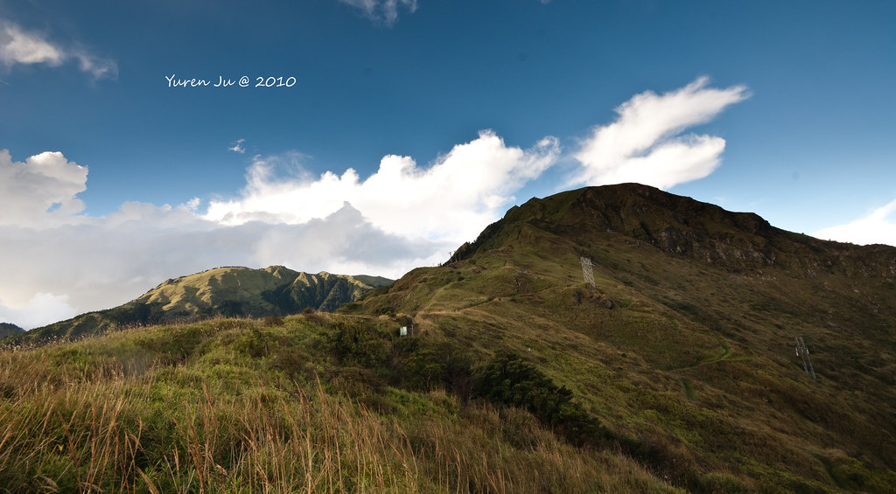](http://www.flickr.com/photos/yurenju/5092340281/ "Flickr 上 yurenju 的 南華山")  
  
十一月份的時候，Chialin 的公司又辦了員工旅遊，這次去[宜蘭明池](http://yurenju.blogspot.com/2010/11/blog-post.html)。這是一個非常適合來放空的小地方，風景美的像幅畫一樣。  
  
  
  
去完明池的隔天，陰錯陽差的排了[草嶺古道健行](http://yurenju.blogspot.com/2010/11/blog-post_23.html)。是個輕鬆的健行活動，順便為之後的桶後越嶺古道健行熱身。Znikang 帶了組裝相機來，拍攝的效果非常有趣。  
  
[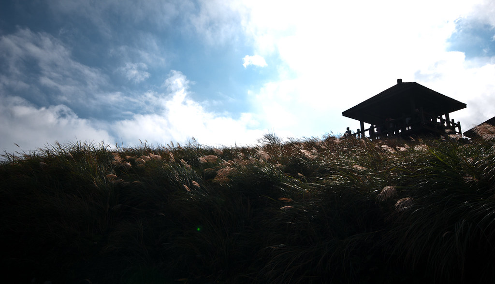](http://www.flickr.com/photos/yurenju/5195046272/ "Flickr 上 yurenju 的 未熟的芒草")  
  
同樣在十一月無意間得知有[咖啡展](http://yurenju.blogspot.com/2010/11/2010.html)，所以跟 Chialin 一起去逛逛，沒來看過咖啡展真是大開眼界 :D  
  
[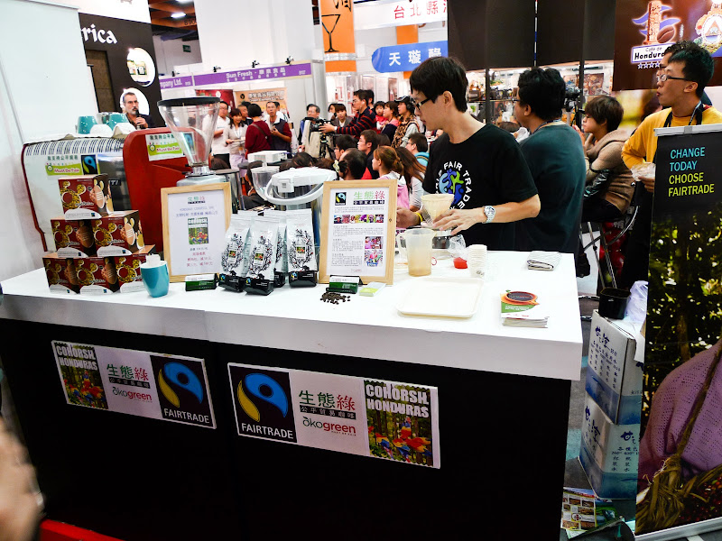](http://picasaweb.google.com/lh/photo/ns0a2Cz6-h33RI7GhlHsMw?feat=embedwebsite)  
  
十二月！經過一個月籌辦終於成行的『[踏破鐵鞋到宜蘭](http://yurenju.blogspot.com/2010/12/blog-post.html)』終於到了！雖然一路上遇到很多搞笑的錯誤，不過終於讓我們一起達成從台北走到宜蘭的目標了！  
  
[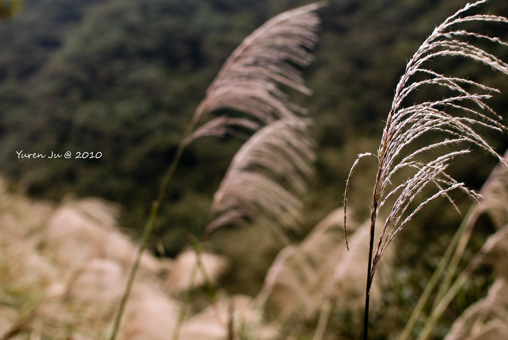](http://www.flickr.com/photos/yurenju/5232747275/ "Flickr 上 yurenju 的 桶後芒草")  
  
走路到宜蘭的隔天，相同的因為沒看到行事曆，我又排了[簡單生活節的活動](http://yurenju.blogspot.com/2010/12/2010.html)。久違了一年的盛大音樂活動，坐在草皮上聽歌的感動還是相同的阿！  
  
[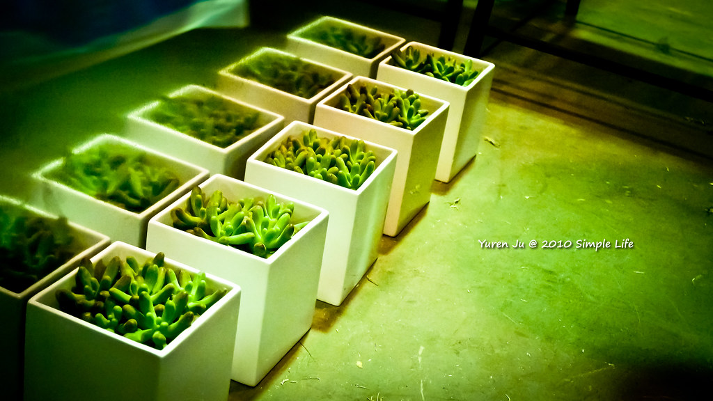](http://www.flickr.com/photos/yurenju/5234537685/ "Flickr 上 yurenju 的 2010 Simple Life")  
  
  
2010 參加了三個大型開放源碼研討會：COSCUP, OSDC, ICOS，分別講了兩場跟 Javascript 相關的主題。  
  
今年只看《寶島一村》一場戲，需要加強。只看[五本小說](http://www.anobii.com/yurenju/books)，三本攝影書籍，一本技術相關書籍。到電影院看了 Alice In Wonderland, Inception《全面啟動》、告白、葉問 2。不過在家裡看了不少電影。  
  
去了[簡單生活節](http://yurenju.blogspot.com/2010/12/2010.html)、雷光夏+BIT Sound、Tizzy Bac 帶我去錄音、MTV Sport B. Plugged Live Concert、[2010 丹尼波爾世界音樂日](http://www.flickr.com/photos/yurenju/5043550743/)五個音樂活動  
  
快速列過今年有記錄的大食團（可能會沒辦法點）：[黑鮪魚](http://www.facebook.com/event.php?eid=133508563341940)、[win 777 熱炒](http://www.facebook.com/event.php?eid=133014783379421)、[金泰](http://yurenju.blogspot.com/2010/06/blog-post.html)、[味留](http://yurenju.blogspot.com/2010/01/blog-post_10.html)、跟小白在麥歡樂吃飯、跟 Eric, 嘉雯、佳妤在 Chili's 吃飯、[海綿北上唱歌](http://www.facebook.com/event.php?eid=118613134822947)、[五分埔 + 饒河夜市](http://www.facebook.com/event.php?eid=131134516909776)、[萬老師粽子](http://www.facebook.com/event.php?eid=130820126951369)、[大仙繞境+三小之師大夜市](http://www.facebook.com/event.php?eid=141939149151272)、[秋日本料理](http://www.facebook.com/event.php?eid=143331035692960)、[松八食堂喝酒](http://yurenju.blogspot.com/2010/08/blog-post.html)、[烤你媽的中秋節 (Znikang 家)](http://www.facebook.com/event.php?eid=147967325241532)、[海綿一路靠北/輝哥kyozi衣錦返鄉之吃飯喝酒](http://www.facebook.com/event.php?eid=108120905918799)、[小銘家喝酒](http://www.facebook.com/event.php?eid=153184928053181)、[雙十國慶煙火](http://www.facebook.com/event.php?eid=166358213377542)、[Kyozi返鄉之拉褲子團](http://www.facebook.com/event.php?eid=161633713855613)、[吃阿 羊雞 城](http://www.facebook.com/event.php?eid=102837513116553)、小杜、康姐、兔兔到台北去爐鍋咖啡。跟 Chialin 一起去了 Oregano 餐廳、肥前屋 + 咖啡、白屋歐風料理、西門元町咖哩、小銅板 x N、哈亞咖啡 x N、爐鍋咖啡 x N、其餘餐廳 x N。  
  
參加了 Derek, Donald, Jason 還有我表哥的婚禮總共四場。  
  
明年應該要至少出去一次國外，多看點書、多點休息跟發呆。  
  
感謝今年一起度過的朋友們，沒有你們的參與生活是不可能變得這麼精采的。人生原本就是來來去去，每次能夠出來一起玩樂都要把握阿。  
  
希望明年還可以跟老夥伴們繼續一起出來玩，然後再拉更多有趣的夥伴進來 ^^