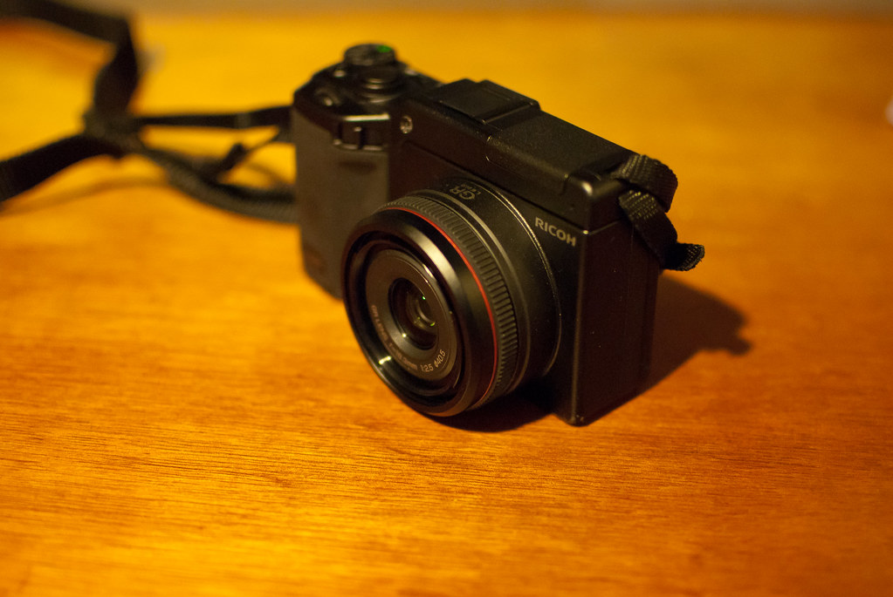
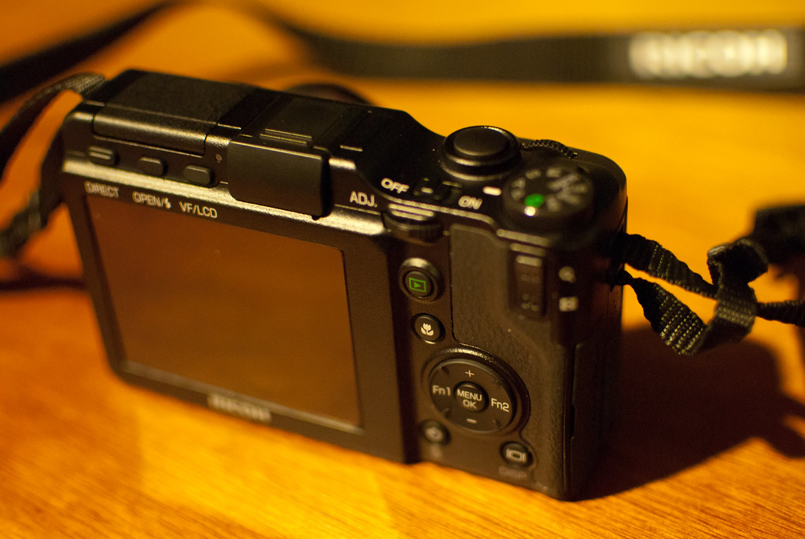

自從過年借了 Chialin 的小相機 LX3 之後，就一直想要買一台輕便攜帶的相機。但是從 GF1, GF2, E-PL2 一直看到最近的 X100 都沒有辦法讓我狠下心買下去。這幾天多看了幾篇 X100 的評測之後，就決定不要買它了。加上今天跑去古亭捷運站附近的電器行看了 GXR + A12 50mm 之後，就默默的去億華把 GXR + A12 28mm 帶回家了。  
  
  
  
  
  
GXR + A12 28mm 是一台非常低調又非常冷門的相機，低調大概是 Richo 高階相機一貫的風格，如 GX200, GRD3 其實都是同樣的調調，至於冷門的話，基本上就是 GXR 特殊的系統導致的。  
  
GXR 跟其他的可交換式鏡頭小相機不一樣，它並不是單純可以更換『鏡頭』的相機，而是透過更換感光元件 + 鏡頭的方式來擴充相機的性能，所以你可以組成的到如同 GX200/GRD3 等級的相機（也就是感光元件是 1/2.33"），更可以搭配 A12 相機模組變成等效於 28mm/50mm APS-C 感光元件大小的相機。  
  
而這次我搭配的模組是 A12 28mm，之所以會選擇 28mm 主要還是看上它的輕巧方便攜帶，如果是 50mm 其實還蠻難帶的。至於其他小尺寸感光元件的模組就不在我的考慮範圍。  
  
  
  
回來之後稍微玩了一下 GXR，發現他的客製化程度真的非常高，幾乎每個按鍵都可以重新定義它的功能，拍攝的時候也可以很快的切換到自己想要的設定，而 Raw 檔格式方面，GXR 採用的是 Adobe 主推的 DNG 格式，希望這樣可以保證在 GXR 上調整的色彩配置可以正確的讓 Lightroom 讀取到。唯一一點不滿意的就是它調整對焦點的方式還是不比單眼有效率。除了這個小缺點以外其他都很滿意。  
  
總之，過了一個多月，我終於買了我的生日禮物了  
  
至於相機到底照片如何？等我出去玩再說吧 XD