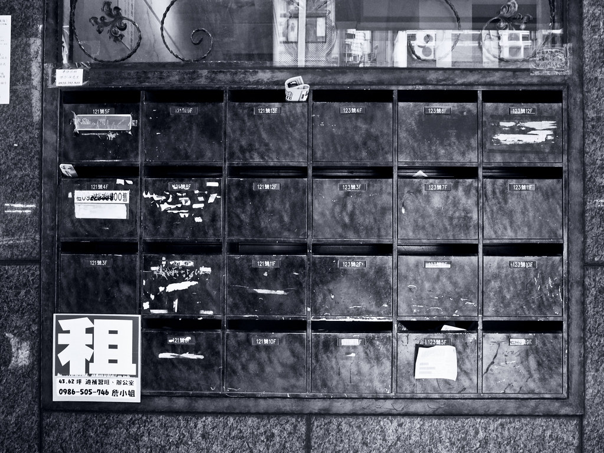
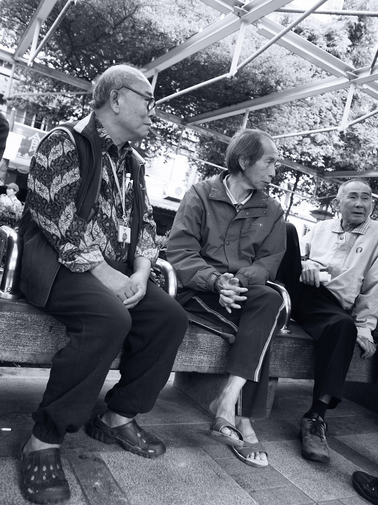
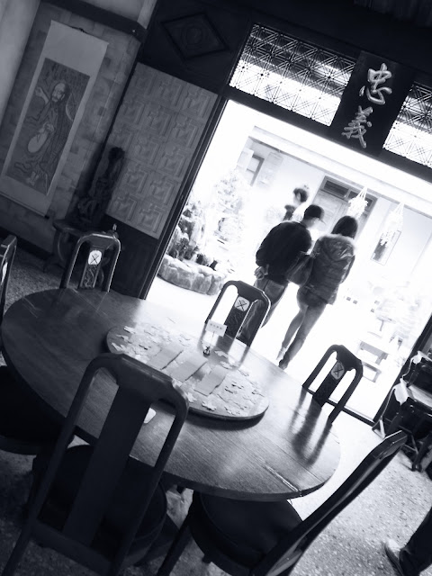
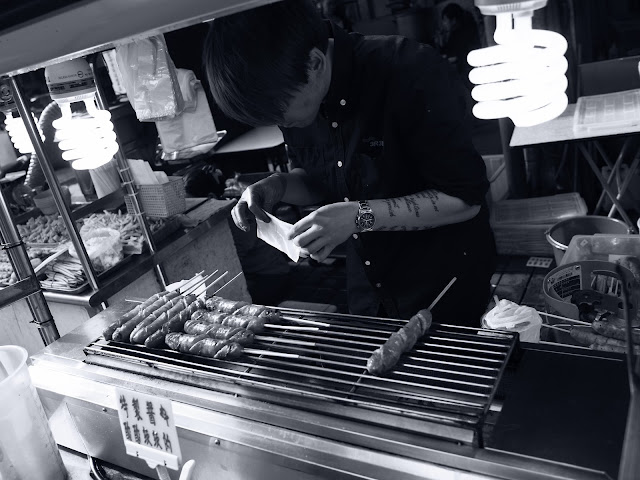
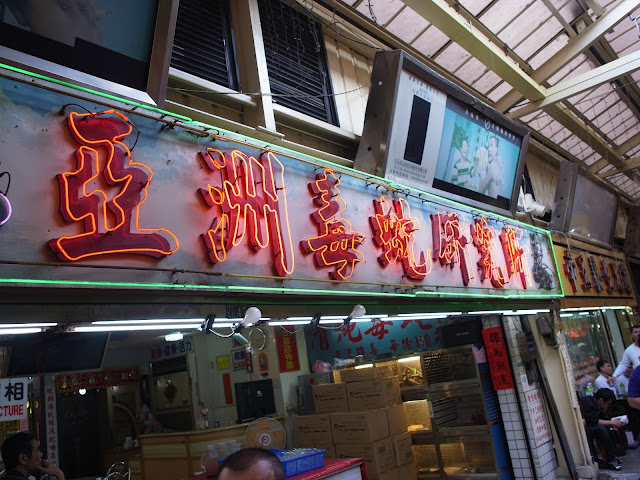
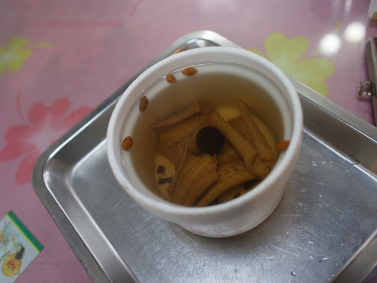
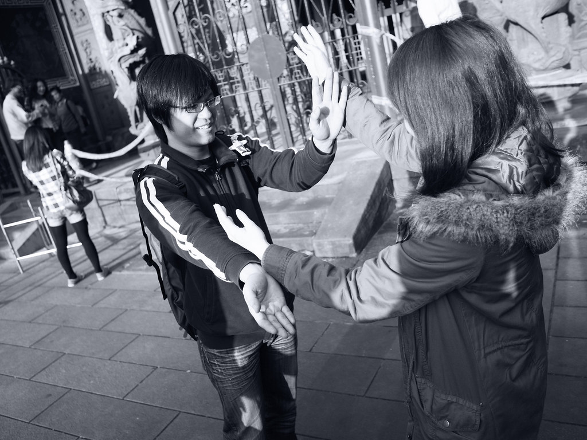
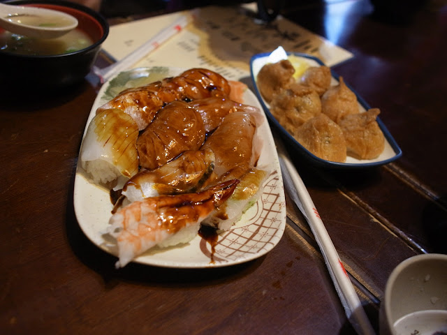
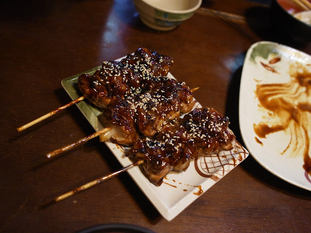

今天是跟大王、海綿、猴子還有輝哥小羊他們一起去吃三味食堂的日子。正巧在西門町附近，就先去天瓏書局買了書在沿路走過去萬華。  
  
雖然是已經有準備了，不過下午三點到萬華的路上就有人用台說：『四千要嗎』感覺天色好像也太早了點。不過這也是萬華的特色吧。  
  
  
  
  
  
到了龍山寺捷運站，這邊還真多阿伯做在涼亭下閒聊下棋阿。  
  
  
  
中間一不小心就走到了電影艋舺的拍攝場地，看得出來這是哪裡嗎 :)  
  

  
  
跟大王他們會合後，就開始了萬華小吃之旅... 當然有輝哥的話一定要先來個香腸  
  

  
  
這間的沾料酸酸甜甜，其實還蠻特別的。後來又去吃了大腸也是很好吃，花生味很濃。不過既然來了萬華，我們當然還去吃了這個 XD  
  

  
不免俗的來吃一下蛇肉，不過我覺得不會再吃了耶，其實像是魚一樣刺很多，所以吃起來有點麻煩。  
  

  
蛇湯喝起來很清淡。然後再補個薑汁番茄後，我們就前往今天的目的地 - 三味食堂了。在這個距離開店還有半個小時的時候店門口已經大排長龍了。然後我們在二輪的時候才排到，所以登記後我們就在附近亂逛。三味食堂旁邊就是電影艋舺的場景之一，我們就過去晃晃。大家就開始瞎聊。猴子在跟我們說截拳道的事情。  
  
  
  
瞎扯完後來就回去三味食堂前面繼續等了。不過等待是值得的，這間日本料理店真的是好吃又不貴。東西都超大份的  
  

  

  
這個雞肉串實在太誇張了，肉有夠紮實的，懷疑是雞腿肉。很滿足的吃飽後，跟同伴們 Say bye bye，我就一個人坐公車到咖啡小自由去。  
  
因為跟咖啡相關，所以就另外寫一篇了 :)