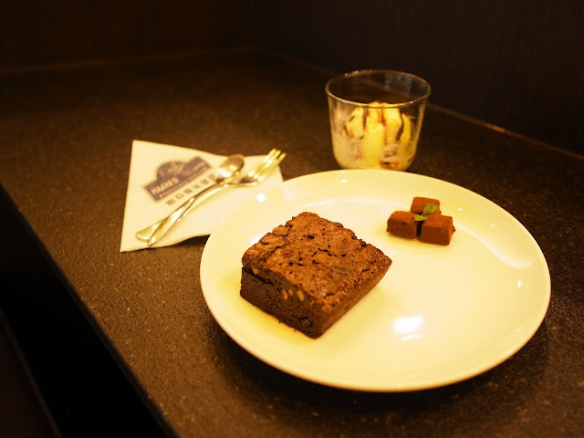
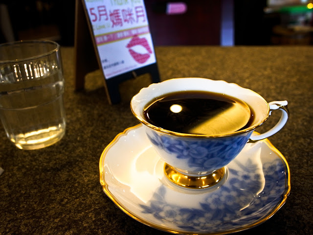

  
  
我不會忘記剛開始踏進哈亞的最初的那幾次。  
  
2009 年我們搬到了天母邊緣。理所當然的，我也不斷的在附近尋找新的咖啡館。很巧的，我正好在 PTT 上看到哈亞徵工讀生的資訊，因緣際會的知道這間咖啡館。  
  
在 2009 年的尾巴，我踏進了哈亞明亮几淨的咖啡館。  
  
  
  
我還記得第一杯點的咖啡是淺烘焙的耶加雪夫『霧谷』。好死不死這支霧谷剛好是偏向我不喜歡的方向，也跟我平常喝的耶加雪夫有些出入（不過年代久遠我已經忘記霧谷的味道到底是哪一點我不喜歡了）。  
  
過了一週，我又回來，點了同一杯咖啡。  
  
時間就像一步步的跨過軌跡。我連續三週來了哈亞咖啡，點了第三杯一樣的咖啡。回想起來讓沖手困擾了真是不好意思。不過沖手熱誠的想解決我對咖啡不滿意的地方也讓我很開心，覺得找到了一個很關心咖啡品質的好咖啡館。  
  
當開始試著喝哈亞其他不同咖啡時，才一步步的發現這些咖啡精采的地方，不論是強烈風格的Galapagos, 有許多層次的巴拿馬『唐.迪亞哥』，或是內斂卻能緩緩釋放甜味的坦尚尼亞『蒙度莊園』，哈亞咖啡館提供這些咖啡逐漸的擴展了我對咖啡知識的廣度。  
  

哈亞咖啡的甜點也是一絕，這是我最喜歡吃的布朗尼 + 冰淇淋 + 咖啡口味生巧克力

  
而不知不覺中，我們的腳步愈來愈常在哈亞咖啡館前駐足。我們在灑滿陽光的午後過來、在下雨天過來，也在工作到一個值得慶祝的段落過來。  
  
有一次，Chialin 從中國回來僅能在台灣停留一個禮拜時，我們迫不及待的來了哈亞咖啡。但是今天剛好是星期一，正巧又是公休的那週。  
  
那天下著毛毛細雨。站在沒有開店的哈亞前面，才體會到哈亞對我們的重要性。  
  
原來那些沖手們親切的微笑、坐在吧台看著微微上昇熱氣的咖啡，還有那溫暖的氛圍與歸宿感，都是構成哈亞在我們內心的樣子。  
  
時間拉回到今日，我穿著輕鬆的打扮，在這個陰雨綿綿的五月到哈亞喝咖啡。  
  
我邊寫著月底要用的教學投影片，一邊喝著還沒列到 menu 裡面的盧安達『rwabisindu』（真是一款典型野放的非洲咖啡豆）。心裡暗自竊喜可以喝到這麼好的咖啡的我，看著窗外車水馬龍的景色、輕快的敲打著鍵盤，在哈亞咖啡館又度過了一個輕鬆的午後。  
  

謝謝招待。

  

  

