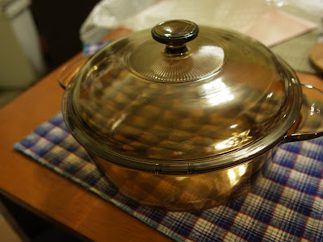

說也奇怪，這位認識接近十年的老朋友，我只跟她見過一兩次面。我們是在《匿名天使故事》認識的，那是 BBS 上面的一個討論區。因為我總是沉浸到她的文章裡面的情節無法自拔，自然很難不注意到這號人物。  
  
從此我就常在她的文章下留言，久了熟了，就偶爾聊聊 MSN，聊聊心事。  
  
從沒女朋友聊到有女朋友，我從來沒跟她見過面。我們對在網路上關心對方的事情很習慣了，也沒打算要改變過。MSN 就像是另外一個不會出現在現實生活中的樹洞 -- 從這邊分享的秘密從不會流瀉到真實世界裡面。  
  
直到有一天，我分手了。  
  
  
  
那個感覺像是你在一陣午夜雷陣雨淋濕，而身體心靈就像大鐘被用力敲響一般，悲鳴的聲音迴盪在傾盆大雨裡面。  
  
我是個不愛講電話的人，但是這個時候真的急需有人聽我說話。這個時候她打電話來了，我們聊了一陣子。她也沒說什麼，只是靜靜的聽我說，然後說著一些故事。這些故事有些溫暖有些悲傷，但是這通電話卻讓我心裡帶來一絲平靜。  
  
我跟她說，我一定會好好的過。  
  
然後我康復了。  
  
我偶爾旅行的時候就寄明信片給她，我們依然偶爾在 MSN 上面聊天。然後她結婚了！我捎上賀禮以及卡片。  
  
  
接近十年阿，我們的友情就這樣涓涓的流動著。  
  
有一天，我也要結婚了。我收到了一個鍋子。  
  

  
  
  
  
我很喜歡這個禮物。我覺得我們的友情就像在冬天用這個透明的鍋子煮火鍋一樣。每分鐘我都可以窺探著裡面食材的情況，要多加點菜呢？多加點火鍋料嗎？  
  
然而就這樣慢火煮著。  
  
有一天火鍋煮好了，我盛起一碗湯。  
  
它的味道就是淡淡的湯頭，配上一些無關緊要的火鍋料。但在冬天吃起來，卻有一種會令人含淚感動的溫暖。  
  
我們的友情就是這鍋冬天溫暖的火鍋  
  
而陪我一起吃飯的  
  
就是我的摯友，南二小姐。