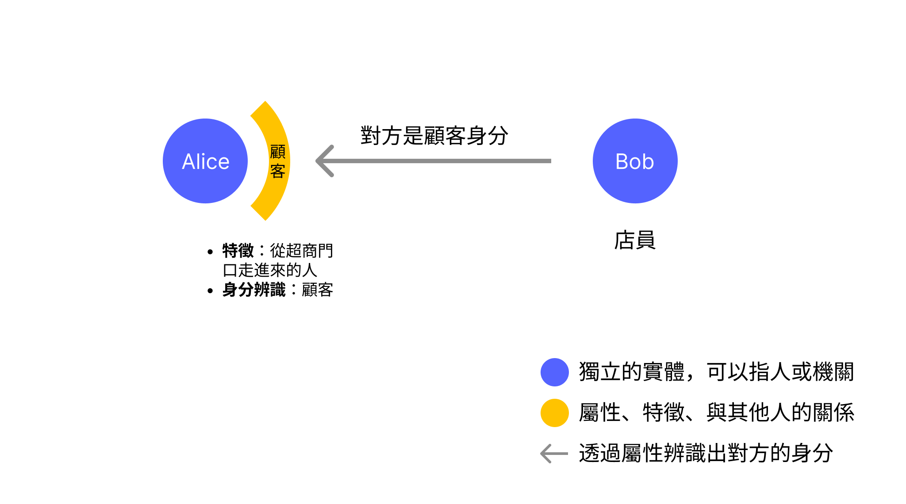
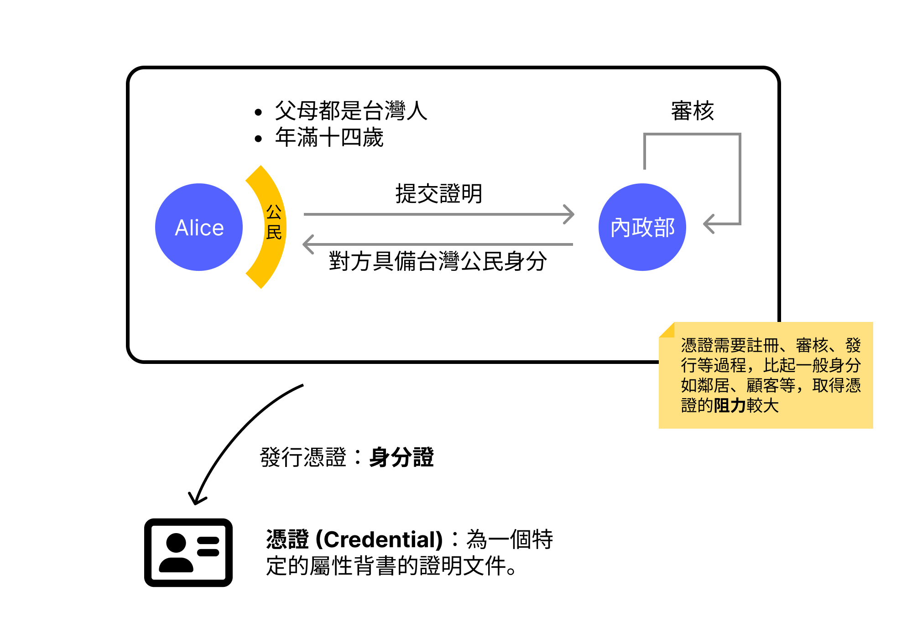
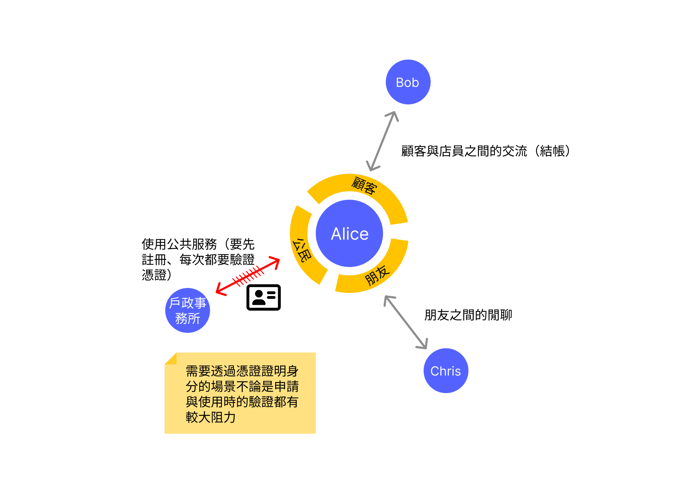
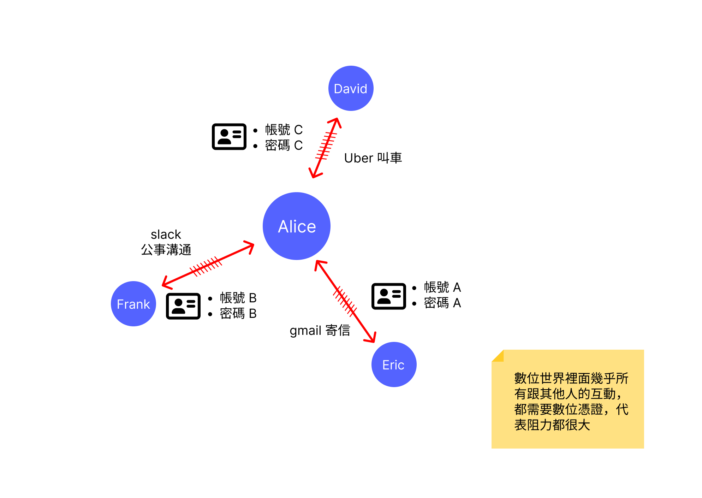
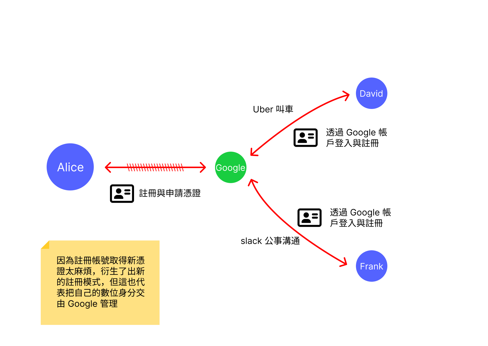
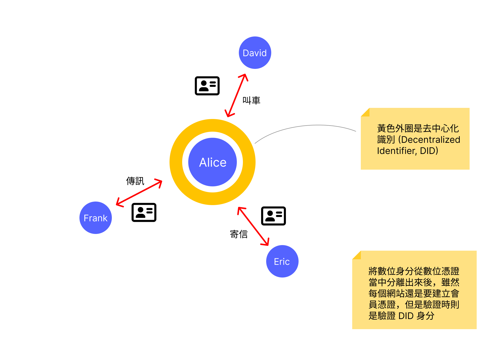

四年前我的 Facebook 帳號被官方封鎖了。他們說我的帳號是可疑帳號，而我用盡了一切辦法嘗試著通過驗證或是聯絡官方都沒有用，最終 Facebook 決定永久刪除我的帳號。當自己做的再多努力都沒用，才發現我根本沒有擁有我的帳號，擁有我的帳號的是 Facebook 這個企業，他可以決定這個帳號的去向，並且不需要我的同意。

但問題不止於此，我意識到透過 Facebook 帳號直接登入的其他服務也不能用了，還好我並不常這樣作，只有少數的服務受到影響。但沿著這個思路想下去，則讓我愈來愈感到不安，如果今天決定封鎖我帳號的不是 Facebook，而是 Google 呢？

那些無數個透過 gmail 註冊的帳號該怎麼辦？

我確實對 Google 充滿的信任感，認為他不會不負責任的封鎖我的帳號 -- 而在 Facebook 真的封鎖我帳號之前，我也不覺得這樣的事情會發生在我身上。

這不禁讓我回想，在現實世界我曾經遺失過證件，雖然造成了一些不便以及需要辦理的手續，但並沒有對我的日常造成巨大的影響，讓生活步步艱難。但是 Facebook 或 Google 帳號如果被封鎖顯然對我會造成非比尋常的影響。

而經過思索之後，才慢慢理出**身分識別**在實體世界以及數位世界的差異，以及了解現在有什麼解決方案可以緩解這樣的問題。

## 實體世界

在一般的生活當中，**身分**跟**憑證**是相關但是不相等的兩件事情。

**身分** (identity) 是指辨識出「你是誰」的特徵、屬性或是關係。身分可以是一個概略的形式存在，比如說 Alice 走進去超商時，店員單從他「走進超商門口」就辨識出他的**顧客身分**。

身分也可以是更具體的形式，比如說 Chris 從 Alice 的外觀、講話的聲音跟走路姿勢辨識出了對方是朋友身分的 Alice。

身分除了個人的自我身分認同以外，當在跟社會中的其他人互動的時候，身分的辨識可以讓雙方知道要怎麼樣進行交流與互動。身分的辨識在實體世界大多情況都是很快就可以完成的。

而 **憑證** (Credential) 則是針對一個身分屬性背書的證明文件，比如說身分證是一個為「具備台灣公民身分」這樣屬性所背書的憑證；健身房會員卡是針對「有付費加入會員」的身分所背書的憑證。憑證在特定的場合會用到，比如說使用公家機關的服務，或是使用健身房器材等等。

根據憑證的性質不同，發行單位通常都需要申請人進行註冊程序與相關驗證，最後才會核發憑證給申請人，比起不需要審核的鄰居、顧客身分，需要註冊、核可程序的憑證持有要花費的心力大得多，會讓人思考這個憑證的重要性與花費的心力相比是否值得。顯然身分證很重要，至於健身房、飲料店的會員卡就要看註冊程序的繁瑣程度與憑證的重要性。

日常生活中大多數與人交流都不需要憑證。跟朋友聊天、投錢搭公車、到超商買飲料，這些交流都是自然而然的發生，不會有什麼阻力。當進行人際之間的交流時，相對應的**身分**會很快速的被識別並且使用，就如同你進入超商，店員會馬上意識到你的顧客身分而進行互動與交流。

需要使用**憑證**才能辨識身分的場景，不論是註冊或是使用時使用的阻力都比較大。

而當憑證遺失時，確實會造成一些麻煩，但卻無礙於日常生活，畢竟大部分狀況，其他人跟你交流的時候，不會要你出示身分證對吧？

**身分**是自己與其他與你有過互動的人共同交織出來並且在適當的時候帶來足夠的脈絡，讓人與人之間的交流更順暢的資訊。憑證可能會遺失，但是一個人身分遺失的可能性很小，除非認識的所有人都否定你，而且本身也否定自己了，關於「你是誰」這樣的資訊才會慢慢的在這個社會上遺失。

那數位身分呢？
## 數位世界

只有在沒有互動的場合例如閱讀網誌、新聞或是維基百科，才可以在沒有憑證的狀況下進行。否則幾乎所有的數位身分幾乎都跟數位憑證緊緊的綁在一起。

當你透過 gmail 寄信的時候，你肯定要證明你已經登入了 google 帳號這個**數位憑證**。就連在 Facebook 按個讚你都需要證明你已經登入 Facebook 了，這些實際上與其他人在網路上互動、溝通的情況，都一定需要驗證數位憑證，雖然勾選「保持登入」可以省下一些麻煩，但背後瀏覽器或是 app 每次都還是會自動的檢查你的憑證是否有效。

所以**數位身分**跟實體世界的**身分**很不一樣，實體世界即使不用身分證或會員卡，還是可以在許多不同的場合下與其他人交流與活動。數位身分則幾乎一定需要**數位憑證**才可以跟其他人互動。實體世界的**身分**本身是很難遺失或是移除的，但是現況的**數位身分**卻會跟著**數位憑證**的移除跟著消失。

申請數位憑證就跟實體世界申請憑證身分證或是會員卡一樣，申請跟使用的阻力都很大，而且在數位世界只要想要跟其他人互動，就無法避開申請數位憑證的環節。

由於註冊帳號這件事情實在是太繁瑣，以至於一些大型的服務平台如 Facebook 以及 Google 推出單一帳號登入 (Single Sign-on, SSO) 的服務讓使用者可以大幅簡化註冊程序，只要記住一組主要的帳號密碼就可以利用這個數位憑證在不同的服務上面註冊與使用，這樣的平台提供者稱為身分識別提供商 (Identity Provider, IdP)，也有幾套不同的標準如 [OpenID Connect](https://openid.net/developers/how-connect-works/)。

雖然還是要註冊會員帳號，不過透過 Google 會員的這個數位身分以及數位憑證的利用，讓建立與驗證數位憑證變得更簡單了，但是這也代表把自己的數位身分交由 Google 代為管理，自己只是透過帳號密碼來表明自己與那個數位身分的關係。

而這樣帶來的便利，正好就是數位身分與憑證遇到的問題。當我們使用 SSO 的時候，你對這個 IdP 提供商要很有信心，相信他不會用任何的理由或是藉口來封鎖你的帳號，否則當你的主要數位身分與憑證被撤銷了，所以透過這個憑證登入的服務都會無法使用。如果你大量使用 Facebook 作為你的單一登入帳號，鑑於我親身經歷，建議你快逃。

而如果為了避免這樣的情況，回到了每個網站都要註冊的狀況，又要重新面臨註冊的繁瑣程度，以及管理無數帳號密碼的窘境。

有沒有一種方法，可以擁有單一帳號登入的便利，同時可以讓數位身分的控制權掌握在自己手裡，而且又沒有任何缺點呢？

沒有（笑），但是有幾個企圖打破現狀的 W3C 標準，[DIDs](https://www.w3.org/TR/did-core/) 與 [Verifiable Credentials](https://www.w3.org/TR/vc-data-model/)。

## DIDs 與 Verifiable Credentials
DIDs 是 Decentralized Identifiers 的縮寫，直譯的話是「去中心化的身分識別方式」，一般會簡稱為**去中心化識別**。它是一個 Web 標準制定組織 W3C 所提出來的**數位身分識別**的標準，主要的目的是讓使用者、發行機構等自行持有一個密碼學的鑰匙對，把公鑰放在公開的註冊表，並且透過私鑰進行簽章來作身分識別，而第三方服務可以透過驗證簽章來確認使用者是不是真的擁有這個鑰匙的所有權。

而 Verifiable Credentials 則是另外一個 W3C 所制定用來規範 **數位憑證** 的標準。當使用者的 DID 經過驗證後，發行方可以簽署並發行一個數位憑證給使用者來為他的特定屬性來背書，同樣也是用密碼學的方式來簽署要背書的屬性內容。

如上圖所示，原本數位身分與數位憑證都是綁在一起，但藉由引進新的元件 DID 之後可以把主要數位身分與註冊不同平台所需要的數位憑證抽離，並且透過 Verifiable Credential 標準協議的數位憑證進行驗證，將身分與憑證抽離開來，更接近實體世界身分與憑證是分開的概念。

透過這兩個標準，往後的數位身分認證可以透過類似 WebAuthn / passkey 這樣的無密碼登入體驗，同時具備了單一帳號登入 (SSO) 簡化登入流程的特性，並且對於自己的數位身分有完整的控制權，不會再有因為企業封鎖你的帳號，導致許多不同服務都同時無法使用。

## DID 是解決數位身分的銀彈嗎？
大家都希望有一個完美的解法可以解決所有問題，可惜 DID 並不是銀彈。當使用者透過 DID 擁有了自己數位身分的完整掌控權之後，其他的問題就浮現了：如果密鑰遺失了，誰可以幫我找回來呢？

這是一個難題。但受益於 DID 標準裡面可接受多密鑰管理單一 DID 的架構設計，可以用不同的機制來解決這個問題，比如說 multisig 多把密鑰簽署或是 Social Recovery 讓認識的朋友或家人協助恢復 DID 數位身分等等。

然而這些技術雖然都已經存在，但由於 DID 相關的標準協議部分還在制定中，另外這些技術也並未完全整合在一起。要到蒐集到足夠的拼圖，可以把整個全貌拼出來的情況，還會需要生態系逐漸的建構。

DID 雖然不是那個馬上就可以解決所有問題的銀彈，但是這幾個由 W3C 所制定的相關標準，確實為目前由大企業掌控多數人的數位身分的狀況，產生了一個可以打破現況的契機。

自從 Facebook 被官方標示為可疑帳號並且永久刪除後，我比以往更加注重數位身分的安全，不再透過單一帳號登入，改用密碼管理軟體為每個服務建立新帳號，也不再太過依賴特定社群網站，而你現在看到這篇文章的網站也是同樣的思路，為了不過度依賴文章發布平台 Medium，而採取自行架設網誌平台。這也讓我在學習 DID 之後，認知到了這個技術往後有可能會改變未來數位世界的身分辨識方式，雖然這樣的標準還在很早期的狀況，但確實是一線曙光。

如果你也希望擁有一個更加自主的數位生活，歡迎你跟我們一起關心這些技術的進展 😎
