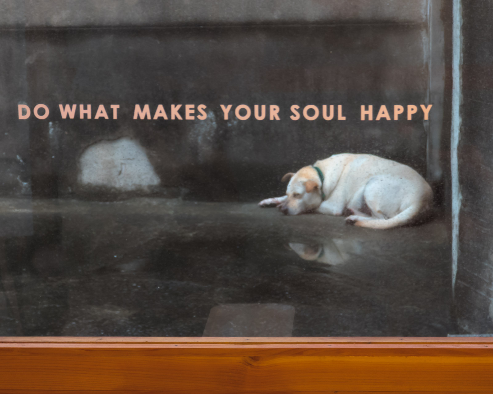

這周一在 Knowledge Night 分享了自己目前記筆記的方式與理由，講題結束完跟大家的交流覺得有些有意思的地方，寫在這邊作為延伸思考的一部分。

首先這次我雖然是分享自己寫知識筆記的方式，但實質上是透過寫筆記這樣的過程來進行比以前要更深度的思考與透過聯想加強自己未來檢索出相關資訊的能力。所以是否作筆記不見得那麼重要，但思考本身很重要。

## 講題

這次的四個演講的交集是**知識管理**，而大家的講題則是南轅北轍的不同，讓我覺得有機會可以吸收完全不同觀點的想法真的很棒。

牆壁講的強調是如何賦予大量資料足夠的脈絡，讓這些大量的資料可以在宏觀的脈絡下面產生足夠的有用資訊。

我則專注在閱讀時能夠進行更深度的思考與聯想。比起我以前閱讀大量的資料，我現在反而閱讀更少的資料，但是讓自己每次閱讀都能夠獲得更多想法。

Ernest 則是不愧是抽象化的達人，分享了抽象化的思考框架，透過這些思考工具來從更高階的角度來闡述自己在知識管理時用的工具。

而小畢則是講解了自己嘗試過的筆記工具以及每個筆記工具的優缺點以及他們獨一無二的特點以及標籤分類的困難之處。
## 會後討論

布丁提到了張忠謀不作筆記，我馬上想到的是他肯定有透過別的方式思考。回頭查了[相關新聞](https://money.udn.com/money/story/5612/7285237)之後確實也是這樣。

在演講裡面我有提到如果是在閱讀、實作、寫作跟交流討論這四種不一樣的學習行為，我會覺得在認真作筆記以前，**閱讀**是我學習知識的管道裡面吸收效率最不好的。而透過特定的筆記方式讓自己作筆記的時候就加強思考的深度確實讓我獲得了很多有趣的想法，而張忠謀就媒體上面的報導來說他可能更擅長於閱讀時就思考，或是透過與其他人交流來組織、思考自己學習到的東西。

後來又聊到**演講學習法**也是我自己經常作的事情，畢竟分享講題的時候就是會強迫自己搞懂一件事情，當作投影片與練習演講時，很快的就會發現自己不足之處並且在演講之前補足自己還沒搞懂的東西。寫文章或是跟別人討論也是一樣的道理，當你試著講解一件事情的時候，腦袋裡面就會重新排列組合知識，當講出口、完成寫作時知識肯定梳理得比起之前要更加清晰了。

而小畢提到《卡片盒筆記》以前在沒有數位工具的狀況只能靠抄寫這樣比較低效的複製方式，而現在數位的複製貼上則把複製的成本降到極低，相較起來現代科技在資訊的擷取與傳遞上真的是有神速的進展。確實這也是為什麼我在有筆記型電腦之後一直到現在都是採用數位方式作筆記的原因。

但是在施行卡片盒筆記一年多後我反而理解了「把螢光標記的重點，重新用自己的話轉述一次寫下來」的優點。看似一個多餘的動作，但是因為需要重新轉寫的關係，讓自己在轉寫重點的當下就產生了一次粗略的思考。

比如說我正在學習一門新知識，相較於單純把重點複製到筆記 app 裡面，如果可以寫下心得或是歸納出重點時，後者大多都可以很大程度的提升自己對新知識的掌握程度。

所以重點是在吸收知識時，有什麼方式可以**讓自己重新咀嚼思考這個知識**。要不要作筆記並不是真正的重點，重點是什麼方式可以促進自己思考。張忠謀不作筆記但是卻勤於閱讀與跟專家請教，布丁的演講學習法都一樣，找到一個好方法可以促進自己的知識重新梳理與深度思考才是最重要的事情。

希望大家都可以在思考與梳理知識中併發出自己覺得有意思的新想法，就跟照片裡面的標語那樣作一些讓自己的靈魂感到快樂的事情 😎
