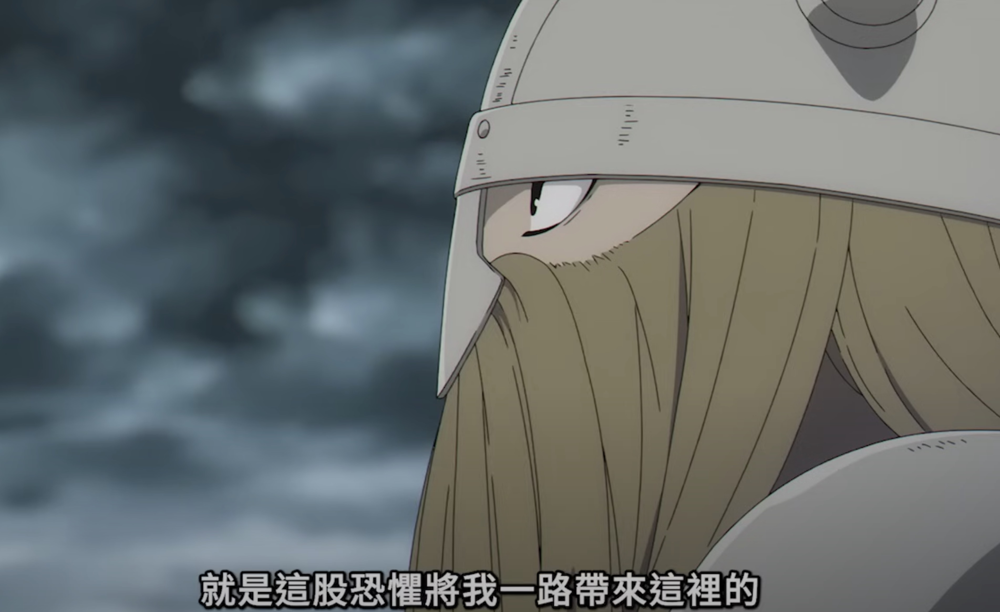

《葬送的芙莉蓮》的艾冉：「就是這股恐懼將我一路帶到這裡。」

我自己踏入新的領域、作新專案時對於未知也是一種恐懼夾帶興奮，然後痛苦也會在遇到困境的時候達到巔峰，最後在突破難關時突然心情放鬆下來。看著自己製作的成品的每個齒輪都鑲嵌在一起喀拉喀拉的轉動運作時，就有種平靜的快樂，走在去買飲料的路上都覺得開心。

岩明均在創作《歷史之眼》前，還創作了另外一部短篇《HEUREKA》講述《歷史之眼》時代後一百年左右在西西里島的故事，顯然作者對那段時間的歷史經過了非常大量的研究才有能量創作這兩部作品，或許他就在這裡找到了在他心裡面那件偉大的成就。

而在《歷史之眼》中最後殺死腓力二世的保薩尼亞斯（Pausanias of Orestis）刺殺後被殺死時看到了亞歷山大時，提到了他存在的目的就是讓一位新的王誕生。

我覺得岩明均本人跟他筆下的保薩尼亞斯都在自己人生的歷程裡面找到了自己心裡面那件「偉大的成就」，這樣的成就不需要別人的認可，而是自己內心深處知道的那件事情。

即使不需要別人的認同，那件「偉大的成就」實在是太難找到，我自己也是在這條路上步履蹣跚。我想過無數次到底什麼是成功，怎麼樣取得這樣的成就。我自己最後的答案就是保持好奇心的去探索這個世界與內心。

雖然我還沒有我自己的答案，但至少在這一路的探索上，有趣這件事情讓我過上了時而精彩時而痛苦的旅程。不管我有沒有找到我自己關於偉大的成就的答案，至少這一路上我很開心跟享受這個路程。

所以看到 Paul Graham 的 《How to Do Great Work》提到好奇心的重要性時，我自己心裡很激動。大家都用了不同的角度在探索自己存在的意義，而去蕪存菁下來，好奇心這件事情絕對佔了很重要的比重。

如果你也在探索人生意義上面感到徬徨無助，別擔心，很多人都是這樣，保持你的好奇心吧，讓它帶領你前進找到你自己的答案。當你對於你還沒有找到答案，甚至還沒找到問題時感到挫折時，請想想一路上帶領你到這裡的那段旅程所經過的溪流與路邊的景致，還有與你交談的有趣的人。

註：感謝周欽華翻譯了 Paul Graham 的那篇文章，[連結於此](https://www.facebook.com/chouchinhua/posts/pfbid03hxGvx9dk6Sb9X3tX9YXa7tvJ39voMaVy4uqNDDxZ3BVwwuVjFSBfggboKbPRy9Nl)。
