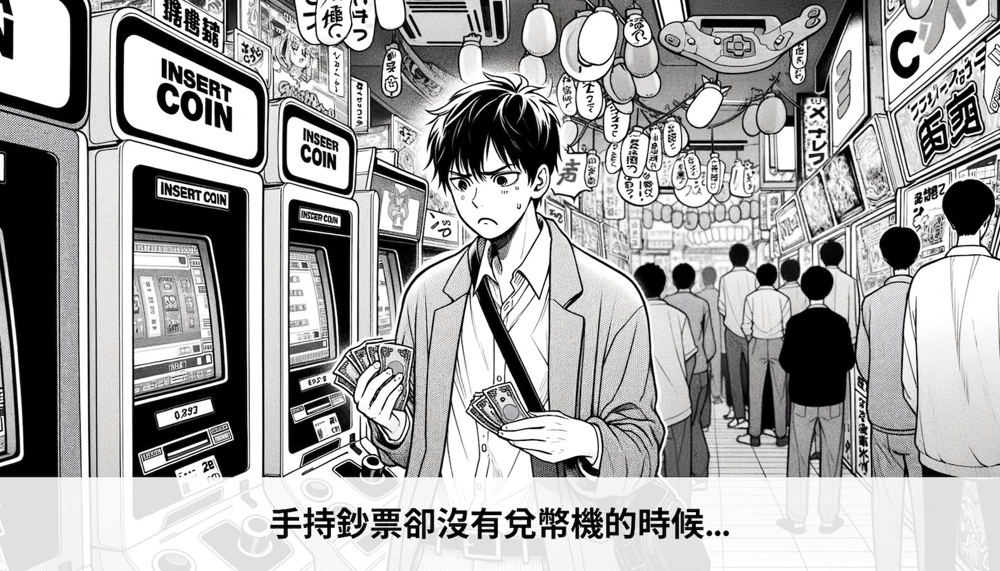

你曾經有 1000 USDC 在 Ethereum 帳號裡面卻因為沒有 ETH 而沒辦法發起交易嗎？

此 1000 USDC 可以替換成任何一種代幣。需要 ETH 才可以發起交易一直都是 Ethereum 使用體驗上的不便之處，當開始常用 Ethereum 之後幾乎一定會遇到這個惱人的問題。

而帳號抽象化（Account Abstraction, AA）這個名詞經常隨著上面這個問題一起被提及，而這又涉及到了幾個不同的以太坊改善提案（Ethereum Improvement Proposals, EIPs），不同提案中大量的技術內容則又讓人感到更困擾了。

本文將會梳理與介紹幾個不同的提案，並且透過同樣的範例來解釋他們分別解決了什麼問題。由於 Account Abstraction 涉及的知識非常多，本文將會把重點放在不同提案之間可以改善哪些使用者體驗，但不會談到太過深入的技術細節。

## 例子
Alice 安裝了錢包軟體，其中錢包軟體幫 Alice 產生了私鑰與相對應的 Ethereum 帳號，這樣擁有私鑰的 Ethereum 帳號稱 EOA (Externally Owned Account)。

他從朋友 Bob 那邊收到了 1000 USDC，原本想到 MockSwap 交易所上面用 USDC 換得一些 ETH，但是因為沒有 ETH 的關係就無法在 Ethereum 上面發起交易。

這個時候只能再拜託 Bob 給他一點點 ETH 他才可以開始使用這個帳號。

接下來我們就用上面這個例子，套用了不同的 EIP 之後使用者體驗可以得到什麼改善。

## EIP-4337: 不需要修改 Ethereum 協議的解決方案
[EIP-4337](https://eips.ethereum.org/EIPS/eip-4337) 是一種透過智能合約以及一個鏈下蒐集交易需求的解決方案，這樣可以在不需要修改 Ethereum 協議的狀況下改善使用者體驗。我們先來用上面的例子來看看透過 EIP-4337 可以得到的效果。

### EIP-4337 套用後的情況
如果使用支援 EIP-4337 的錢包軟體時，錢包軟體除了幫 Alice 產生私鑰以外，還會幫他建立一個合約錢包，所以 Bob 轉 1000 USDC 的時候會轉到 Alice 的合約錢包。

而 Alice 的合約錢包裡面雖然沒有 ETH，但是由於是合約錢包的關係，所以還是可以在 MockSwap 上面用 USDC 換得 ETH，並且可以用 USDC 來支付交易費。

### 解釋
以上的例子可以感受到使用者體驗已經增進很多了，Alice 即使不需要 ETH 也可以用 USDC 交換到 ETH。錢包軟體會幫 Alice 建立的合約錢包，當 Alice 需要送出交易時，實際上會把他要送出的交易以及他的簽名包裝成一種資料結構 `UserOperation`，並且透過錢包軟體提供的 APIs 發送。

當錢包軟體所提供的 API 收到使用者想進行的交易請求後，會把一個或多個操作請求打包成交易後送出，呼叫合約錢包的函式作為代理，並且在合約錢包裡面驗證使用者的簽名，驗證通過之後透過合約錢包呼叫 MockSwap 的函式進行代幣交換。

實際上的 ETH 交易費會由錢包軟體所管理的一個 EOA 支出，但在這樣的結構下可以讓使用者用不同的代幣如 USDC 支出，並且一段時間後把 USDC 交換成 ETH 並且存入這個 EOA 帳號。

而 EIP-4337 提供了更進一步的功能是可以用各種不同的驗證方式，不限於 Ethereum 私鑰所支援的 ECDSA 的 secp256k1 橢圓曲線，這樣可以增加很多彈性。

比如說它也可以設計成用 TouchID 或是 FaceID 進行 **P-256** 簽章，由於 iOS 透過硬體保護的私鑰都不會暴露在開發者可以存取的範圍，所以這樣也可以做成既安全又方便的設計。相同的 Android 的生物識別裝置，透過 Android Keystore 也支援 P-256 曲線。

EIP-4337 目前唯一、同時也是最大的缺點是他需要幫使用者建立合約錢包。建立合約錢包在 Layer 2 以目前的成本來說是可行的，但是如果要在 Ethereum Layer 1 上面建立就要看當下的交易費，以歷史資料來看補助使用者建立 Layer 1 的合約錢包，由於成本波動太高不太實際。

## EIP-3074: 原生 EOA 的代付機制
[EIP-3074](https://eips.ethereum.org/EIPS/eip-3074) 是一個相對的輕量修改方案，透過新增兩個 opcode 來讓 EOA 帳號所需支出的交易費可以由其他的帳號代付，我們用同樣一個例子來看 EIP-3074 可以達成的效果。

### EIP-3074 套用後的情況
當 Ethereum 支援 EIP-3074 以後，Alice 可以直接使用他的 EOA 帳號把 1000 USDC 在 MockSwap 交換成 ETH，在這之前他的帳號底下不需要有 ETH 才可以發起交易。

### 解釋
實際上 EIP-3074 新增了兩個新的 opcode:
- **AUTH**: 新增一個變數 `authorized`，呼叫 AUTH 時將會驗證參數中的 ECDSA 簽名，驗證成功時會將把 `authorized` 設定為使用者 EOA 的地址。
- **AUTHCALL**: 可以使用 `authorized` 變數裡面所指定的 EOA 身分進行交易。

實際上的作法是 Alice 把自己想要的**操作需求**用私鑰進行簽章之後透過錢包軟體提供的 API 送出這個有簽章的交易請求，接下來錢包軟體會用他們所管理的一個 EOA 帳號發出交易。

而執行的內容則是會透過一個代理的智能合約，先透過 `AUTH` 驗證使用者的簽章，驗證完成之後再透過 `AUTHCALL` 代替使用者的身分發出交易。所以這邊付出 ETH 交易費的會是錢包軟體所管理的 EOA 帳號，但是交易發生時會以 Alice 的帳號發出，這樣就可以達成不需要 ETH 的情況下也可以發出交易。

這樣的好處是不需要幫每一個使用者都建立一個智能合約錢包，而是可以更彈性的讓使用者用自己的 EOA 接收 USDC，並且支援從 EOA 帳號發出交易而不需要先有 ETH。

缺點有幾個。首先是會需要升級 Ethereum 協議，相較於 EIP-4337 可以完全用現有架構辦到，新增這兩個 opcode 會需要修改協議。另外一個缺點是 AUTH 所檢查的簽名只能是帳號的 ECDSA 演算法的 `secp256k1` 橢圓曲線簽名，比起上個解決方案可以用 FaceID 進行簽章會比較沒有彈性與易用性。

## EIP-2938: 完整支援 Account Abstraction
這是最早提出的方案，也是一個從修改協議層的角度下完整解決這個問題的改善方案。相同的讓我們先來看一下套用改善方案之後的情境。

### EIP-2938 套用後的情況
當 Ethereum 支援 EIP-2938 以後，Alice 可以直接把他 EOA 帳號底下的 USDC 在 MockSwap 交換成 ETH，除了不需要先有 ETH 以外，還可以用 TouchID 或是 FaceID 驗證身分，使用者體驗得到的大幅度的改善。

### 解釋
EIP-2938 大幅度的修改了 Ethereum 協議，使得發送交易時不需要附上原本 Ethereum 原生支援的 `secp256k1` 簽章格式，而是可以在智能合約裡面實作自訂的驗證邏輯，並且由於不需要原生簽名的關係，可以直接由智能合約發送交易，同時也新增 PAYGAS opcde 達成讓智能合約支付交易費的功能。

EIP-2938 修改的非常多，這邊只是非常粗淺的介紹，深入內容有興趣可以閱讀  [Account Abstraction 抽象帳戶：EIP-2938 簡介 | by ChiHaoLu](https://medium.com/taipei-ethereum-meetup/account-abstraction-%E6%8A%BD%E8%B1%A1%E5%B8%B3%E6%88%B6-eip-2938-%E7%B0%A1%E4%BB%8B-edfd64fac767) 以及作者發表的一系列 AA 文章。

EIP-2938 透過 Ethereum 協議的修改完整的解決了使用者體驗的問題，既可以用自訂的驗證方式支援不一樣的密碼學演算法，讓 TouchID 這類安全裝置內的私鑰進行簽章，同時又解開了 Contract Account 不能自行發行交易的限制。

缺點也顯而易見，EIP-2938 需要大幅度的修改協議，這麼大的修改實際上要充足討論到可以上線的時間顯然是曠日廢時。

## 結論
以上比較了三個不同的改善方案：

- **EIP-4337**：一個智能合約與鏈下設計的解決方案，可以在不修改 Ethereum 的狀況下達成 AA
- **EIP-3074**：讓 EOA 錢包可以透過兩個新的 opcode 達成只需 ECDSA 簽名並且無須 ETH 也可以執行交易
- **EIP-2938**：究極目標，讓 EOA 可以透過自訂驗證方式，無須 ETH 的情況下執行交易

以下是不同的改善方案的優缺點。

| 方案名稱  | 不需修改協議 | 不需為每個人建立合約錢包 | 支援多種簽名方式 |
|-----------|----------------|-------------|------------------|
| EIP-4337  | ✅             | ❌          | ✅               |
| EIP-3074  | ❌             | ✅          | ❌               |
| EIP-2938  | ❌（大幅度）             | ✅          | ✅               |

雖然 EIP-2938 是究極的解決方案，但面對要大幅度修改 Ethereum 協議，真的上線目前還是遙遙無期。EIP-3074 則位於中間地帶，相對 EIP-2938 來說修改幅度較小，但可以有效的解決 EOA 一定要有 ETH 才能送出交易的問題，不過看目前的 [討論狀況](https://ethereum-magicians.org/t/eip-3074-auth-and-authcall-opcodes/4880/130) 似乎也沒有太多進展。

EIP-4337 是最新提出的方案，既可以透過 TouchID/FaceID 來驗證使用者，同時透過合約錢包提供更多方便的功能例如社交還原等等功能，當然也支援了使用不同代幣支付交易費的情境。

雖然需要幫使用者建立合約錢包在 Ethereum Layer 1 上面成本不太合理，但是在眾多的 Layer 2 解決方案裡面由於交易費低廉，使得 EIP-4337 是一個在 Layer 2 最合理的解決方案。

Account Abstraction 在台灣社群裡面有非常多文章討論，本文並沒有針對技術細節詳加討論，若有興趣以下有一些推薦閱讀清單，如 [Anton](https://medium.com/@antonassocareer) 的 [從抽象帳戶到 ERC4337](https://medium.com/taipei-ethereum-meetup/%E5%BE%9E%E6%8A%BD%E8%B1%A1%E5%B8%B3%E6%88%B6%E5%88%B0erc4337-1b10d417b8d5)，另外 [ChiHaoLu](https://medium.com/@ChiHaoLu) 有一系列的文章討論 AA 也非常值得一讀，列表如下：

- [Account Abstraction 抽象帳戶：EIP-3074 與 EIP-4337 簡介](https://medium.com/taipei-ethereum-meetup/account-abstraction-%E6%8A%BD%E8%B1%A1%E5%B8%B3%E6%88%B6-eip-3074-%E8%88%87-eip-4337-%E7%B0%A1%E4%BB%8B-cb4e1f3f6864)
- [Account Abstraction 抽象帳戶：EIP-2938 簡介](https://medium.com/taipei-ethereum-meetup/account-abstraction-%E6%8A%BD%E8%B1%A1%E5%B8%B3%E6%88%B6-eip-2938-%E7%B0%A1%E4%BB%8B-edfd64fac767)
- [Account Abstraction 介紹（一）：以太坊的帳戶現況](https://medium.com/imtoken/account-abstraction-%E4%BB%8B%E7%B4%B9-%E4%B8%80-%E4%BB%A5%E5%A4%AA%E5%9D%8A%E7%9A%84%E5%B8%B3%E6%88%B6%E7%8F%BE%E6%B3%81-6c03c303f229)
- [Account Abstraction 介紹（二）：以太坊未來的帳戶體驗](https://medium.com/imtoken/account-abstraction-%E4%BB%8B%E7%B4%B9-%E4%BA%8C-%E4%BB%A5%E5%A4%AA%E5%9D%8A%E6%9C%AA%E4%BE%86%E7%9A%84%E5%B8%B3%E6%88%B6%E9%AB%94%E9%A9%97-cca0380d3ba5)
- [2023 年如何接觸 Account Abstraction](https://medium.com/@ChiHaoLu/2023-%E5%B9%B4%E5%A6%82%E4%BD%95%E6%8E%A5%E8%A7%B8-account-abstraction-b488f8fd6ab)
- [zkSync 中的原生 Account Abstraction 介紹](https://medium.com/taipei-ethereum-meetup/zksync-%E4%B8%AD%E7%9A%84%E5%8E%9F%E7%94%9F-account-abstraction-%E4%BB%8B%E7%B4%B9-bc7269f8893a)

