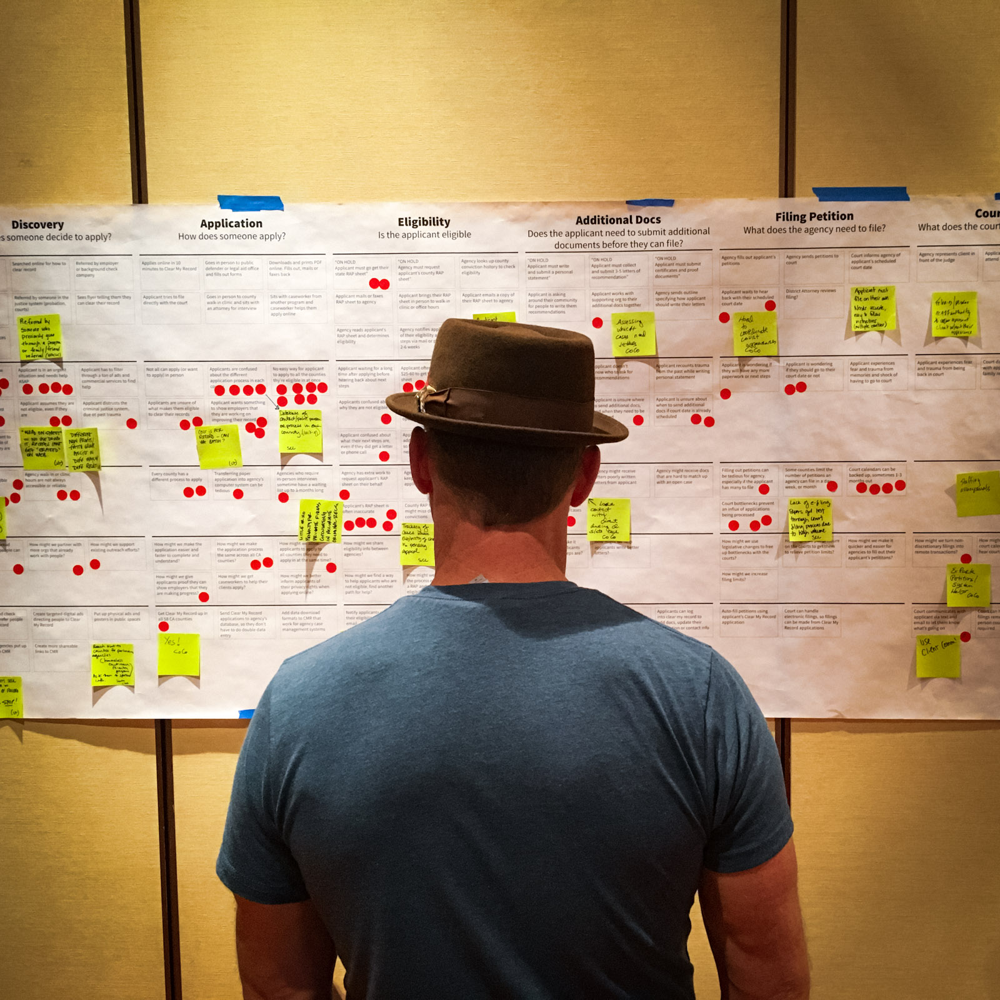
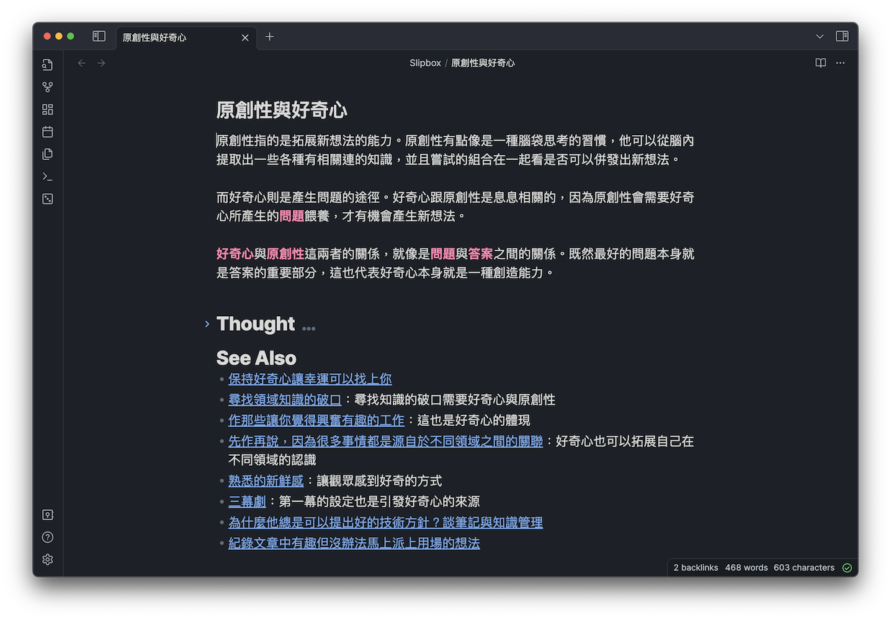
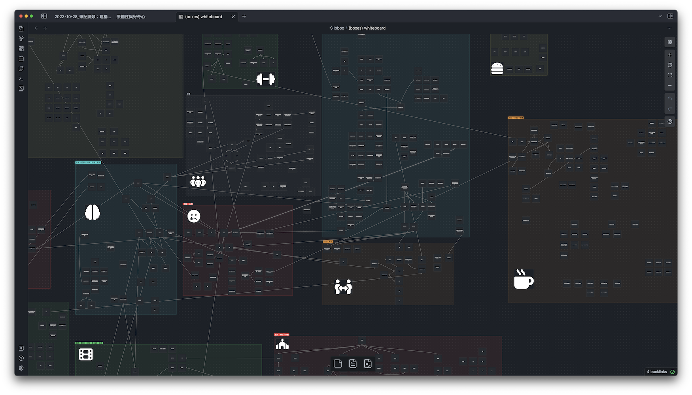
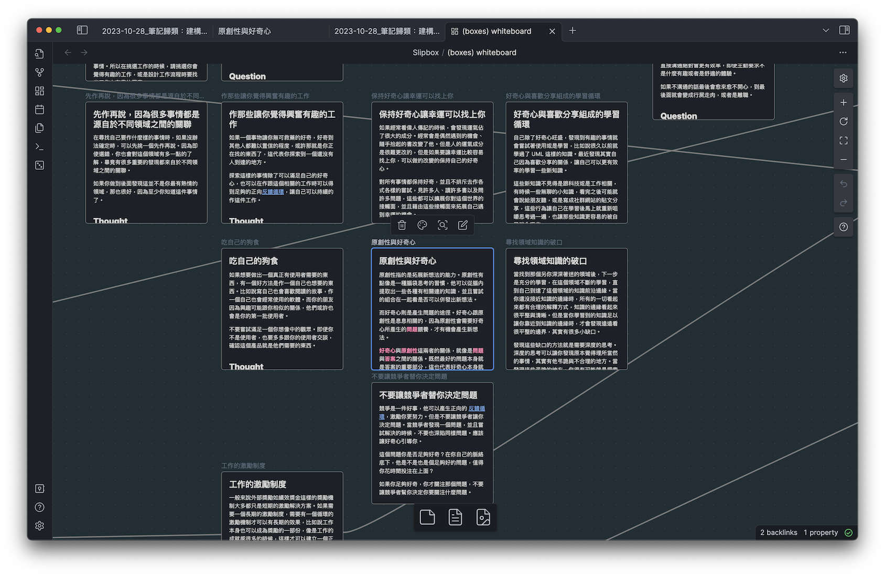

你曾經試過用分類（Categories）或是標籤（Tags）來嘗試著分類你的筆記嗎？

為了想要重新利用與堆疊自己的筆記產生新想法，我通常都會在筆記裡面有一個 "See Also" 的段落，放置自己覺得相關的筆記，並在需要的時候寫上一些註解描述。但當筆記變多之後，要找到相關的筆記就愈來愈困難。

而不論是發表的文章或是筆記，我都嘗試過用分類或是標籤來試圖找到相關的筆記，但是效果一直都不是很好，標籤與分類的顆粒粗細很難掌握，太細跟太粗都找不到關聯的筆記。

不過當 Obsidian 筆記軟體發表了新功能**畫布**（Canvas）後，我發現這是一個找到關聯筆記的優秀解決方案。我感覺我就像是電影裡的偵探一樣，一個個的把筆記用大頭針釘在地圖上，用棉線纏繞住好幾個相關的筆記，哼哼的冷笑兩聲後，眼神銳利的把兇手的照片用紅筆框起來（想太多）。

以下解釋一下問題脈絡，再來看我怎麼樣用畫布功能來找到相關連的筆記。

## 我的問題
我的狀況是大約有一千多篇筆記是這一年多來用固定格式紀錄的筆記，當超過一兩百篇之後就愈來愈難找到關聯了。之所以想要找到筆記之間的關聯，主要是希望可以併發出新的想法，或是找到我寫筆記時沒有注意到的細微知識，但是把兩篇關聯在一起之後就會比較容易發現。

比如說這篇《原創性與好奇心》筆記底下的 See Also 我會有一些相關的筆記跟註解，寫這些註解的實際用處是讓我在寫註解的時候就**再經過一次思考與咀嚼**。

但是這樣的關聯通過分類或是標籤不是很容易發現，但有時我自己腦子裡有時候可以想到一些可能有關的筆記填寫進去，這邊反倒是靠著我自己的**聯想**能力。而其他的部分可以靠關鍵字搜尋或許有機會找到一些。

那麼 Obsidian 的畫布功能是怎麼幫助我的呢？

## 我怎麼用畫布（Canvas）
Obsidian 的畫布是一種可以把多篇筆記、圖片放到一個平面上，並且可以有許多不同的整理工具，比如說線段、群組等等。

而我的用法也很簡單：我把每一篇筆記都放到同一個畫布裡面，並且把**相關的筆記放在一起**，我的畫布遠遠看是這樣：

裡面的每個色塊是一個分類群組，而每個群組都會有一個圖示來讓我在遠遠的鳥瞰時就可以知道他是哪個分類，比如說中間左邊的哭臉是**情緒**群組，情緒左邊的大腦圖示是**哲學、記憶、思考**，我的分類通常都不會太精確。

當我寫完一篇新的筆記時，我就會打開這個畫布，並且就像是在閒逛一樣先鳥瞰整個畫布，想想這篇筆記可能可以歸類在哪裡，然後再放大到我覺得有可能的地方。這時候我可能會放大錯地方，但是也沒關係，因為在這樣閒逛的同時，透過一瞥（At a glance）的瀏覽內容，也會重新讓這些筆記的資訊重新回憶，也有助於我一邊思考與檢索關聯。

由於畫布一次可以看到很多篇，通常只要有標題跟一些前面的一些文字就有助於我回想起筆記內容，偶爾可以從這樣的一瞥形式的瀏覽找到相關的筆記，特別是自己原本覺得毫不相關的筆記，但仔細想想其實有相關就會被我記錄到 See Also 段落裡面。

當我找到覺得最相關、最適合存放的位置時，就會把那篇筆記放下去，舉上面那篇《原創性與好奇心》的筆記，他被放置的地方是這裡：

這個時候旁邊通常都會是跟這篇筆記非常相關的內容，這個時候我也會再閱讀一下旁邊的筆記，並且把相關的筆記放入 See Also 裡面。

而這樣視覺的歸納法提供了幾個優點。
### 一瞥式的閱覽 (at a glance reading)
就像在逛書店或是看偵探證據牆一樣，當我們接收到這些視覺資訊時，經常可以刺激我們的聯想能力，而且這種攤開每篇筆記閱讀標題以及開頭的部分內文時，我自己確實也可以從這樣的過程中回想起筆記內容，進一步思考關聯性。

而在畫布**閒逛**本身也很重要，有很多有趣的想法都需要這樣**不經意的提起**。比如說在公司的茶水間閒聊，或是在大家一起吃下午茶或是雞排的時候併發的一些想法。在畫布的閒逛也替代了某種隨機的閱讀，並且透過標題以及開頭內文的輔助來形成快速提取資訊。

### 視覺距離的關聯取代分類
跟一般的分類與標籤相較起來，這樣的歸類方式其實是透過**距離**來評量關聯程度。這樣的歸類法比較不會因為顆粒細度影響相關筆記的檢索能力，同時也不需要太精準，因為我們只要在差不多的距離裡面可以看到筆記就行，畢竟我們的目的是要找到相關的筆記。

分類或索引的時候，進入到相同的標籤或分類的同時通常會有很多篇筆記，但標題排序、時間排序通常都不會讓我們更容易找到相關連的文章，比較有用的排序方式是**不同筆記之間，相同標籤的多寡**。但是這樣又需要建立大量標籤時才會逐漸有用，但同時又要面對標籤分類顆粒粗細的問題。

透過視覺化距離的關聯反而可以聚集這些相關的筆記。

## 使用了一段時間的感想
我使用這個方法來建立視覺化的索引方式差不多半年了，這樣的使用經驗確實讓我自己在探索相關筆記有很大的進步，而**聯想**與**思考**畢竟是我作筆記最想要達成的目標，那些寫下相關筆記後，接著補充的註解經常給了我很多不同的思考空間，甚至都足以再寫另外一篇筆記來擴展想法。

分類與標籤帶給我的實質幫助在筆記愈來愈多的情況下就越顯低落，相較之下視覺化索引即使在這種情況下還是很有幫助。

總之對我來說很有用，但我不知道是不是對每個人都有用，但試試也無妨對吧？至少你會得到一幅很酷的偵探證據關聯牆 🕵️‍♂️
