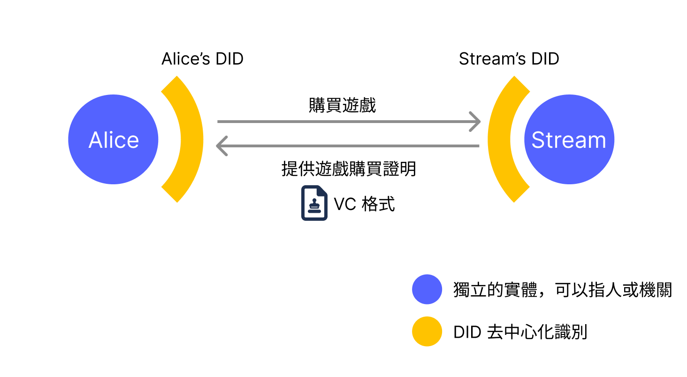
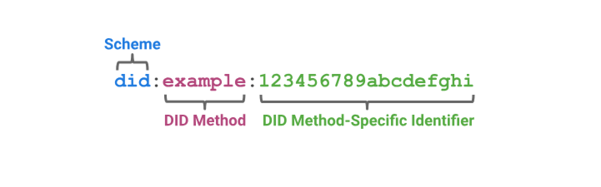
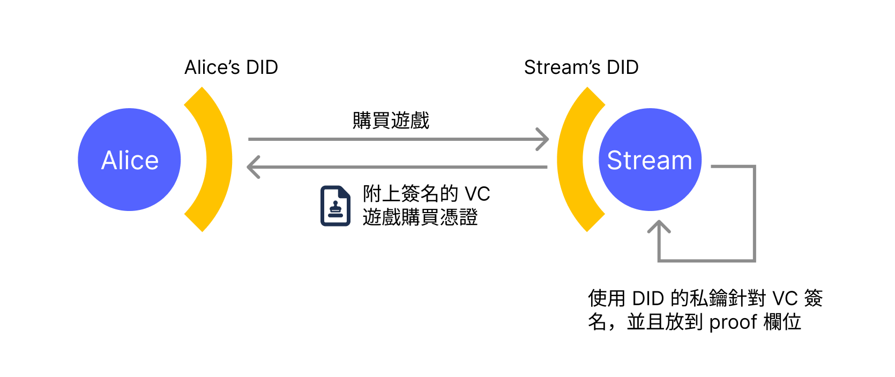
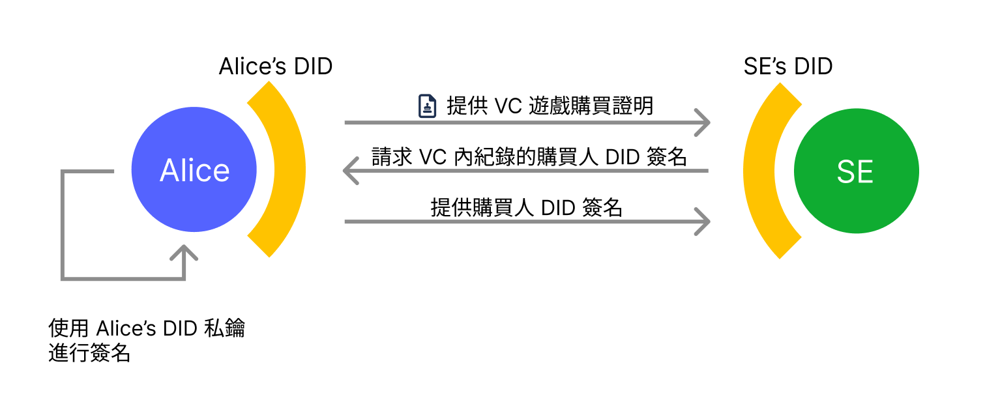

上一篇相關文章《[從 Facebook 無端封鎖帳號來看數位身分的問題與 DID 解決方案](https://yurenju.blog/posts/2023-08-21_fb-ban-and-did-solution/)》從我被 Facebook 無端停權的慘劇中重新審視了數位身分的現狀，並且簡短的提到 [W3C DIDs](https://w3c.github.io/did-core/) 這個企圖打破這個現狀的標準，接下來想要更深入的來探討 W3C DIDs 的機制如何改變現狀。

還沒閱讀[上篇文章](https://yurenju.blog/posts/2023-08-21_fb-ban-and-did-solution/)的讀者可以先回頭重溫一下 😎
## 現況
從我的角度來看現在的數位身分服務有幾個問題：
### 自主性
目前的數位身分不是由使用者擁有，而是由大企業擁有，而他們**允許**你使用那個數位身分，就像我 Facebook 帳號被永久刪除卻不需要取得我同意的情況。
### 隱私性
身分識別提供商（也就是 Google 與 Facebook 等企業）可以追蹤使用者的登入行為，而使用者的數位足跡就是他們的營利工具，透過使用者的數位足跡可以成為他們廣告的養分獲得豐厚的利潤。配合上企業擁有的其他服務如 Google 搜尋引擎、Facebook 社群網路搭配上嵌入在網站的 Facebook 留言功能就足夠拼湊起使用者的模樣，然後提供你喜歡的廣告，甚至餵給你[更容易上鉤的詐騙廣告](https://www.youtube.com/watch?v=PAr1F5keUGw)。

但 DIDs 要怎麼解決這些問題呢？首先讓我們更進一步的了解 DIDs。
## W3C DIDs
W3C 去中心化身分識別（Decentralized Identifiers, DIDs）是一個**去中心化身分識別**的標準，使用者可以使用一個基於密碼學的數位身分來進行身分驗證。實際上使用 W3C DIDs 的時候，經常需要配合另外一個標準 **W3C 可驗證憑證**（Verifiable Credentials, VCs） 。兩個的標準分別負責不同功能：

- DIDs 標準：如何驗證一個 DID 身分識別
- VCs 標準：一個 DID 要替另外一個 DID 的聲明背書時所發出的憑證

舉例來說，Alice 在一個遊戲購買平台（就叫這個平台 Stream 吧）購買一個由遊戲開發商 "SE" 開發的遊戲《最先幻想》時，Stream 會發給 Alice 一個遊戲購買證明。



這個情境底下 Stream 作為平台方會擁有一個 DID 身分識別，而 Alice 也會有一個作為個人的 DID 身分識別。Stream 在 Alice 購買遊戲之前，會先從 Alice 的 DID 識別裡面找出如何驗證的資訊，並且驗證這個 Alice DID 識別，DID 標準就是制定這些要如何驗證的資訊。

當 Alice 通過 DID 驗證並且購買遊戲後，Stream 會發給 Alice 一個採用 VC 標準格式的遊戲購買證明，裡面由 Stream 的 DID 作為發行者（Issuer）證明 Alice 在 Stream 上面購買了遊戲《最先幻想》，這樣針對一個聲明背書所產生的憑證。往後收到這個憑證的系統可以根據裡面的資訊驗證 VC 裡面記載的資訊是否正確無誤，這就是 VC 標準所提供的功能。

一個 DID 識別長得像這樣：



DID 識別由三個欄位組成並且以冒號分隔欄位。第一個欄位固定是字串 `did`，第二個欄位則是 DID Method，由於基於密碼學的數位身分有非常多不同的種類與平台，有區塊鏈平台、非區塊鏈平台、使用者放在自己網站上的公鑰資訊、甚至本地產生的公鑰也支援，這些不同的 DID 種類的存取方式稱為 DID Method，而第二個欄位就是標記這個 DID 識別使用了哪種 DID Method。第三個欄位則是針對特定 DID Method 的識別字串。

舉例來說以下的 DID 識別：`did:ethr:0xb9c5714089478a327f09197987f16f9e5d936e8a` 代表的意思是：
1. `did`: 這是一個 DID 識別
2. `ethr`: 這個 DID 識別採用的識別方式是 `ethr` 這個 DID Method
3. `0xb9c5...6e8a`: 使用者在這個 DID Method 用這個字串代表特定身分識別（可以想像是身分證字號）

而這個 DID 識別字串經過合適的函式庫解析之後就可以得知要如何跟這個 DID 互動，比如說如何驗證使身分或是驗證憑證，這些互動資訊會是一個 JSON 檔案，稱為 DID Document。

這邊介紹幾個不同的 DID Method：
- `did:key`：使用者直接在 DID 識別字串裡提供的公鑰，沒有把公鑰資訊放在其他地方
- `did:web`：使用者把公鑰資訊放在自己的網站上面
- `did:ethr`：使用者指定自己在 Ethereum 區塊鏈上面的帳號地址作為 DID 識別

除了以上三種以外 DID Method 有非常多種，更多種類請參考 [DID Specification Registries](https://www.w3.org/TR/did-spec-registries/)。
### did:key
`did:key` 是指 DID 識別的字串裡面就自帶了公鑰資訊，所以不需要區塊鏈或是其他存放公鑰的地方。舉例來說一個 DID 識別 `did:key:z6MkhaXgBZDvotDkL5257faiztiGiC2QtKLGpbnnEGta2doK` 的第三個部分 `z6Mk...2doK` 就是一個演算法的公鑰，這樣的資訊就足夠來驗證這個 DID 識別了。要判斷是哪一種加密演算法，可以從第三個欄位開頭判斷，舉例來說：

- `z6Mk`: Ed25519 演算法
- `zQ3s`: Secp256k1 演算法
- `zDn`: P-256 演算法

所以上面的例子 `z6Mk...2doK` 就可以辨識需要採用 Ed25519 演算法來驗證訊息。

`did:key` 的好處是非常簡易，並且由使用者自行保管，如果包裝成 app 甚至可以使用生物識別裝置如 TouchID 來安全的存放私鑰，算是非常方便的選擇。缺點是比較沒有彈性，比如說你想要幾個不同裝置如手機、電腦來管理一個 DID 身分並沒有一個安全的管理方式。

另外一個缺點是 `did:key` 目前的格式並不支援 [WebAuthn](https://webauthn.io/) 的格式，所以沒辦法在網頁上直接用生物識別裝置來管理 `did:key`，必須要包裝成 mobile app。

### did:web
`did:web` 是使用者透過上傳一個 JSON 到特定網址來提供 DID 互動資訊的方式，舉例來說 DID 識別 `did:web:mattr.global` 實際上會從網址 https://mattr.global/.well-known/did.json 獲得 DID 識別資訊。這個 DID 的擁有者可以藉由改變這個放在網站上面的 JSON 檔案來調整他對身分驗證的需求，比如說他可以在多個裝置都擁有不同的密碼學鑰匙，讓他可以在手機、電腦、平板電腦上面都可以登入，或是他想要定期的汰換更新鑰匙來保持安全性也都可以做到。

`did:web` 的好處也是很簡單，並且要更新也非常方便，我想因為大家覺得自己**擁有**那個網址，所以會覺得滿安全的。缺點是針對一般人不算是特別方便，簡易的方法可能是在 Github pages 裡面上傳一個檔案，對於工程師來說很簡單，對於一般使用者會稍有難度。

但從**去中心化**的角度來說 `did:web` 有一些缺點。比如說如果是放在 Github Pages 時，當你跟 Github 產生利益衝突，官方決定移除掉你的網站後，你的數位身分也被奪走了。更別說網域名稱即使註冊了也是有期間限制，同時你也有可能跟網域商有利益衝突而導致網域失效。

當然從大多數人的角度來看，這個方法已經夠有自主權了，但如果你擔心的話，可以使用稍微沒有彈性的 `did:key`，或是看看下一個解決方案 `did:ethr`。
### did:ethr
`did:ethr` 是一個把 DID 識別的互動資訊放在 Ethereum 或相容區塊鏈上面的一種 DID Method，舉例來說 DID 識別 `did:ethr:0xf3beac30c498d9e26865f34fcaa57dbb935b0d74`，第三個部分就是帳號地址，使用者就可以用控制這個帳號的私鑰來驗證這個 DID 識別，驗證的方法預設就是針對一個訊息簽名，這是一個 Ethereum 區塊鏈使用者經常會作的事情，也很直覺。

除了開箱即用以外，他還可以透過一個[智能合約](https://etherscan.io/address/0xdca7ef03e98e0dc2b855be647c39abe984fcf21b)來進階設定這個 DID，也可以做到多裝置/私鑰管理同一個 DID 識別以及進行鑰匙的更新汰換等進階功能。

`did:ethr` 的優點在於跟 `did:web` 一樣有更多選項可以調整 DID 識別，同時足夠**去中心化**，保證了只要擁有相對應的私鑰就可以完整的控制 DID 識別，中間沒有其他中間人如雲端伺服器廠商或是網域商可能跟使用者有利益衝突而奪走你的數位身分。

但缺點也很顯而易見，由於 `did:ethr` 是採用區塊鏈技術，沒有接觸過區塊鏈的使用者會覺得門檻太高不容易使用。

## Verifiable Data (VC)
VC 跟 DID Document 一樣都是一個 JSON 檔案，如同前面的敘述所說 VC 是一個 DID 發給另外一個 DID 的憑證來為一個特定聲明背書。如果一樣以遊戲購買平台 Stream 的例子來看，Stream 的 DID 可能是 `did:web:streamgame.com`，而 Alice 如果選擇用他自己的 Ethereum 區塊鏈帳號來代表他的身分，那 DID 就會類似 `did:ethr:0xf3beac30c498d9e26865f34fcaa57dbb935b0d74`。

這邊也可以觀察到 VC 裡面的**發行者**跟**授予者**可以使用不同 DID Method，所以一個把公鑰儲存在網站的發行者，也可以把 VC 憑證發行給一個使用 Ethereum 帳號地址作為 DID 識別代表的使用者。

當 Alice 購買遊戲後，Stream 的系統就會發行一個 VC 遊戲購買憑證給 Alice，範例如下：

```javascript
{
  "@context": ["https://www.w3.org/2018/credentials/v1"],
  "issuer": {
    "id": "did:web:streamgame.com"
  },
  "credentialSubject": {
    "id": "did:ethr:0xf3beac30c498d9e26865f34fcaa57dbb935b0d74",
    "purchaseId": "123456789",
    "gameTitle": "First Fantasy",
    "purchaseDate": "2023-12-31T15:00:00Z",
    "paymentAmount": 59.99,
    "currency": "USD",
    "platform": "PC"
  },
  "type": ["VerifiableCredential"],
  "issuanceDate": "2023-10-30T07:57:06.000Z",
  "proof": {
    "type": "JwtProof2020",
    "jwt": "eyJhbGci...2rzP0K5wow"
  }
}
```


這個範例裡面描述了發行方（Issuer）是 `did:web:streamgame.com`，購買遊戲的人是 Alice 的 DID `did:ethr:0xf3beac30c498d9e26865f34fcaa57dbb935b0d74`，並且在 `credentialSubject` 欄位有遊戲購買資訊。

這邊重要的是 `proof` 欄位裡面是發行方針對這個 VC 的簽署資訊，任何人拿到這個檔案之後都可以驗證這個檔案是否確實是由 Steam 所簽署與發布。Alice 取得這個憑證之後，就可以跟其他人或是廠商出示來證明他擁有這個遊戲。



舉例來說他購買的遊戲《最先幻想》的遊戲廠商 "SE" 推出了下個世代的遊戲《中間幻想》，而新版本並不在 Stream 上面販售，改在 "SE" 的官方網站可以購買數位版本，但是買家可以透過《最先幻想》的購買證明來享有《中間幻想》的六折優惠。

另外由於在 `credentialSubject` 的 `id` 屬性有紀錄了 Alice 的 DID 識別，"SE" 官方網站在確認使用者是 VC 當中所紀錄的購買人時，也可以請求使用者 DID 的簽名，確保他就是這筆購買證明的購買者，而不是竊取的購買證明。




接下來我們用同一個範例來檢視現行身分驗證機制與採用 DID 身分驗證機制的不同之處。
## 範例：現行身分驗證與 DID 的差異
在上面這個例子裡 Alice 從遊戲購買平台 Stream 購買了《最先幻想》，新版本的遊戲《中間幻想》則在 "SE" 官網上面販售數位版本，而且只要以前在 Stream 購買過上個版本《最先幻想》就可以用六折優惠購買《中間幻想》。

### 現行身分驗證機制
如果是現行的身分驗證機制，Stream 遊戲購買平台會提供一個登入 Stream 平台的功能，通常會採用類似 OpenID Connect (OIDC) 的標準提供這個功能。當在遊戲官方網站透過 OIDC 連結 Stream 之後，再透過 Stream 的 APIs 來取得使用者的購買資訊。

接下來我們來探討一下這個方法在自主性與隱私性上面有什麼問題：
#### 自主性
如果 Stream 因為年代久遠下架了《最先幻想》，或是 Alice 跟 Stream 之間有什麼利益衝突（比如說 Alice 幫敵對平台 Epico 打廣告）進而宣稱 Alice 「違反平台規範」而停權了他的帳號，"SE" 官方網站是無法透過其他方式來取得 Alice 在 Stream 上面的資料。

這個狀況就跟我遇到 Facebook 完全無理由的將我的帳號永久停權一樣，我並沒有真的 **擁有** Facebook 上面的數位身分。
#### 隱私性
當遊戲官方網站因為《中間幻想》的折扣販售需要透過 Stream APIs 進行登入、查詢購買紀錄，Stream 將會得知 Alice 在 "SE" 官方網站商店的數位足跡。如果 Stream 也是一間利用使用者數位足跡營利的遊戲平台（比如說他有提供遊戲廣告），那麼他就有強烈的動機來紀錄使用者的數位足跡。

接下來我們來看看如果採用 W3C DIDs 會是什麼情況。
### W3C DIDs 身分驗證機制
如果採用 W3C DIDs 實作購買證明機制時，當 Alice 購買遊戲《最先幻想》時，就會根據 Alice 的 DID 識別發布一個採用 Verifiable Credential 格式的遊戲購買證明給 Alice，這個購買證明裡面會包含 Stream 發行方的簽章、購買人資訊以及遊戲資訊。

當 Alice 想要從 "SE" 官方遊戲平台購買新版本的《中間幻想》需要檢查在 Stream 平台的購買資格時，僅需要把該遊戲購買憑證 VC 提供給 "SE" 官方網站，此時 "SE" 官方網站會驗證該憑證是否為 Stream 發行，並且是正確的遊戲購買憑證以及藉由購買人簽名驗證 Alice 是否擁有購買時使用的特定 DID 識別。

驗證完 VC 格式的購買證明之後，"SE" 遊戲官方網站就可以提供優惠給 Alice 了。接下來我們一樣來審視一下自主性以及隱私性。
#### 自主性
當 Stream 提供 VC 購買憑證給 Alice 之後，上面會附有 Stream 發行方的簽名，這個簽名是無法否認的，證明 Stream 發行方肯定有簽名過。

W3C DIDs 標準其實有提供撤銷機制，但這個撤銷機制僅是透過**撤銷清單**讓發行方將此憑證標記為**撤銷狀態**，之前附在 VC 上面的簽名依然是無法否認。

即使 Stream 標注了 Alice 的購買證明已經被撤銷，但是以前 Alice 所保存的購買資訊憑證仍然可以證明他曾經在 Stream 上面購買過這個遊戲，因為所有需要的資訊都在憑證裡面了。雖然撤銷機制會把這個憑證標示成 **已撤銷**，但並沒有辦法否認 Stream 發行方以前曾經對這個憑證簽名過，所以憑證的發行方簽名依然有效，只是多了一個 **已撤銷** 的標記。

這樣販售《中間幻想》的 "SE" 官方網站可以自行決定要不要接受這樣的憑證，而不是把權力都集中在發行方上面。
#### 隱私性
當 Alice 提供憑證給遊戲官方平台時，Stream 如果選擇把發行方公鑰資訊放在網站上，頂多只能知道有人下載了公鑰資訊，並不知道是哪個使用者要拿來驗證哪個遊戲，如果放在 Ethereum 區塊鏈上面的時候，Stream 甚至不知道有人下載過公鑰資訊。在隱私權的保障上就比起現行的實作方式要更好。

這兩個特性在傳統驗證機制與 DID 驗證機制的差異如下：

| 特性 | 傳統身分驗證機制 | W3C DIDs 身分驗證機制 |
|------|-------------------|-----------------------|
| 自主性 | 平台有權決定撤銷使用者的憑證或身分，並且拒絕任何資料存取 | 平台只能標記憑證為已撤銷，但是無法否定他曾經簽名過的憑證 |
| 隱私性 | 透過 APIs 登入或查詢資料時，平台可以獲得使用者的數為足跡 | 平台無法透過登入行為追蹤使用者的數位足跡 |
## 結論：隱私與自主得到了保障，還缺什麼？
承上所述，W3C DIDs 以及 Verifiable Credentials 標準確實提升了使用者對於身分驗證的自主性與隱私性，這個機制既然這麼好，應該現在就要立即導入 DID，我們還在等什麼呢？

DIDs 是一個剛成形不久的標準協議，其實還是有很多不足的地方。首先如果需要更好的支援 DID 已及 VC，我們會需要一個可以收納各種 VC 憑證的 app，並且在需要使用的時機可以透過這個 app 來選取自己這次要使用的憑證，而這個 app 還會需要可以管理使用者的私鑰，這個 app 本質上會很像 Apple Wallet 或是 Google Wallet 這樣用來收藏票券以及會員卡的錢包，但是還會需要額外有管理內部或是外部私鑰的功能實作。

現實中並沒有一個成熟好用的 app 來作這件事情，更何況 DID 還在起步階段，到底是要先有 VC Wallet 還是先支援 DID 就變成先有雞還是先有蛋的問題。

而下一個問題就是**動機**。就如同上面的敘述，採用 DID 之後，身分識別提供商或是憑證發行方的權力都會大幅縮減，並且更難追蹤使用者的數位足跡。這邊可以換位思考一下如果 Google 或是 Facebook 實作一個新的身分驗證協議會大幅度的降低廣告的精準度，進而導致主要營收來源的獲利減低，同時又失去了更多對於使用者的控制權，那他們會有什麼動機來換成 DIDs 呢？

比較好的切入點可能會是從監管的角度來看，由主管機關比如說歐盟規範巨型企業必須縮減對數位世界的掌控權，甚至由政府針先行針對官方憑證如身分證或是駕照採用 DID 標準，我認為是比較好的切入角度。

回過頭來說 DIDs 還非常的早期，要面對的缺點實在很多。但反過來看他也是充滿希望的地方，這個標準針對目前巨型企業對於數位世界的巨大掌控權進行了反思，並且描繪了一個更加自主與具備隱私的藍圖，讓我們可以藉此思考是否有機會可以透過標準來將一些原本就該屬於使用者的權力收回。

當然我們對於未來的想像也可不止於此，我們可以再推進一步來看：如果還想要更好的隱私，現在有什麼解決方案可以達成？舉例來說，如果我們驗證使用者是否曾經在 Stream 購買過《最先幻想》時，是不是連自己的 DID 識別都不用揭露，也可以驗證使用者確實購買過該遊戲呢？

下一篇文章將會講解 [Semaphore](https://semaphore.appliedzkp.org/) 這個零知識證明的框架如何達成更進一步的隱私應用，我們下回分曉！

## 補充資訊
### did:web 無痕更換鑰匙的問題
Luoh Ren-Shan 在 [Facebook 的評論](https://www.facebook.com/yurenju/posts/pfbid0916c4YdTULXymUW68pE32nuNTYVHAXcpkV4NZEuM7ZodGBHz1NEKpaBgrmLLG6VEl?comment_id=881600443684722) 提到如果發行方 Stream 採用 `did:web` 作為 DID 時，發行方是可以無痕的更改自己的鑰匙資訊，來讓 Alice 手上的憑證失效。

這確實是一個問題，但是這樣更新鑰匙資訊時，Stream 其他用原本鑰匙簽發的憑證也會一併失效，並不能只限制在 Alice 的憑證，這就會產生對於 Stream 發行方的信任危機，身為使用 `did:web` 的發行方就會需要在好壞權衡裡面考量是否要這麼做。當然如果出大包的時候發行方可能還是會出這招來激進的處理棘手問題，但相較於傳統的方法可以輕易的操縱結果，使用 `did:web` 還是會更值得信任一些，但並不完美。

回過頭來如果使用的是 `did:ethr` 時，當 DID 擁有者更新鑰匙資訊的時候會留下歷史紀錄，並且可以透過 [參數查詢](https://github.com/decentralized-identity/ethr-did-resolver/blob/master/doc/did-method-spec.md#versionid-query-string-parameter) 之前版本的 DID 文件，相較於 `did:web` 又會更值得信賴一些。
