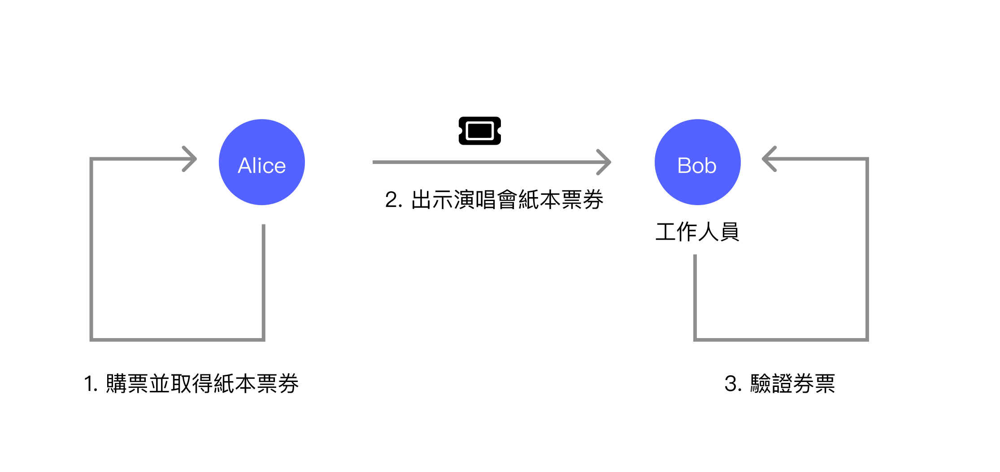
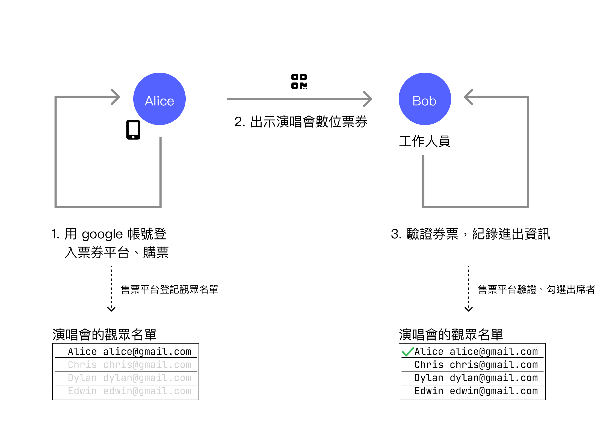
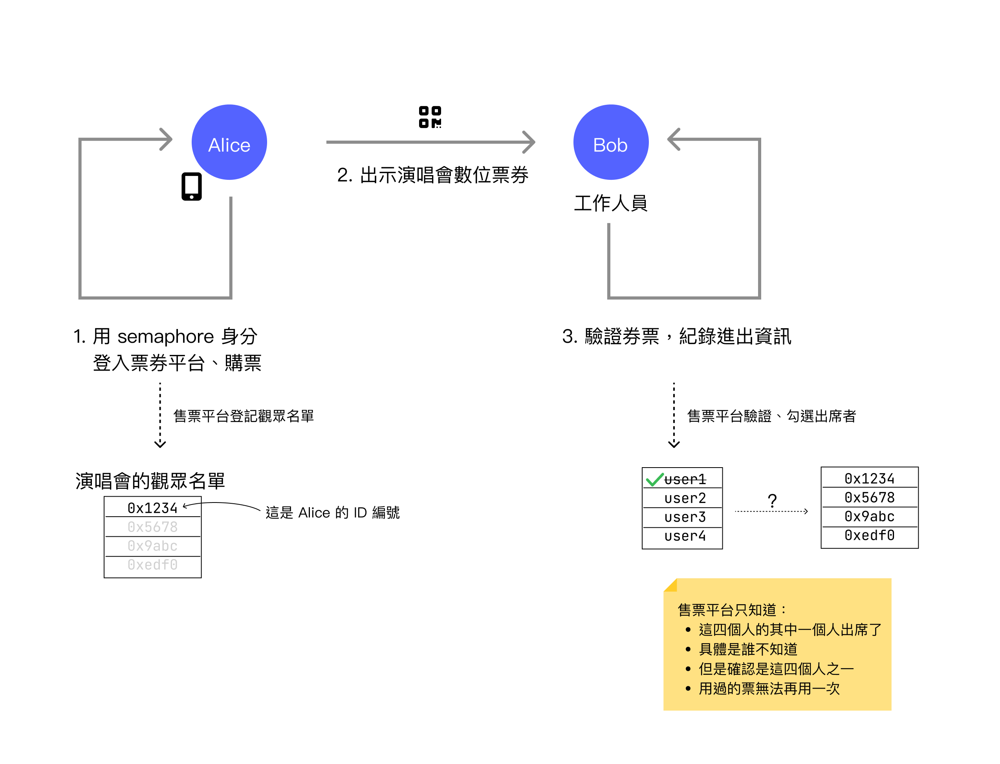
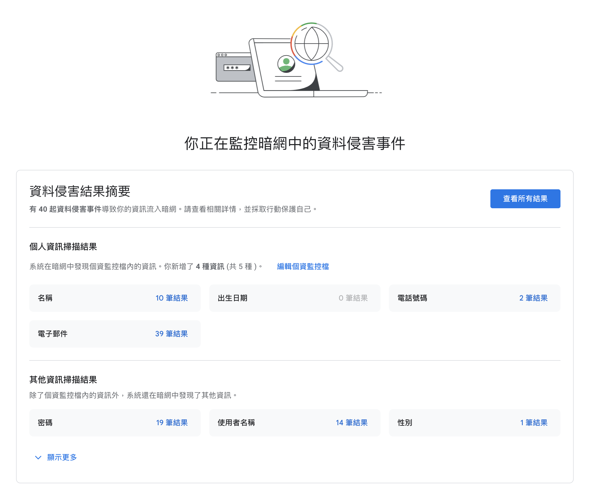

當去看演唱會的時候，只要出示演唱會紙本門票就可以進入會場了，偶爾實名制的場合會需要出示身分證，這樣透過紙本門票的方式，工作人員既可以驗證身分而你的足跡又不會被紀錄。

但是在數位生活的場合就不是這樣。

在數位生活裡面當你需要證明身分而進行驗證時，幾乎無一倖免的，你的驗證行為會被紀錄。就拿同樣的例子來說，如果進入演唱會會場出示電子門票時，你的入場資訊很大的機率就會被紀錄下來。

很多時候這些紀錄都是有意義的，而使用者也可以理解與接受，就比如說票券確實要進出紀錄才可以防止一張票券多次使用。但是數位足跡**容易跟蹤**的特性已經走太遠而有許多不堪其擾的現象，最常見的就是瀏覽網頁之後在 Facebook 與 Google 上面都會充斥著各種相關廣告，就像是走在路上後面有人拿著筆記本貼近著你紀錄一舉一動，你在超商翻過的雜誌，你喜歡喝的飲料。然後反覆在你行徑的路上張貼他覺得你會買單的廣告。

而以往針對身分的登入與驗證，實作的方式都不會考慮讓這件事情不容易被追蹤，因為有效、容易評估與追蹤就是數位紀錄的長處。但當人們開始重新認知到數位足跡對與隱私的重要性之後，才會回頭發現我們目前常用的數位科技並沒有那種**不容易被跟蹤**的特性。

而 [Semaphore](https://semaphore.pse.dev/) 就是因此而生的機制。

Semaphore 是一種透過密碼學當中的零知識證明（Zero Knowledge Proof, ZKP）而實作的身分驗證機制。傳統的數位身分驗證都會需要明確的輸入你的身分識別資訊，比如說登入 Google 帳號時要輸入帳號與密碼，而帳號本身就是你的身分識別資訊了。

在 Semaphore 的使用情境下，你不會需要輸入**帳號**這樣的資訊，取而代之的是只驗證**資格**，而不驗證使用者確切對應的數位身分。讓我們同樣的使用售票平台的場景，但是三種不同的技術實現來解釋這個概念。

## 範例場景
### 紙本票券

使用紙本票券的情況下，Alice 在售票網站購票之後取得紙本票券，在活動現場時出示票券給工作人員 Bob，Bob 此時會檢查這張票券是否正確，如果正確的話就讓 Alice 參加活動。

紙本票券有些固有的缺點，比如說會需要額外的防偽措施來避免其他人造假票券，同時這樣的情境通常也可以用一些電子檢查手段，比如說附上 QR Code 掃描驗證來避免一張票被使用兩次，但採用電子檢查機制時一般來說也會紀錄使用者的足跡。

### 數位票券

使用數位票券的狀況時，Alice 首先要用帳號登入票券平台並且購票。當購票成功後 Alice 會被加入觀眾名單，當到了活動會場的時候，則出示如 QR Code 的手機畫面入場，Bob 用 QR Code 驗證票券正確之後即讓 Alice 入場，並且系統標示 Alice 的這張票券已經入場。

數位票券的好處就是查核上更為方便，雖然會有技術性的問題要克服，但是入場時可以透過後台的資料庫快速的確認觀眾是否為出席者，即使多人用同一張票券入場也可以偵測到。

缺點就是數位足跡的問題，合理使用的時候沒問題，但是以現在的情況實在是太濫用了，特別是廣告。

### Semaphore 身分認證

Semaphore 是一個開發套件來協助開發者製作一個**匿名卻可驗證**的登入機制。首先一樣的會先需要登入票券平台並且購票，但是這邊售票平台則是讓使用者註冊他的 Semaphore Identity，如果有輸入名字時，售票平台依然會知道使用者的名字與對應的 ID 編號，舉例來說 Alice 註冊之後，他的 ID 編號 `0x1234` 還是會對應到他的名字 Alice。

活動當天 Alice 要進去時，同樣的會出示 QR Code 入場，此時工作人員 Bob 一樣也是掃描票券，但是這個 QR Code 並不會包含使用者明確的身分驗證資訊（比如說帳號或是電子郵件），而是會讓驗證方提出一個密碼學挑戰，並且使用者在不揭露身分的前提下回覆一個挑戰解答，這個解答只有是出席者之一才有辦法回答出來，用此來證明他是出席者但卻又不表明自己實際上是哪位。

這代表驗證票券時，出席名單裡面只會出現類似 `user1`, `user2`, `user3`, `user4` 這樣的資訊，而這會分別代表四位出席者，但是 `userN` 跟實際出席者的 ID 編號的對應關係是平台無法得知的。

當 Alice 驗證成功之後，平台只會知道這四個可以入場的出席者裡面，有一個人入場了，還有三個人還沒有入場。至於究竟是哪位入場的，驗證方無從得知，並且這張票券會被標示成已使用，其他人不能拿著同一張票券入場。

而這些功能的實作，都是基於密碼學裡面零知識證明的技術，用密碼學保證使用者的資格既可以驗證，而又不用揭露確切身分。

這又比起 W3C DIDs/VC 的機制對於隱私的保護能力又更強了一些，VC 驗證時無可避免的會透漏使用者的公鑰，而 Semaphore 則是不會透漏任何使用者的識別資訊。

# 使用 Semaphore 的原因與場景

如同前面所說，現代常用的數位身分驗證技術都不可避免的會披露使用者的身分，當這些紀錄被串連在一起之後所產生的數位足跡對個人隱私的揭露是一大威脅。如影隨形、不堪其擾的廣告還不夠煩人，就連使用者在兩個完全不同帳號的平台之間切換，比如說社群網站跟部落格網站這樣帳號沒有共通的地方，廣告竟然可以尾隨到各個地方，這些事情惱人到了極致。

另外一個更令人憂心的是網站入侵事件，當駭客入侵了網站，而使用者在那個網站有許多資料與足跡的時候，這些東西就會被當成詐騙或是下一次入侵的素材散佈在無遠弗屆的網際網路上面。舉例來說，我自己使用網際網路時已經算是比較小心謹慎的人，但是在 Google One 上面的暗網監控功能裡面還是可以看到我的資料大量的被洩漏，而這些大多都是網站被入侵後放到暗網上面販賣。

而當使用 Semaphore 這樣技術的網站變多了之後，由於網站上面儲存的資料最小化，這樣一來連網站本身也無法識別使用者的數位足跡的狀況下，即使被盜取資料也沒有用處了。

當然這樣匿名又可以驗證的技術並沒辦法套用在所有場景，除了購票以外，這邊舉幾個例子是可以使用 Semaphore 作為認證的，不過 Semaphore 只能解決隱私問題，通常例子裡面都會有很多複雜的情況需要處理，但我們這邊就只聚焦在隱私問題。
### 網路買酒
一般在網路買酒的時候不會希望被知道你的個人隱私身分資訊，但是又需要驗證你的年紀資訊，如果可以在特定服務驗證身分之後，具備成年資格的人都可以獲得一個 Semaphore 規範的資格證明，未來網路買酒的時候只要出示這個證明就可以了，並且不會透過確切身分識別被追蹤到你的數位足跡。

這邊驗證年紀時，由於只能知道是否符合資格，但卻不知道確切身分，所以通路商那邊也不會儲存任何隱私資料。當然提供身分驗證的服務還是有隱私資料，但是攻擊面就會小得多。
### 吹哨者平台
不管是性騷擾或是各種吹哨者平台，通常都會需要驗證該使用者有資格可以回報特定事件，但是又需要保持匿名。想像如果公司登記平台時，會需要把員工透過 semaphore 身分登錄系統內，當需要舉報時，Semaphore 身分驗證就可以作為一個既可以驗證，但又保持匿名的身分驗證方式。

舉例來說性騷擾防治平台在舉報時，可以確認舉報的人真的有在那間公司工作過，但是又可以保持匿名性。
### 藥物或是清寒補助
有些藥物補助跟清寒補助由於社會上長期有污名化問題時，也可以用類似的方法解決。比如說可以透過 Semaphore 建立補助資格清單，但是領取補助的時候不需要實際出示身分，但是卻可以確認他具備領取補助的資格。
### 意見調查
意見調查（或是說電子投票）也是一個經常會需要驗證身分，但是在發表意見時又需要保持匿名的場景。不過意見調查要解決的問題還很多，隱私只是其中一個大問題，還有更多問題需要解決。關於這個議題我推薦看 Tom Scott 的 Youtube 影片《[Why Electronic Voting Is Still A Bad Idea](https://www.youtube.com/watch?v=LkH2r-sNjQs)》。

上面是一些我想到的例子，但是普遍來說只要場景是**匿名但又需要資格驗證**都可以採用 Semaphore 作為開發套件。

## 結論
Semaphore 作為一個採用零知識證明建構的開發套件，其實可以在隱私上面有很多不同的應用，當然在隱私上面提升了，這也就代表縮限了平台方的權力。

在上篇文章《[W3C DIDs：拆解權力結構的數位身分標準](https://yurenju.blog/posts/2024-01-01_w3c-dids-redefining-identity-authority/)》發表的迴響裡面有一則讓我印象深刻，他提到了這樣的烏托邦式的機制很美好，但不會有人用。我其實部分同意他的說法，因為這樣的機制確實巨型企業的參與者不投入的話，其實不容易取得成功，而巨型企業為什麼要縮限自己已經大權在握的權力呢？

但由於數位足跡與個人隱私的問題深深地影響到每個人，逐漸的也引起了各方面的關注。比如說歐盟的 GDPR 開始更嚴格的限制隱私資料的使用，甚至到最近的 [歐盟數位身分識別皮夾（The European Digital Identity Wallet, EUDIW）](https://github.com/eu-digital-identity-wallet/eudi-doc-architecture-and-reference-framework?tab=readme-ov-file) 也將會採用 W3C Verifiable Credentials 1.1 標準，進一步的從跨國家的法規與監管角度加強隱私保護。

而相對不靠隱私營利的蘋果也在近幾年導入 App 追蹤許可，讓使用者可以自行決定要不要揭露自己的數位足跡給 app，這些都是讓數位足跡問題慢慢修復的跡象。

我是相對悲觀的人，我也同意這些隱私相關的進展並不會很快的就改變世界，但看到這些進展的時候還是會保有一點希望，總是不能因為胖虎一直都欺負大雄，就悲觀的跟老師說他不懂胖虎吧。改變眾人看法或是習慣是很困難的事情，我也希望可以提供一點能力所及的協助。

回過頭來，Semaphore 作為一個開發套件，他的功能是讓開發者可以開發出更符合隱私原則的身分驗證機制，但他並不像 W3C DIDs 是一個標準，而是更底層的開發套件，所以還需要開發者搭建出更完整的隱私優先的身分驗證機制。

現在有一些專案慢慢的引進了 Semaphore 的身分驗證機制。

例如 [zuzalu passport (zupass)](https://github.com/proofcarryingdata/zupass) 作為一個研討會/活動的身分驗證平台，採用了 Semaphore 作為 zupass 的身分驗證基礎建設，並且發布了 Proof-Carrying Data (PCD) SDK 作為憑證的解決方案，zupass 像是一個輕量型的 DID 方案，但並沒有特意去符合 W3C DIDs/VC 標準。

另外 [UniRep](https://developer.unirep.io/) 作為一個匿名的聲譽系統可以接收與授予聲譽，同樣也是採用了 Semaphore 作為底層的身分識別方案。

總體來說 Semaphore 還是一個非常新穎的解決方案，而雖然從開發者的角度來說 Semaphore 已經將用於身分驗證的零知識證明框架包裝得非常容易使用，但是這些密碼學技術還是個前沿領域，開發者還是需要理解整個技術的概念，同時也需要謹慎的透過實驗性嘗試來評估開發套件的各種面向。

所以 Semaphore 距離大規模應用還會有一段路需要走，但是隨著更多人關注這樣關注隱私的技術，我相信網際網路上面的隱私問題會有改善的機會。

而至於我會什麼要在 W3C DIDs 系列文章介紹 Semaphore 呢？主要是因為我去年下半年作的一個專案融合了內政部的行動自然人憑證、W3C DIDs 以及 Semaphore 零知識證明框架，實驗性的驗證這幾個不同技術整合的可能性，同時評估各種優缺點。

這其實將 W3C DIDs 與 VC 與 Semaphore 隱私保護疊加了起來，將隱私保護更往前拓展到更前沿與未知的邊緣，而在這樣的狀態，我們才更容易觀察到這些技術的各種面向。

但是不論是 W3C DIDs/VC、Semaphore 甚至連**去中心化身分識別**都非常難以一次講清楚，所以才有了這個系列文章鋪陳所有的知識，而下篇文章會是系列的最後一篇，希望這個月有機會可以寫完並且發布，敬請期待！

