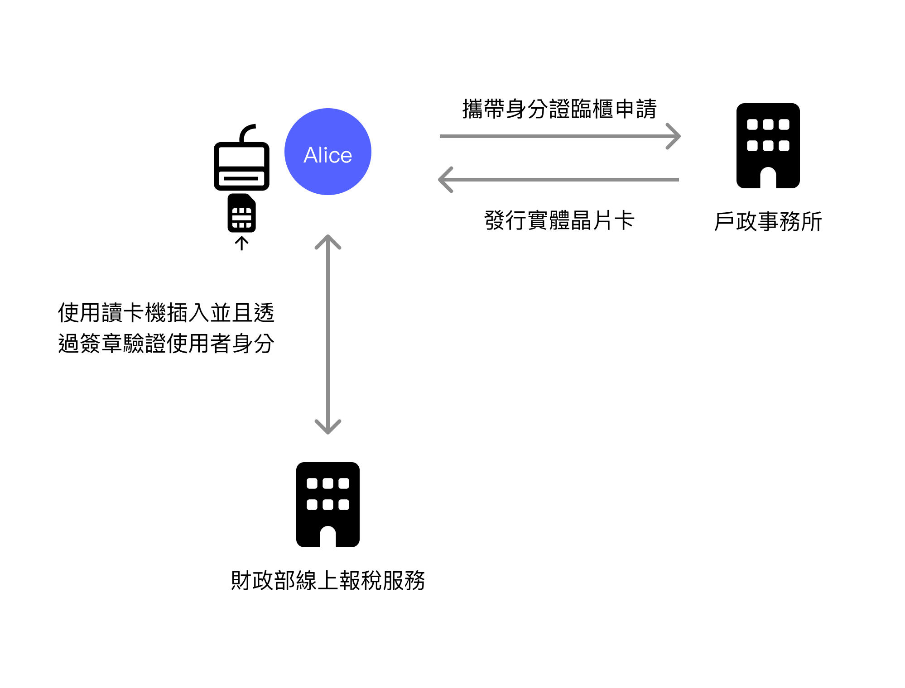
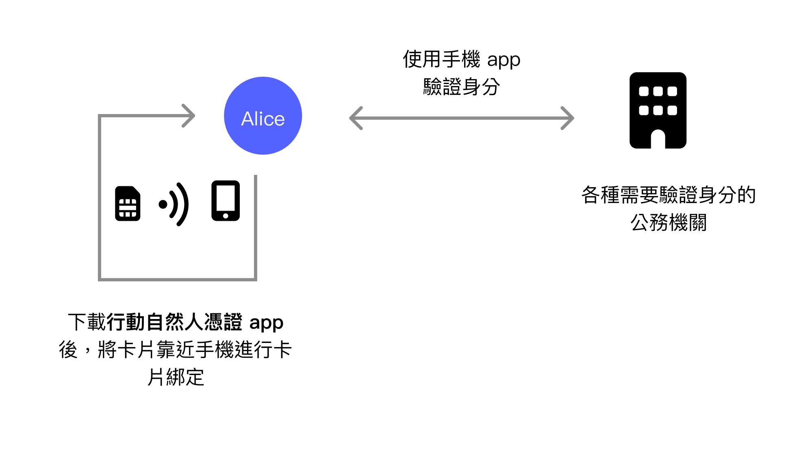
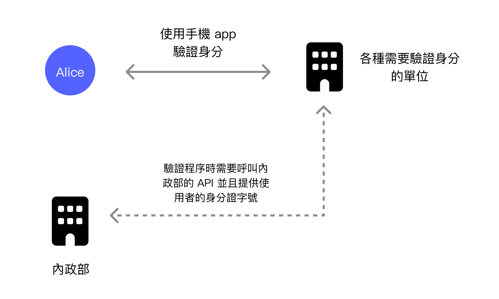
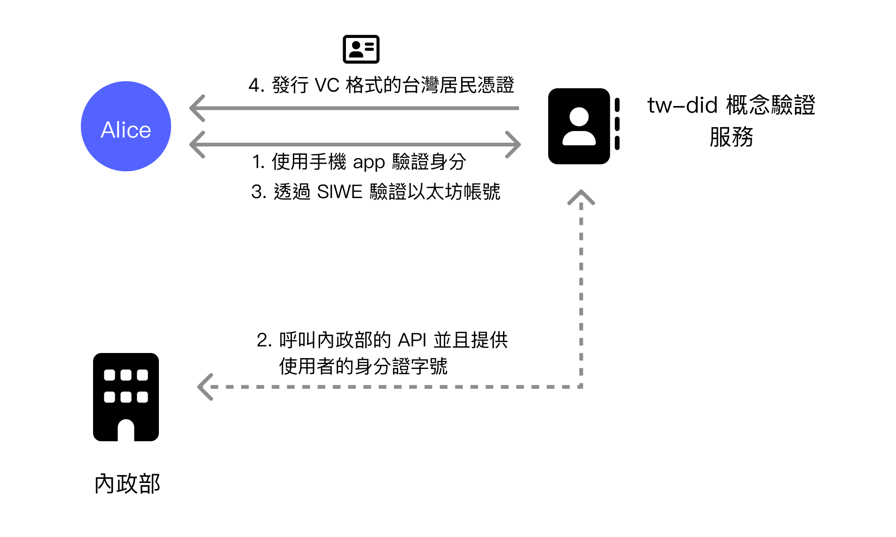
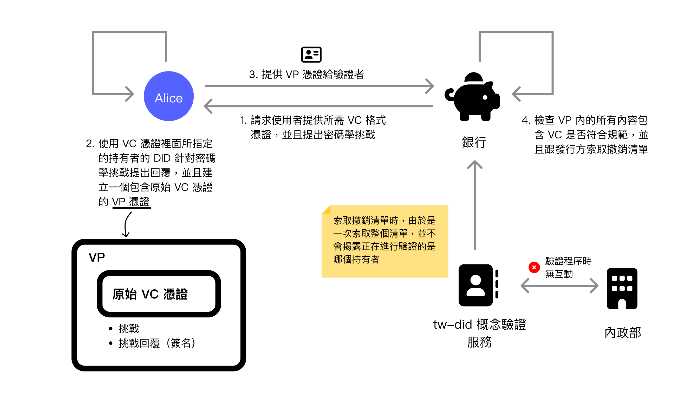
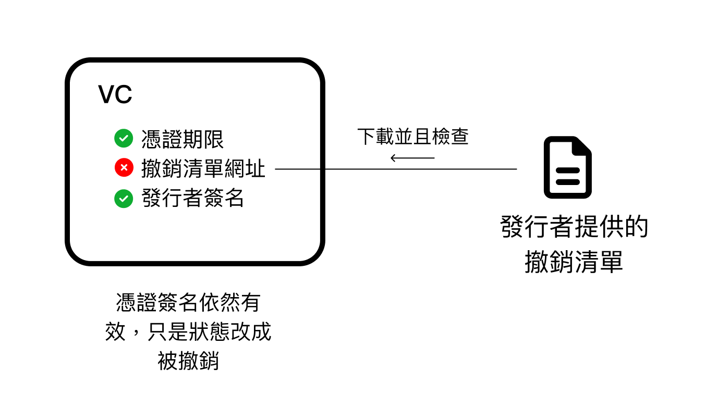
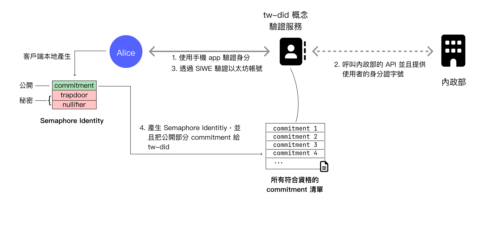
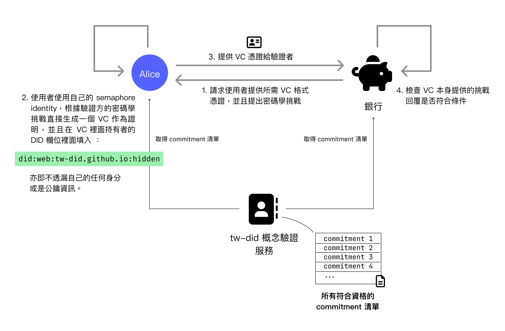

在 W3C DIDs 系列文章裡面，從首篇《[從 Facebook 無端封鎖帳號來看數位身分的問題與 DID 解決方案](https://yurenju.blog/posts/2023-08-21_fb-ban-and-did-solution/)》提出了現今常用的數位身分掌控在大型企業如 Google 或是 Facebook 手裡，他們可以刪除你的數位身分而不需要你的允許或同意；第二篇《[W3C DIDs：拆解權力結構的數位身分標準](https://yurenju.blog/posts/2024-01-01_w3c-dids-redefining-identity-authority/)》從 W3C DIDs 標準出發，更深入了探討透過 DIDs 與 VC 標準要怎麼樣解決數位身分的自主權與隱私權的問題；到第三篇《[Semaphore：強化隱私的身分解決方案](https://yurenju.blog/posts/2024-02-02_semaphore/)》更深入的理解前沿科技如 Semaphore 如何提供**匿名但可驗證**的開發套件。

而本篇文章將會融合以上資訊，來講解去年下半年我所開發的專案。

感謝 Ethereum Foundation 的 Phini 的邀請，我在 2023 下半年接受了基金會的 Grant Program，參與一個多方合作計畫並且開發一套整合台灣行動自然人憑證、W3C DIDs/VC 與 Semaphore 零知識證明框架的實驗性專案 [tw-did](https://github.com/moda-gov-tw/tw-did)，改善集中式數位身分解決方案目前在自主權與隱私權的問題。

此專案目前已經轉移給數位發展部，這個專案的合作結構有點複雜，我會在後續的短文補充細節。

首先先介紹一下之前都還沒提到的**行動自然人憑證**。
## 行動自然人憑證
在台灣報稅時，最方便的方式是直接採用線上報稅。而其中一種驗證身分方式就是**自然人憑證**。自然人憑證是一張晶片卡，裡面有一把私鑰儲存在安全晶片當中，並且可以透過晶片讀卡機來簽名與驗證，作為一個台灣居民的數位憑證。

尚未有擁有卡片的民眾會需要透過戶政事務所現場臨櫃申請，公所發行實體卡片後，就可以用這張晶片卡到其他公務機關使用，比如說線上報稅服務。

自然人憑證雖然安全，但是實體卡片的缺點就是會需要使用晶片讀卡機才可以使用，即使這張晶片卡也支援 NFC 感應讀卡，但在大多數的場合都需要使用插卡式讀卡機，除了在電腦上使用還要額外的讀卡機以外，在手機上也難以使用。

**行動自然人憑證**就是為了解決這樣不便的問題。**行動自然人憑證**是一個**自然人憑證**的延伸解決方案，下載行動自然人憑證 app 之後，Android 裝置可以透過 NFC 的方式感應讀取到自然人憑證卡片的資訊，並且將這張實體卡片跟手機綁定，未來就可以直接用手機 app 作為自然人憑證卡片使用。

驗證時將會透過生物識別如指紋或是人臉辨識保護，解鎖之後用安全硬體裡面的私鑰進行簽名與身分驗證。

行動自然人憑證解決了實體晶片卡的不便問題，透過手機就可以驗證自己的台灣居民身分。如果以便利性為目標來說，確實解決了一大問題。另外使用生物驗證裝置、無須記憶密碼，並且採用手機的安全區域存放私鑰，安全性也足夠。搭配上沒有離開手機的指紋或是臉部辨識資料，整體上算是個面面俱到的解決方案。

當然行動自然人憑證還是一種集中式的身分驗證方案，我們同樣可以用在之前文章提到的兩個現行身分驗證方案的主要問題**自主性**與**隱私性**來觀察該解決方案。

在這之前要先說明一下當使用者要到一個機關使用行動自然人憑證進行台灣居民身分的驗證時，將會使用內政部的 API 進行驗證程序。

### 自主性
行動自然人憑證雖然透過非對稱式密碼學進行身分驗證，但該服務的發行方同時也參與了驗證程序，這代表如果政府想要封鎖特定台灣居民時，可以在驗證程序呼叫 API 時，透過黑名單來拒絕提供驗證服務。

舉例極端的例子來說，一間國外的信用卡公司支援台灣居民申請信用卡，並且整合了行動自然人憑證作為驗證方式。假設台灣未來變成極權國家了，並且把所有以前發出去的台灣居民憑證全部撤銷，即使這間國外的信用卡公司願意接受原本的台灣居民申請，政府還是可以輕易的透過黑名單讓一個政府不喜歡的人無法通過驗證。
### 隱私性
這跟自主性問題的源頭是一樣，因為發行方參與了驗證過程，代表每次使用者進行驗證時，政府都會知道。這以前並不是個大問題，因為行動自然人憑證只開放給政府機關進行驗證程序，大眾還可以接受政府機關追蹤同樣是政府機關的登入行為。

但是在 2023 下半年之後根據[公告](https://fido.moi.gov.tw/pt/main/news_detail/16)，行動自然人憑證的適用範圍擴大至**非公務機關**，這時候隱私問題就需要更慎重的考慮，想像未來有一個服務如網路銀行登入的時候要透過行動自然人憑證服務來驗證身分時，政府可以紀錄每一個使用者進行登入行為時的數位足跡，這樣就把數位足跡的蒐集擴大到民間企業了。

上面的論點好像把政府想像的很壞，其實並不是這樣的。區塊勢的 podcast 的[其中一集許明恩跟豆泥的訪談](https://blocktrend.substack.com/p/ep235)裡面也提到新科技如果不經過適當的引導，科技不見得會走向普世認同的價值觀，因為政府擁有的權力很大，如果不適度的導引科技的走向，很容易就會走偏了方向。

如果在我們有機會制定機制與框架時，應該盡早的把科技框架設計的往好的方向前進。既然可以設計成**自主與隱私優先**，我們應該就該朝著這個方向前進。

## TW-DID 實驗專案
講解完行動自然人憑證終於可以開始介紹這個專案了。[tw-did](https://github.com/moda-gov-tw/tw-did) 是一個實驗性質的專案，整合了行動自然人憑證、W3C DIDs/VC 標準與 Semaphore 零知識證明框架，並且從專案的產出來窺探未來的模樣，以及審視現在的不足之處。

前面提到的行動自然人憑證仍存在的自主性以及隱私性問題，而 tw-did 可以透過整合行動自然人憑證，把台灣居民的資格憑證介接與轉發成 W3C VC 格式的憑證來解決這兩項問題，並且進一步的透過 Semaphore 將隱私性更往前推進，讓驗證程序時完全不需揭露數位身分。

接下來我們會分成兩個部分講解：**W3C DIDs/VC 的整合**與 **Semaphore 的整合**。
### W3C DIDs/VC 整合
tw-did 提供了一個網頁服務，此服務首先透過行動自然人憑證來登入、驗證使用者的台灣居民身分，接著驗證使用者的 DID 身分識別。這兩項資訊都驗證成功後，就會發出一張**可驗證憑證**（Verifiable Credential, VC）格式的憑證給這位使用者，讓使用者可以在別的需要證明他是台灣居民的網站使用這張憑證。

就如同《[W3C DIDs：拆解權力結構的數位身分標準](https://yurenju.blog/posts/2024-01-01_w3c-dids-redefining-identity-authority/)》裡面介紹的一樣，不管是**發行方**或是**持有者**都可以採用不同的 DID Method，不過為了讓實驗環境單純一點，tw-did 專案裡面一律都採用了以太坊區塊鏈的 DID Method `did:ethr` 與以太坊帳號作為 DID 身分識別，而驗證 DID 身分時將會使用以太坊的常見驗證方式 Sign-In with Ethereum (SIWE) 透過 MetaMask 的訊息簽章驗證使用者確實擁有該帳號，也就證明了他擁有該 DID 的私鑰。

當透過行動自然人服務確認持有者是台灣居民以及擁有該 DID 識別後，tw-did 作為發行方就可以發行 VC 格式的憑證給使用者了。發行時 tw-did 將會使用發行者 DID 簽署該憑證，並且提供給持有者下載收藏憑證。整體的發行流程如下：

發行流程的步驟二依然有呼叫內政部 API 並且提供使用者身分證字號，但是這是唯一一次會揭露持有者身分的 API 呼叫，而在驗證流程並不會揭露是哪個持有者正在進行驗證。

假設現在有一個銀行支援了 W3C DIDs/VC 標準的驗證流程，使用者就可以出示這張憑證來證明他自己確實是台灣公民，流程圖如下。

當驗證機關如銀行請求使用者提供特定的 VC 格式憑證時會一併提出一個密碼學挑戰。使用者收到這個請求時，會使用自己 DID 所對應的私鑰針對密碼學挑戰進行回覆，並且把原始的 VC 憑證、挑戰以及挑戰回覆（也就是簽名）一併包裝成**可驗證展示文件**（Verifiable Presentation, VP）回覆給銀行。

銀行接下來會檢查 VP 格式的憑證的各項內容是否正確，另外還會額外跟發行方索取撤銷清單。因為不是透過 API 詢問**特定憑證**是否有撤銷而是一次取得整個撤銷清單，讓驗證者自己在從清單裡面找到該憑證的撤銷資訊。這樣就可以保持發行者不知道現在是哪個持有者正在進行驗證，但還是可以得知是否撤銷。

最後內政部的 API 並不會被呼叫，這也代表內政部並不會參與驗證流程。

當驗證成功，銀行確認使用者為台灣居民後，就可以開始使用銀行的服務。同樣不免俗的來驗證這個架構下的數位身分自主性與隱私性。

#### 自主性
銀行透過 VP 格式的憑證來驗證使用者的身分時，VP 文件裡面的原始 VC 憑證裡面已經包含了發行者的簽名，銀行可以直接利用公開資訊驗證發行者的簽名，不需要發行者的參與，所以也無法阻擋驗證流程。

雖然發行者可以把憑證標記成撤銷，但即使如此這個憑證的發行者簽章還是有效的，因為簽章的結果是**不可否認**的。這代表即使憑證被撤銷了，驗證者還是可以自行決定要不要採用這個情況的憑證。

就如同上圖的狀態，VC 的各種狀態是分開驗證的。驗證期限並不會影響到驗證發行者簽名，憑證被撤銷了也不會影響到驗證發行者簽名。

舉前面的極端例子來說，假設台灣未來變成了極權國家，並且把原本的居民身分全部都撤銷，這個時候驗證者收到使用者的被撤銷的憑證時，還是可以考慮是否要採用這樣的憑證作為證明，而不是把所有權力都放在發行者身上。

相較於發行方會參與整個驗證流程相比較起來，W3C DIDs/VC 規範的流程還是擁有比較高的數位身分自主性。
#### 隱私性
這同樣跟發行方有沒有參與驗證流程相關，使用者在銀行出示 VC 格式的憑證時，發行方並沒有辦法得知與追蹤，這也讓隱私性在驗證流程中得以保障。

在常規的 W3C DIDs/VC 的架構下在自主性與隱私已經有保障了，接下來我們來看看 Semaphore 整合可以為我們帶來什麼樣的好處。
### Semaphore 整合
Semaphore 整合相較於一般 W3C DIDs 標準驗證程序來說，可以做到即使**不揭露 DID 識別**也可以達到**驗證資格**的目的。

以 tw-did 實驗專案的情況來說，常規的 VC 憑證內會紀錄持有者的 DID 識別字串（包含 Ethereum 帳號地址），裡面可以解析出公鑰資訊來驗證這個 VC 憑證是否正確。

但這也代表使用者的 Ethereum 帳號地址會被揭露。

而 Semaphore 整合則是可以完全不需要提供 DID 識別，也可以證明自己有台灣居民的資格。套用在行動自然人憑證的例子時，代表使用者不需要揭露他的 Ethereum 地址也可以驗證他的台灣居民身分。

但我們在上一篇文章有提過 Semaphore 是一個開發套件，並不是一個像是 W3C DIDs 的標準，所以在 tw-did 實驗專案我們所進行的工作是將 Semaphre 嘗試整合到 W3C DIDs/VC 標準。比較好的作法是建立一個新的 DID Method 比如說 `did:semaphore` 並且制定各種互動方式，但考量到時間以及實作的難易程度，我們決定先用 `did:web` 來包裝 semaphore 驗證方式作為實驗的評估方案。

在 Semaphore 整合的發行流程當中，使用者在透過行動自然人憑證服務確認自己的台灣居民身分後，接下來使用者會在客戶端產生 Semaphore Identity，這個身分識別由公開與秘密的部分所組成：
- **公開**：Commitment，功能類似非對稱式密碼學的公鑰部分
- **秘密**：Trapdoor 與 nullifier，功能類似非對稱式密碼學的私鑰部分

而公開的 commitment 將會提供給 tw-did，它會被加入一個 Semaphore Group 裡面，作為具備台灣居民資格的證明。登記在 tw-did 的所有 commitments 清單任何人都可以取得，為公開資料。

在 Semaphore 驗證過程當中，驗證方如銀行會發起一個密碼學挑戰，而只有具備台灣居民資格的 Semaphore Identity 才有辦法產生正確的挑戰回覆。

這邊分成兩步驟：**產生證明**與**驗證**。產生證明會在持有者的客戶端執行，而驗證會由驗證方的服務進行。

持有者在**產生證明**時，會需要密碼學挑戰、自己的 Semaphore Identity 以及所有符合資格的 commitment 清單，其中的 commitment 清單要向 tw-did 索取。有了這三個輸入參數之後，就可以產生出相對應的證明了。

而驗證者在**驗證**時，則需要有兩個輸入參數，第一個是持有者提出的證明，第二個也是 commitments 清單，有了這兩個參數之後就可以驗證證明了。

我們可以把一般的非對稱式密碼學與 Semaphore 零知識證明的證明驗證流程比較一下。

一般的非對稱式密碼學將會使用私鑰進行簽章，並且驗證者則會需要取得相對應的公鑰進行驗證。由於公鑰就代表了 DID 的鑰匙對，所以 DID 身分資訊還是會有一定程度的曝光。而在 Semaphore 的驗證流程並不需要提供代表特定身分所相對應的特定 commitment，而只需要所有符合資格的 commitments 清單即可，如此一來就可以在不揭露身分的前提下面進行驗證。

這比起常規的 W3C DIDs/VC 來說在隱私性上又更加強了，驗證的時候也只能知道對方符合資格，但卻無法得知具體是誰。常規的 VC 憑證裡面一定都會包含公鑰資訊，像是如果 Ethereum 帳號不想要讓驗證方知道時，就可以透過這個更進階 Semaphore 零知識證明來達成強化的隱私保護。

但這邊要注意的是 Semaphore 整合是非常實驗性質的整合，所以在開發上走了一些捷徑，讓現在這個雛形的數位身分自主性不像常規 VC 這麼好，但是這是明確知道要怎麼樣改善的問題，這在後面的**回顧與探討**一節會討論。

## DEMO 影片
這次做了一個嘗試是每一次里程碑釋出的時候都會附上一個展示影片，現在回頭看覺得很有趣，沒想到從八月到十月專案的變化可以這麼大 😎

可以到這邊看一下每次里程碑的介紹以及影片： https://github.com/moda-gov-tw/tw-did/releases

這邊引用 Milestone 6 的影片如下：


<video width=100% controls>
    <source src="tw-did-select-credentials.mp4" type="video/mp4">
    Your browser does not support the video tag.
</video>


這邊有兩個分頁，Web 分頁是發行者，SampleVerifier 分頁是驗證者。

在 Web 分頁當中會先透過行動自然人憑證服務驗證使用者的身分，在這個服務串接當中會透過使用者已經安裝的 **行動自然人憑證 app** 送出通知，或者使用者也可以選擇掃描條碼一樣也可以進行登入程序。

登入完成之後就會透過 Sign-In With Ethereum 以簽章的方式驗證使用者是否確實擁有一個 Ethereum 帳號，最後一個步驟則是產生一個 Semaphore 身分識別，並且將其 commitment 註冊到 tw-did 的資料庫當中。

如此一來發行程序的前置作業就完成了。

最後會讓使用者下載兩種不同的 VC 憑證，第一種是發給持有者的 Ethereum 帳號地址的 VC 憑證，另外一種則是發給持有者的 Semaphore Identity 的 VC 憑證，檔名分別是 `vc-ethereum.json` 與 `vc-semaphore.json`。

接下來則是驗證程序的範例頁面 SampleVerifier。這個頁面作為開發與除錯的目的所以比較陽春一點。驗證網站可以驗證上面發出的兩種分別針對 Ethereum 以及 Semaphore 的憑證。

在驗證 Ethereum 憑證的部分，首先會讓使用者選擇一個發給 Ethereum 地址作為 DID 的 VC 憑證，使用者可以直接用檔案選擇功能選擇 `vc-ethereum.json` 進行驗證，或是按下 "Select on DID" 在發行網站選擇所需的 Ethereum 憑證。選擇之後會開始進行解析工作，當按下**驗證**之後會透過 MetaMask 簽名、產生 VP 文件來確認持有者的資格。

在驗證 Semaphore 憑證的部分，則是按下 **Semaphore Challenge and verify** 會在驗證網站即時產生一個密碼學挑戰，而持有者將會在客戶端產生證明並且包裝成 VC 格式的憑證，回傳給驗證網站進行驗證程序。

## 回顧與探討
從 Github 的提交紀錄來看，我在八月初提交了第一個 commit，然後到十月底專案完成。而在得知這個專案之前，我對 DID 的了解非常粗淺，所以不管是研究或是開發都是在十萬火急的狀況下完成。

所以研究跟實作都難免有不足之處，很多都是邊學邊做，甚至有些知識是在專案結束之後我才知道怎麼樣才可以做得更好，寫在這邊給未來的開發人員作個參考。

這個專案最重要的目標有幾個：
- 這個雛形是否提供一個未來情境的想像，協助理解未來的正式環境我們可以做到哪些事情？
- 這些機制整合在一起時，數位身分的自主性與隱私性是否有得到保障？
- 開發的過程中是否有遇到問題可以供正式環境作為參考？

### 雛形是否提供未來場景的想像
在這個實驗當中整合的是行動自然人憑證，而發出去的憑證可以由另外一個驗證服務來確認這個使用者是否為台灣居民。

我們可以想像未來這個台灣居民的憑證可以給許多服務作為驗證身分的審核資料，比如說銀行開戶，或是電商用於審核賣家是否為台灣居民。

但由於是雛形的關係，現階段當然不會真的有驗證單位信任這份憑證，未來的正式環境的憑證還是要由比較正式的機關來發行，比如說是內政部或是數位發展部，才可以增進驗證機關對這個憑證的信任程度，甚至會需要有法源依據才可以在更正式的場合使用。

而在憑證的收藏方面，想像未來會有多張不同的憑證需要收藏時，還會需要有一個 VC Wallet app 來完成這個目的。

### 數位身分的自主性與隱私性
前面有提到集中式的數位身分缺乏的是自主性與隱私性，即使在行動自然人憑證服務也有一樣的問題，當一個驗證機關（特別是非公務機關）採用了行動自然人憑證作為驗證手段時，不管是自主性或隱私性都有不同疑慮。比如說之前的例子，開銀行帳戶的時候，政府可以直接屏蔽驗證程序讓特定的使用者無法開戶的自主權疑慮，同時政府也會知道使用者到哪間銀行開戶的隱私疑慮。

而介接行動自然人憑證並且發出 VC 憑證之後，由於驗證時發行方不用參與的特性，這也讓數位身分的自主性與隱私性得到保障。

自主性方面，由於發行方沒有參與驗證程序（撤銷清單除外），所以無法透過阻擋驗證程序來抹除一個人的數位身分，即使透過撤銷功能把一個憑證標記為已撤銷，也無法否認發行方曾經簽署、認可過這個數位憑證。

隱私性方面同樣的因為發行方沒有參與驗證程序，所以發行方是無法得知哪位使用者正在進行驗證程序。

當然研究與開發時當然都遇到不少問題，下面就來分享一些相關經驗。

### 開發套件
首先，在這個專案裡面使用的是 [Veramo](https://veramo.io/) 這個 TypeScript 的開發套件，從開發這次專案的經驗來看，Veramo 算是相當有彈性，使用起來也不難。在這次開發裡面我時做了一個新的簽章驗證方式 `Semaphore2023`，雖然過程有點糾結，但最終是完成了。

不過由於這些都還是比較新的開發套件，W3C DIDs/VC 相關的開發者並不像如 React, Vue 之類的熱門開發框架這麼多人關注，所以在文件上並不是那麼齊全，所以要開發非內建的功能時還是要搭配閱讀源碼才有辦法進行。

由於專案的時間比較趕，所以當初選擇套件的時候並沒有作太深入的研究，後來陸續又看到幾套不同的開發套件如 SpruceID 以 Rust 實作的 [SpruceKit](https://www.sprucekit.dev/) 以及 Ceramic 實作的另外一套 TypeScript 函式庫 [ceramicnetwork/js-did](https://github.com/ceramicnetwork/js-did)  看起來都是可以嘗試的選擇，特別是 js-did 看起來有[讓 WebAuthn 整合到 did:key 的功能](https://github.com/ceramicnetwork/js-did/tree/main/packages/key-webauthn)，值得更深入研究。

### 缺乏 Wallet
在實作的當下並沒有找到適合的 VC Wallet 來收藏發行者所發出的憑證，原本有打算要快速實作一個 Wallet，但是也因為時間的關係沒有做完，可以在 github 裡面找到才剛寫好前端介面，還沒實作邏輯的 [wallet app](https://github.com/tw-did/tw-did/tree/main/apps/wallet)。最後我們把驗證程序的選擇憑證功能作在發行方網站裡面，這其實不符合發行方不參與驗證程序的原則，但考慮到實作當時並沒有找到適合的 VC Wallet，這樣算是一個還可以接受的實驗作法。

雖然當初沒有找到適合的，但在專案結束後才發現微軟平常用來作二階段驗證的 Microsoft Authenticator 有支援收藏 VC 的功能，可以看[這篇文章](https://learn.microsoft.com/en-us/entra/verified-id/using-authenticator)瞭解詳情。

如果更早發現 Microsoft Authenticator 有這個功能時，我們就會參考他們的整合方式，讓憑證可以收藏到 MS Authenticator app 裡面。

### 缺乏交換協議
當初閱讀 W3C 的文件時並沒有規範要如何交換憑證，所以**發行者發行憑證給持有者**與**持有者出示 VP 給驗證者**都沒有定義。既然沒有定義，最直觀的方式就是產生一個憑證檔案給使用者下載，而驗證者一樣也是透過網頁原生的檔案選擇功能來提交一個 VC，並且讓使用者進行簽署之後轉換成 VP。

而在研究 Microsoft Authenticator 的同時，我們也發現了 app 使用的交換協議是另外一個組織 OpenID 訂定的標準 `openid-vc` 與 `openid-vp`。

當初的實作雖然還是有達到實驗的目的，但如果真的要實作正式產品的時候，可以考慮採用 OpenID 所訂定的標準，就可以使用微軟的 Microsoft Authenticator 作為 VC Wallet 收藏憑證。

### Semaphore 提升了隱私性，但是實作細節需要打磨
透過 Semaphore 整合確實又大幅度的提升了隱私性，不過由於是實驗的關係，確實有很多實作細節需要打磨。

舉例來說，我們使用了 `did:web` 這個 DID Method，並且在裡面包裝了一個新的驗證型態 `Semaphore2023`，這邊實際上是透過 Veramo 擴展了一個新的驗證型態，同時在 Github Pages 上面建立了一個匿名的 DID 身分識別 [did:web:tw-did.github.io:hidden](https://tw-did.github.io/hidden/did.json)。這邊更好的方式可能是新增一個新的 DID method `did:semaphore`，並且原生支援匿名身分識別。

同時這邊也會遇到其他套件不會支援 `Semaphore2023` 這個特殊的驗證型態，舉例來說前面提到的 MS Authenticator 就無法使用這個我們自行定義的驗證型態。如果可以把整個規格思考清楚，註冊到 [DID Specification Registries](https://www.w3.org/TR/did-spec-registries/#did-methods) 並且加以推廣會更適當。

另外在驗證程序的實作違反了自主權的原則，跟發行方索取了公開資訊 commitments 清單。因為索取的是公開資訊，並不會對隱私性造成問題。但是發行方仍然可以選擇不提供 commitments 來阻擋所有人驗證自己的身分。

而這個問題可以使用 Semaphore 的鏈上版本解決，因為使用鏈上版本時可以直接跟智能合約互動達成許多事情，也不需要跟發行方索取 commitments 清單，這樣就可已解決自主權的問題。當然如果需要在發行機制裡面使用區塊鏈，也會衍生出其他問題需要解決，比如說交易費的支出問題等等區塊鏈特有的問題。

總之，整個 Semaphore 整合入 W3C DIDs 的實作細節還有許多需要打磨的地方，可能還需要更多次的迭代與討論才可以找出一個比較成熟的方式。

## 結論
總體來說我覺得這個實驗專案很棒，它透過一個關鍵場景**驗證台灣居民身分**窺探了未來的模樣，讓關心這個議題的人們（也就是把文章看到這邊的你們）對於更加具有自主性以及隱私性的數位身分有更具體的輪廓。同時在實作的部分也走的夠遠，可以了解到未來正式環境時可能會遇到的阻礙。

另一方面也更深入的探討如果想要透過零知識證明做到 **匿名但可驗證資格** 的程度，現在是否具備所需的技術。也可以刺激大家的想像，思考這樣具備高度隱私的技術對我們來說有多重要，以及有沒有其他負面影響。

當然對我來說也是一個很棒的探索，我自己其實之前沒那麼了解 DID，到這個專案才真正的深入的搞清楚了這些事情。

自己今年目前的計畫是獨立開發小型的服務或 app，不會跟 DID 或區塊鏈有關，不過還是希望之前的開發經驗能夠發揮一點作用。所以如果你想要針對 DID 這個主題找人討論或交流，還是可以跟我聯絡。我會抽出一點時間在這個主題上，時間上沒辦法做到開發專案但是交流現有經驗跟看法是沒問題的，[歡迎來信](mailto:spry.flag8191@fastmail.com )！
