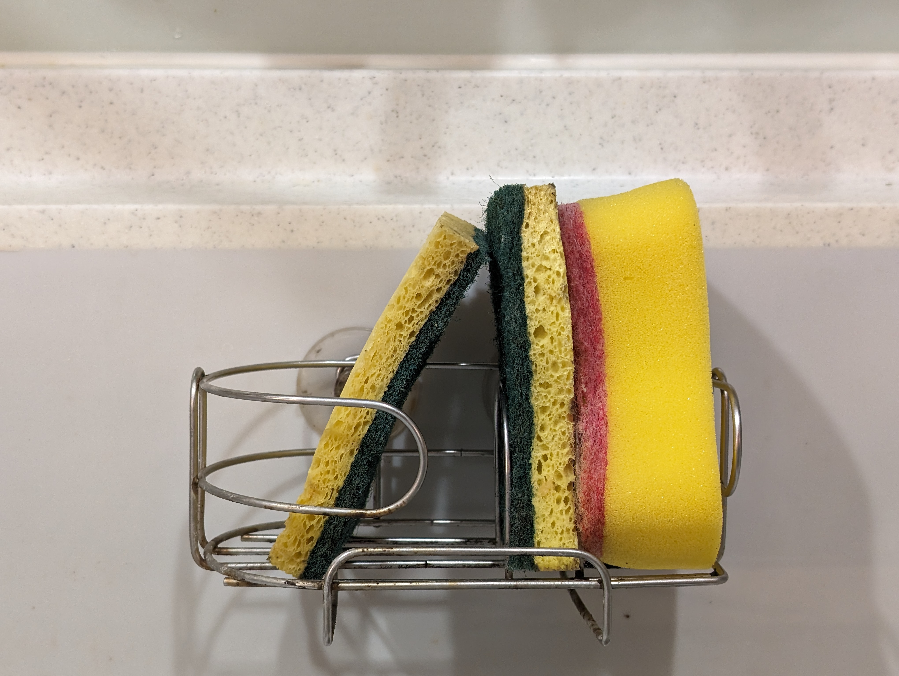

「他連三塊菜瓜布的功能都分不清楚！」她說，坐在一桌的朋友們都笑翻了。

因為功能區分的關係，我家的水槽有三塊菜瓜布，分別用來清洗不油膩的杯子、油膩的碗盤跟清洗水槽。剛開始的時候家裡有三種不同款式的菜瓜布，所以我可以記得哪種款式的菜瓜布的特定功能。

直到有一天其中一種款式的菜瓜布用完了後，其中兩種功能的菜瓜布都使用同一個款式，然後接下來我就很常把洗油膩碗盤的菜瓜布拿來洗咖啡杯。

不管我寫了多少程式碼、講了多少演講，我還是沒辦法分清楚菜瓜布的功能。

這樣的互相吐槽時時在我們家發生，我也不太在意。不過即使我們已經相處超過十年，還是經常會有惹對方生氣的時候，總是也有許多時候需要坐下來好好談談怎麼相處會比較順暢。而這樣人與人之間的邊界是浮動的，偶爾我們會發現對方特別脆弱需要照顧的地方，也會發現以前的相處方式不再適合了需要改變。跟人相處就跟跳雙人舞一樣，總是需要進進退退，找到一個適當的距離。

總覺得以前受的教育太注重於二元論述，不是對就是錯。在十幾二十歲的時候，總覺得事情就是有一個固定的運行規則，我所要作的事情就是說服別人。那個某某某專家說的是對的，我們只要照著這套流程走，最終我們就可以成為最好的人、寫出最好的產品、作一個最棒的軟體工程師。

這也是一種成長痛，它帶領我學習到了很多東西，但同時伴隨而來的也是過於苛刻的對待自己與別人。定義了怎麼樣才是好的軟體工程師，鑽研要怎麼寫自動化測試讓每個分支都可以反覆驗證，同時也質疑、嘗試說服別人怎麼樣才是對的，批評那些看不慣的事情，指責那些不符合自己標準的工作方式。

回過神來自己也在職場打滾了好久了。以前那些我曾經追求的最佳實踐方式，如今看來都不見得受用。從這些歲月中讓我了解的脈絡的重要性，一件事情到達它的最終結果前，經歷了什麼也很重要。他為什麼選擇抄捷徑？為什麼這邊反而用複雜的方式處理？

理解脈絡也多了一些同理心，理解事情演變至今的經過，有些事情就沒那麼奇怪，也不會有那麼多堅持什麼事情一定要怎麼作。

人際關係也是這樣，即使相處十幾年的人也會有錯踩界線的時候。而原則的界線放大來看也不是平整無缺的，每件事情都有它的脈絡，每件不好的事情都有其他觀察角度讓它變得更好，而每個人的界線也是在變動的，每個人跟另外一個人的界線也長得不一樣。

我們的物理世界或許有一個統一的運作規則，但是構成如此複雜的世界、放大到人與人相處的關係與界線的時候，數以萬計的變因讓人沒辦法找到一個統一適用的相處規則。

這個時候就多點同理心吧。

人跟人的相處就像跳雙人舞，亂了步伐踩到腳的時候，吐吐舌頭眨眨眼露出歉意，輕輕的扶持著對方繼續跟上節奏就行了。
