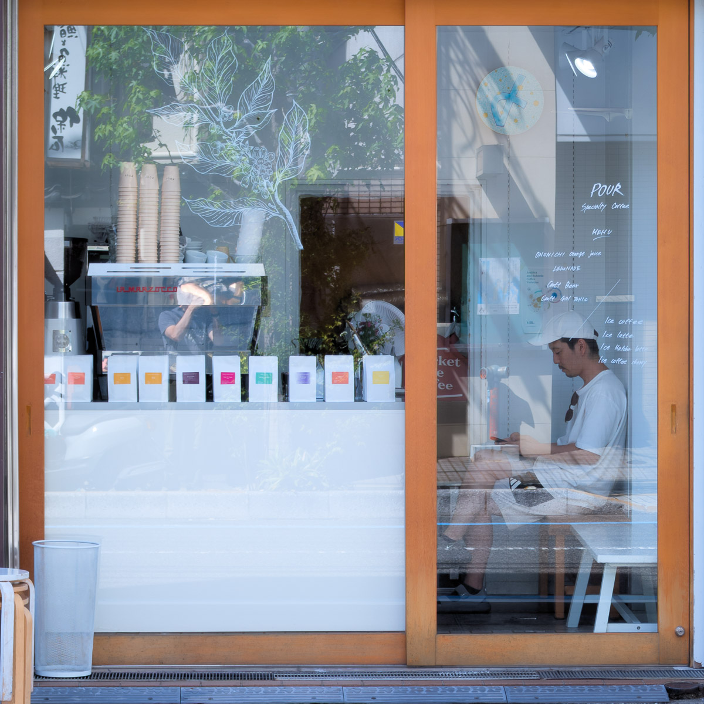
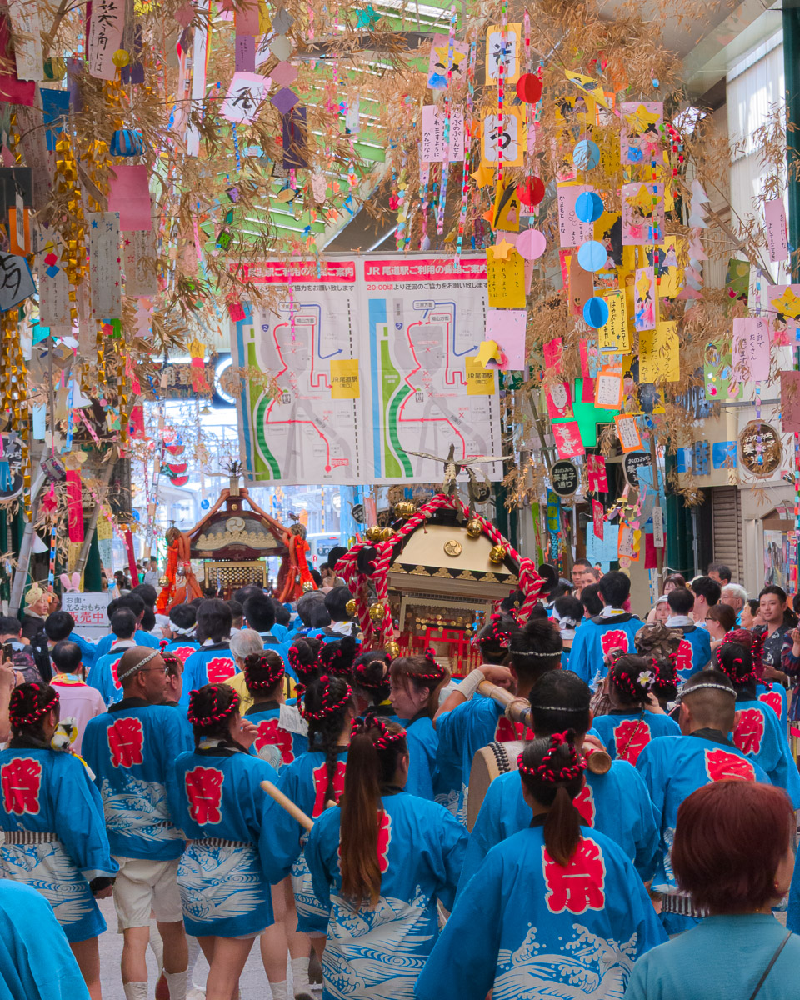
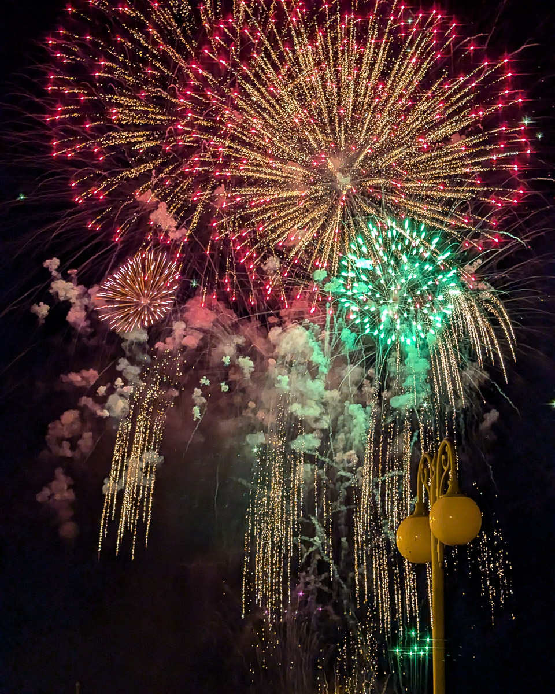

「三十分鐘前我看到你經過咖啡館前，」咖啡館的老闆一邊打理著檯面一邊笑著對我說。

聽到這句話前的我，前一週都還在岡山的共用空間工作，週五才坐火車到了尾道做個旅行中的小旅行。在極度炎熱的夏季中午找餐廳時，經過這間咖啡館的門口，我嗅到了一間好咖啡館的氣味，也理所當然的在吃完午餐後造訪這間咖啡館。

拉開大片的木質玻璃窗拉門就可以進入這間小巧精緻的咖啡館，裡面有四個肩挨著肩的座位。而門口整齊著陳列的純白包裝但用不同顏色標示不同產區的咖啡豆，用最不突兀的方式點綴著店面。坐在裡面的感覺很微妙，大片的落地窗帶來的開闊抵銷了只有四個座位與吧台區的狹窄感，但是這樣肩並肩、面對面的座位安排，就跟《[一席](https://www.facebook.com/yixialonetogether/?locale=zh_TW)》一樣，對話也是組成這間咖啡館的重要元素。

老闆英文很不錯，隔壁的客人感覺也是熟客。老闆介紹這位客人是在尾道賣生啤酒的另外一位老闆，明日花火大會的晚上，他們會一起在咖啡館的門口賣生啤酒與餐點。只能理解幾個日語單字的我聽不太懂他們的對話，大部分都是咖啡館老闆居中翻譯，不過從他們親切的討論語氣中可以感受到他們是熟識的朋友，這種造訪對方的店、需要時互相支援的氛圍讓人覺得很有趣，在旁邊嘗試著捕捉空中幾個聽得懂的日語的我（像是煙火 Hanabi），好像也有種似乎融入當地熱鬧祭典準備的參與感。

花火大會總是夏天來日本不可避免的絢麗火花，摩肩擦踵的擁擠人潮稱不上是我喜歡的元素，但是熱情的攤販跟大家穿著浴衣所帶來的夏季感還是很值得參與感受，這也是我再次造訪尾道的其中一個原因。不過因為明天我打算坐纜車到山上的千光寺看煙火，距離這個濱海的咖啡館有段距離，也不太確定有沒有機會到時候再來買生啤酒。總之短暫的閒聊之後就離開了。

「我明天再來，」離開前我這麼跟老闆說。旅行的時候要找到一間適合自己的咖啡館很難，偶爾這樣的咖啡館出現時，都像是在沙漠裡面發現到綠洲一般的珍貴。

對我來說，日本是一個讓人熟悉，同時有存在些隔閡的地方。在每次體驗到賓至如歸的服務時讓我感到溫暖與熟悉，但同時也從社會的各方面可以感受到人與人之間是存在一點距離的。對我這個才剛開始學習日語的人更是如此，一個人旅行時還進一步加乘了這樣的感受。語言加上人際關係的隔閡，讓我在旅途的孤獨中就像是在尋找自我的邊際一樣。

聽起來很孤單，其實我很享受這種感覺。但是當在旅程中出現這樣一間有機會打破隔閡的咖啡館時，還是讓我很開心。我喜歡獨自旅行中，不經意冒出來那一點點恰到好處的連結。

隔天，趁著早晨的溫度還舒適的適合散步時，我又走到同一間咖啡館買咖啡。

「可以跟你聊聊嗎？」隔壁的客人用簡易的英文這樣問我，原來他是一位急診室醫生。今天休假，剛從大阪看煙火回來尾道，還跟我說了大阪的花火大會非常多人，他預告了尾道的也會一樣的擁擠。早上跟我一樣到咖啡館報到，準備用保溫瓶帶著滿滿的能量（咖啡）去他岳父的診所幫忙。我們都一樣，想要用一杯好的咖啡來開啟一整天。

這個咖啡館就像是在地居民交流場所一樣，除了像我一樣的遊客外，總是有熟客陸陸續續的造訪，我也很喜歡這樣在旅途中遇到了一些不同的人，可以在同一個時空互相分享生活小事的時刻。

醫生離開後，老闆跟我說醫生正在學習英語，所以也很努力的在找機會用英語對話。我也說身為剛開始學習日語幾個禮拜的我，真的很能體會學習新語言的困難。老闆有一股很容易輕鬆聊天的特質，不知不覺我們已經從語言學習一路聊到的在人生的路上「失敗」的重要性，我提到了我在各種創業公司的工作經驗，他也提到了他曾經開過的咖啡烘培事業等，對於可以用英文可以聊到深入的話題讓我很驚訝。而這樣的交流也有種慢慢的從一個普通的遊客，逐漸構築起與尾道這個地方跟在地人更深入的聯繫。

離開咖啡館前，老闆說他有保留了幾個在咖啡館附近堤防邊可以看到花火的座席，如果我在山上的千光寺找不到適合看煙火的地點，可以到他預留的位置看煙火。我有點感動，對他來說我只是一個見過兩次面的客人，卻願意讓一個位置給我，我也很珍惜這樣可以跟當地人建立一些聯繫的機會。

當天晚上，在萬頭攢動、堪比台北 101 的觀賞煙火的人潮下，我遠遠的就看到了正在準備水餃餐點的咖啡館老闆，還有昨天看到的生啤酒老闆，跟他們招手。

這次在旅程中陪伴我的一本書《[入境大廳](https://www.kobo.com/tw/zh/ebook/Y3afKG7jRjmZopHiwKgqWw)》，作者對於家鄉的形容非常的精闢。他說家鄉就是個有一層層安全網，隨時可以把你從各種困境接住的地方，而身處異鄉的人就連遇到小小的問題，都要花費巨大的力氣才有辦法解決。

尾道不是我的家鄉，理所當然的不會有各種令人感到熟悉的安全網。但經過這次在尾道參與的花火大會後，這些與當地人的聯繫，確實讓我慢慢的對這個地方產生了一些些不一樣的感受。

在花火大會賣著餃子的咖啡館老闆、昨天遇見賣生啤酒的咖啡館熟客、剛從大阪回來要趕往診所的急診室醫生，與這些人的交談與認識，自己似乎慢慢的融入了這個地方，感受到尾道與在這邊生活的人所構築的立體感。

而煙火在盛夏尾道的夜空綻放時，所有人不自覺張大嘴巴發出此起彼落的驚嘆聲。這樣在同一個時間與空間裡我們共享著這同一份絢麗時，這些旅程中的連結，我也獲得了屬於自己跟尾道的那份熟識感。

就像在宇宙中獨自單人旅行時，偶然的遇見了另外一艘星艦，在彼此的軌道最接近的時候，似乎可以從圓形的觀景窗中，看到對方也貼在玻璃窗上開心的跟我揮手。

你好，謝謝，下次見。

