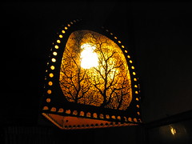
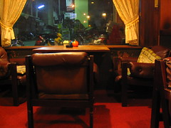
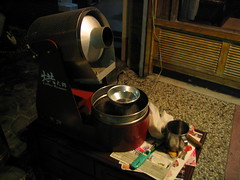

斗六市總是熙熙攘攘。不管什麼時候總是滿路車水馬龍，一間間比鄰而居的商家打亮了招牌，各式各樣的人群穿梭在火車站附近。我跟小黃慢慢的在斗六狹窄的道路上前進，經過肯德基，在左手邊發現了那間時光暫停的咖啡館，吾愛吾家。  
  
在旁滿是商家的路上，它算是最不顯眼的一個小小空間。木頭顏色的裝潢，配上不怎麼顯眼的咖啡館招牌，唯一能認出的它正在營業的，就是店內昏黃燈光，以及從外面就可以看到的老闆身影。  
  
進去咖啡館，彷彿是透過了倒轉時光的大門，把時間硬生生抽回好幾個年頭的歲月。店裡瀰漫著陳舊的味道。燈罩上面支節繁多的樹發著光、灑在紅色的地毯上。從音響緩緩飄出輕慢、音量細微的音樂，還有，深紅色的單人沙發，這是我看過比 La Strada Cafè 時間流動的更緩慢的咖啡館。  
   
  
當初第一次進來時我跟老闆的兒子說這邊的氣氛很特別，他卻笑著跟我說過，『這間咖啡館二十五年前就是這樣了』。就是因為沒有沒有大的改變，這邊才可以保持以前舊咖啡館的模樣。  
  
再談咖啡。今天點了一杯上次老闆兒子推薦的摩卡咖啡。甚深的苦味、完全沒有酸味，而在入喉後，浮現淡淡的巧克力香。硬要雞蛋裡挑骨頭，就是最後有相當微小的苦澀了。不過比起第一次喝到的摩卡，上次的巧克力香比起這次要濃厚的多。  
  
跟老闆淺談後，才瞭解到原來他們是自己烘豆，而剛好這幾天烘豆的品質有些下降，才導致最後的苦澀味道。不過也聽到一些讓我蠻驚訝的消息，像是高雄的那間同名『吾愛吾家』的咖啡館竟然是以前老闆常去的地方，而且是分別兩間『吾愛』跟『吾家』咖啡館唷！只是現在『吾家』已經不再營業，而在中山路那間吾愛吾家咖啡館則是以前的『吾愛』。  
  
  
在跟老闆的談話中，感覺出他對於咖啡相當的堅持，不論是在煮咖啡或是烘豆子方面都是。而煮自己所喜愛的咖啡風味的這論點我也很喜歡。畢竟每個咖啡館都有自己的特色，雖然說迎合客人的口味這種作法也不錯，不過能堅持自己要的味道，而也將這種味道分享給每個來這品嚐咖啡的客人的感覺卻更讓人感到心曠神怡。就算可能失去一些跟自己不合的客源，但是卻能充份表達一間咖啡館的特色，這就足夠了。  
  
延伸閱讀：[吾愛吾家相簿](http://www.flickr.com/photos/46509322@N00/sets/338571/show/)