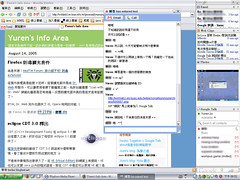

最近都是 Google 的消息。Google 釋出了新的即時傳訊(Instant Messaging, IM) 軟體，使用者可以利用 gmail 的帳號即可登入系統。而 Google Talk 使用的協定是 Jabber，所以各家 Jabber IM 均可以連結上 Google Talk，只是不能使用其語音聊天的功能。  
  
其實這款 IM 目前還沒有什麼特殊的功能。至於 Google Talk 官方網站所說的**"Talk through your computer but hear your friends as if they were in the same room"**，是否真有那麼清晰，就要進一步的使用才知道了。  
  
PS.

1.  我想再過不久應該就會整合到新的 Google Desktop 裡面 :)
2.  雖然說還沒使用，不過 Google Talk 應該會把聊天的訊息直接放到 Gmail 去吧？這樣也蠻方便的。

  
  
2005/08/24 18:06 Updated  
\* 馬上說錯話， Google Talk 已經整合入新的 Google Desktop 了。  
\* Google Talk **不會**把訊息儲存在 Gmail。  
  
延伸閱讀：[Google Talk](http://www.google.com/talk/)  
  
下面這張 Screehshot 展示了 Google Desktop Sidebar 與 Google Talk 整合的樣子  
