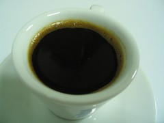

  
經過兩天的測試與調整後，今天咖啡的品質算是比較穩定了 :)  
  
今天做的調整是稍微把填壓咖啡粉的力道減小，改為以敲粉的方式讓中間的空隙變少。如此一來煮咖啡的時候就不會用噴的，然後後段的部份抓準時機關掉瓦斯，讓最後面泡沫般的 Crema 適度的流出 ─ 一杯近似 Espresso 的咖啡就完成囉。  
  
喝了一口，hmmmmmmm, 雖然還是殘留了苦澀味，但是該有的味道都已經到齊了。再補一張。  
  
  
  
雖然說只淡淡的圍繞著一小圈 Crema, 但是以我使用摩卡壺的極限大概就是這樣。明天會用一般溫度的水再試試，我想調整咖啡的部份大概就到了一個段落 :)