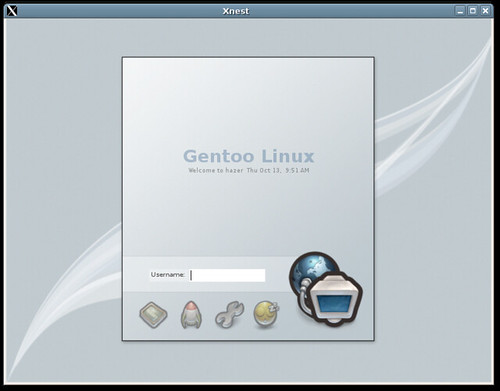
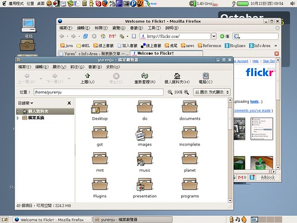

最近換了 GDM 的佈景主題 :-)  
不過桌面的部份在怎麼換都是那幾套呀，圖示最近又換回 Suede。metacity, gtk2 theme 還是持續的使用 Clearlook。雖然說 [gnome-look](http://gnome-look.org) 不時都不錯的佈景主題，只是都不合我的胃口…  
  
對了，桌布在 [flickr tag wallpaper](http://www.flickr.com/photos/tags/wallpaper), [flickr tag wallpapers](http://www.flickr.com/photos/tags/wallpapers) 還頗多，不妨去找一下有沒有合意的桌布。  
  
  
  
