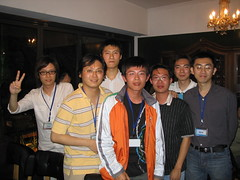
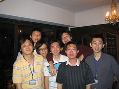

到了祥哥那邊，才發現長庚大學還真的是在山上。雖然說空氣是蠻清新的，不過也有點不方便，下面的林口是蠻熱鬧的，如果要去，還是得騎一段路的機車。  
  
早上祥哥送我到林口長庚坐車。隨後就到了這次的目的地國科會大樓。至於在裡面聽到什麼有趣的東西嘛，晚點再到 Info Area 發表囉 :-)  
  
晚上則有由[奇摩奇先生](http://tw.yahoo.com/)所贊助的 [BoF](http://en.wikipedia.org/wiki/BoF)，在 The Villa 舉辦，有很多好吃的餐點，跟無限暢飲的酒。這次去跟 DUCATI 還有 Yenjin 聊了蠻多的，其實也很想去大咖桌那邊去聊聊，不過不知道為什麼跟大咖們總會有些距離，大概是在網路上總是看到他們遠遠的背影，還有令人驚訝的貢獻，反而把自己設了限，每次遇到 jserv, chihchun 等人總是很緊張，不知道該說些什麼，雖然這群 Hacker 實在是很親切。其實跟同一桌的一直想要找點切入他們的話題，不過一直都沒有機會 XD  
  
至於食物跟酒，實在是棒透了。只是平常不喝的我實在是不勝酒力，喝沒多少就不行了。  
  
快要離開前，順便照了些合照 ^^  
  
  
  
大家都喝了點酒，臉都紅通通啦！  
  
後來就獨自去了黑潮咖啡。  
  
BTW, 再次感謝 [奇摩奇先生](http://tw.yahoo.com/)，我吃得很飽，酒也喝夠了，感恩。