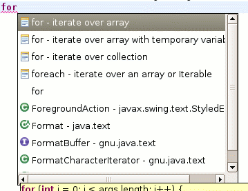
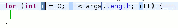
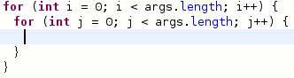

受到 [gugod](http://gugod.org/blog/) 在 [OSDC.TW](http://osdc.tw) 上講的[利器善事](http://svn.kwiki.org/gugod/talks/Sporx/SharpKnife.xul) (我猜這個簡報只能用 Firefox 開) 的啟發，找了一下 eclipse 中是否有自動補齊的功能，結果當然是有的。  
  
請先用 eclipse 開一個 Java 檔案，先鍵入『for』接著再按下 \[alt\] + \[?\]，此時會跳出一個選單，有很多 for 樣式可以選。  
  
  
  
直接按 \[enter\] 選擇第一個樣式，這樣 for 迴圈就寫好了，按 \[tab\] 鍵可以在各個變數之前移動。  
  
  
  
那如果在大括號之間再使用一次勒？就會出現以 j 作為變數的 for 迴圈！  
  
  
  
看來我還不夠了解我的 IDE 阿，下次再多研究。另外我覺得有一天，猴子也可以寫程式。  
  
猴子對 eclipse 講：『吱吱吱~』  
eclipse 就寫出一支香蕉程式來。