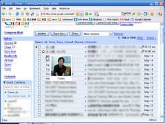

  

  
  

  
今天 gmail 右上角又出現了『New features!』，原來是 gmail 跟 google talk 結合的更緊密了。  
  
  
  
如果您使用的是英文版的 gmail, 在左方的 quick contact 停留一下，將會出現此聯絡人的照片 (如果他有設定的話 :) ，在右方的信箱亦然。  
  
  
  
還有一個很不錯的功能，就是 gmail 現在會自行辨識信中出現的住址，並且會在右方出現 google maps 的連結。可惜不支援中文，這個功能相當實用，找地方很方便。  
  
**UPDATE**  
剛剛發現還可以幫聯絡人自訂照片耶 ^^  
自訂完照片後，它好像會送信跟那個人講有人幫它自訂照片？大概吧 :P