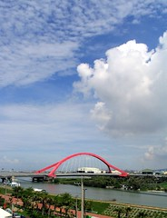

  
[進德大橋](http://www.flickr.com/photos/yurenju/166805366/)  
Originally uploaded by [yurenju](http://www.flickr.com/people/yurenju/).

度過漫長的梅雨季，今天總算放晴了。這幾天也總算可以出去溜達。從虎尾回到屏東之後，就過著與以前截然不同的生活，節奏放慢了許多。事情雖然做的很少，但我還是很高興有這樣的期間，可以讓自己放鬆心情。  
  
最近看了幾本 XP (極致程式設計) 的書，也對一些時間上的安排有了些完全不同的領悟。不管看什麼書，有那種豁然開朗的感覺時，心情真的是很舒服。