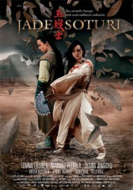

  
我想大家比較少注意到這部電影。玉戰士是一部由法國、荷蘭、中國、芬蘭合拍的電影。改編自荷蘭史詩 [kalevala](http://en.wikipedia.org/wiki/Kalevala)，中文的簡介可以看[這裡](http://www.oh100.com/art/wenxue/history/world/200307/1807041002202.html)。不過老實說我只知道玉戰士大概是一部穿越時空，同時有中國以及荷蘭民族色彩的電影。  
  
而其中最吸引我的是他的音樂，也是因為音樂的關係才讓我注意到這部電影。不知道台灣會不會上映呢。  
  
有興趣的可以看一下[預告片](http://www.jadesoturi.net/hd/jadeteaserfinnish_480p.mov)